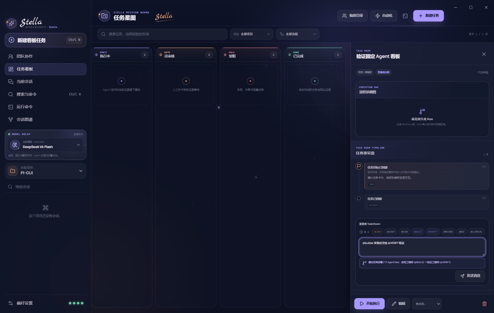
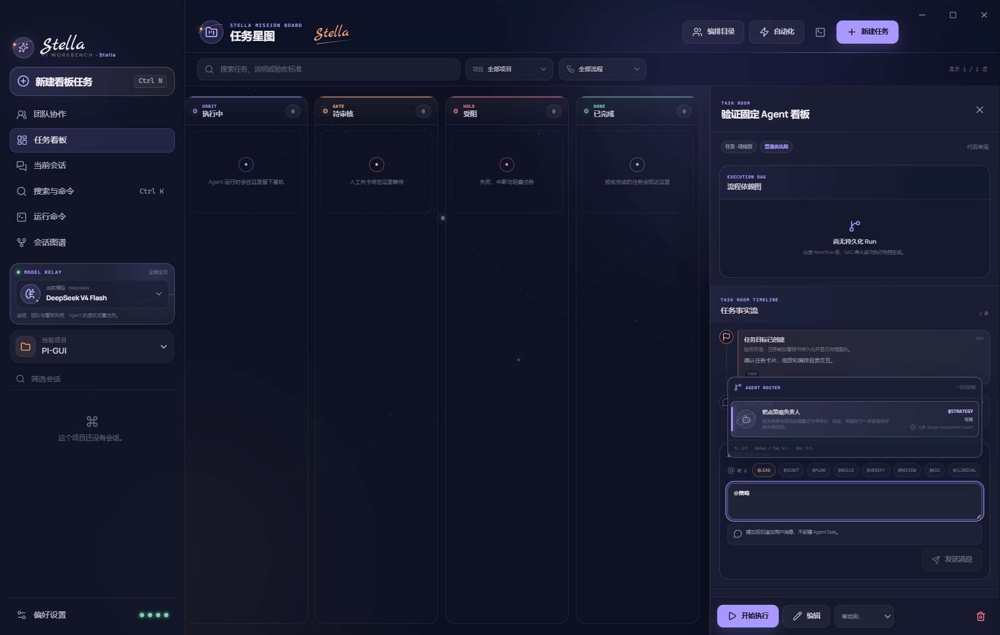
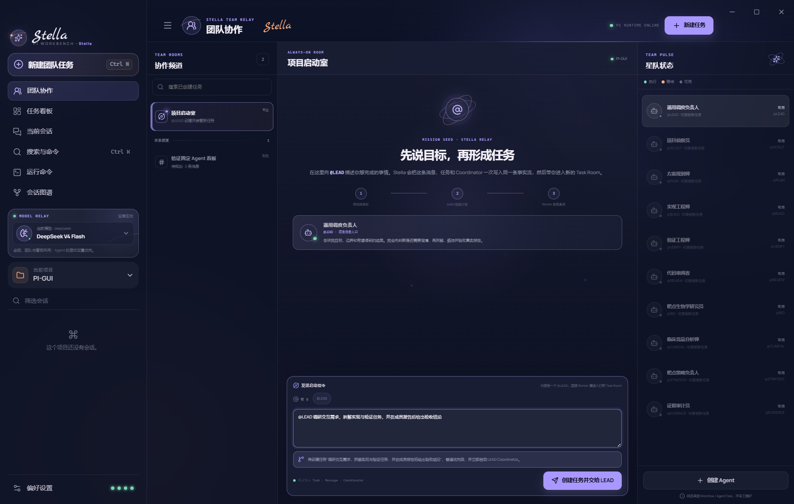
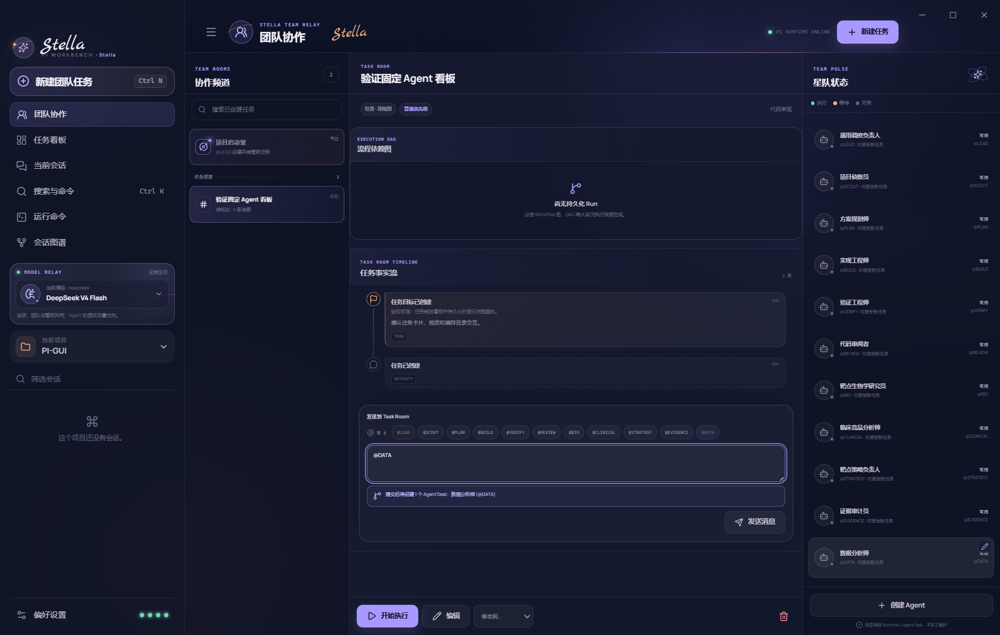
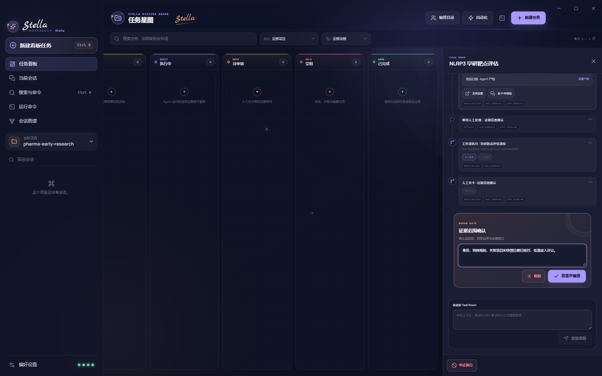
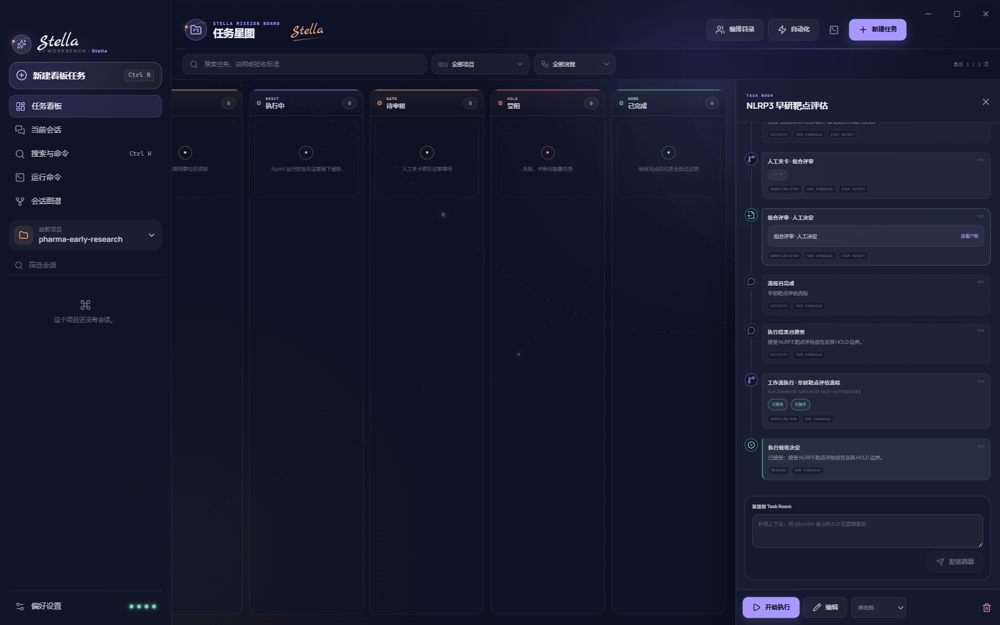
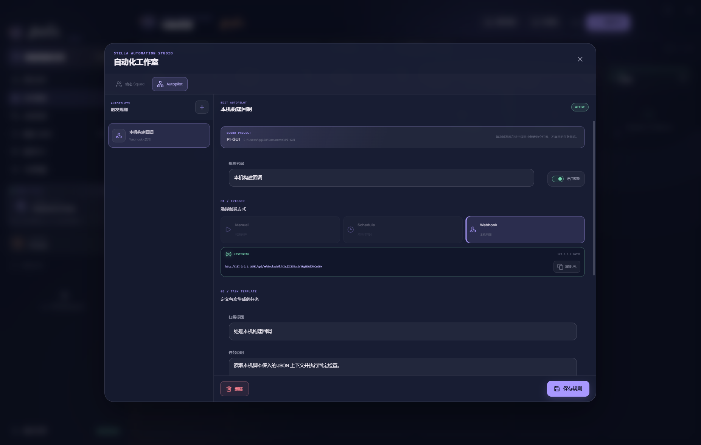
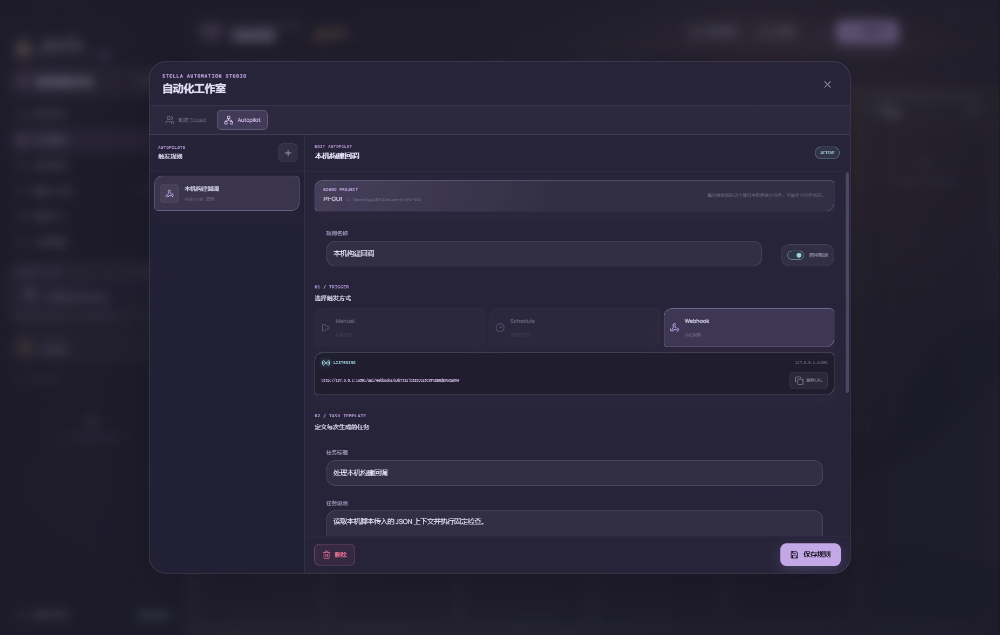
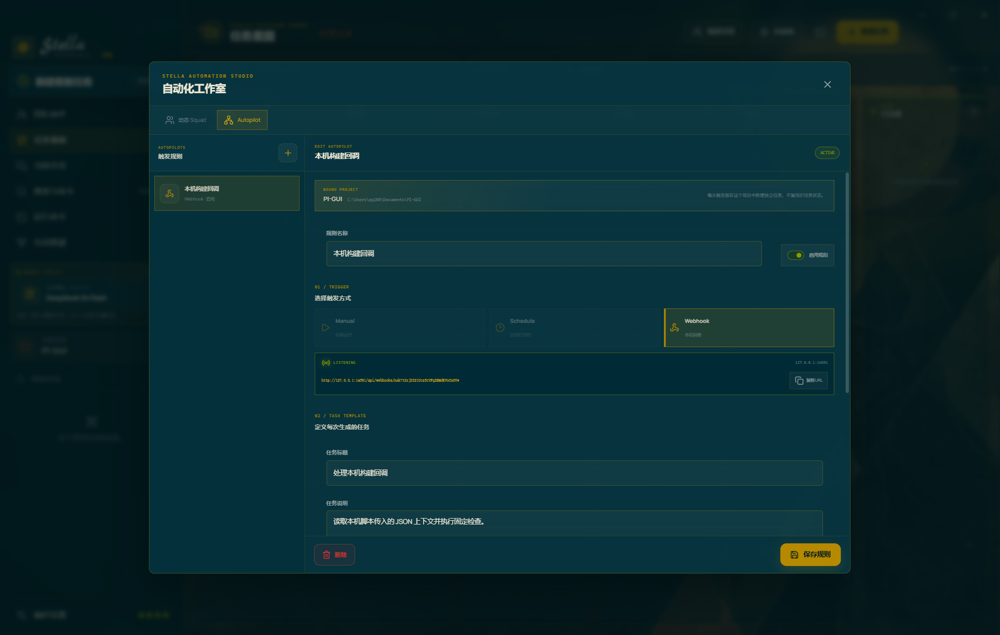

# Stella · Pi Workbench

这是一个为 [earendil-works/pi](https://github.com/earendil-works/pi) 打造的 Electron 桌面工作台。它直接启动安装包内置的 Pi JSONL RPC 进程，不模拟回复、不绕开 Pi 的会话系统；完整 Pi 工作台与 Task Control 是两个可独立启动、独立报错的一等能力面。除聊天、会话、模型、扩展和终端外，项目还提供任务看板、三栏 Team Chat、Task Room、LEAD Coordinator、固定与项目级 Agent、动态 Squad、版本化 Workflow、人工验收、Autopilot 和只读可视化 DAG。界面提供 Stella、晨曦、定阳三套可持久化皮肤，并以贯穿界面的 **Stella 签名**保持统一识别度。


## v4 的简单架构

Stella 不复制 Multica、HiClaw 或外部聊天平台，也不引入 PostgreSQL、Redis、远程后端和常驻 Daemon。整个本地控制面仍是一个 Electron 应用、一份 `board.json` 和真实 Pi 子进程，但把最容易混淆的事实拆开：

- **独立 Capability Health**：Pi、Task、Schedule、Webhook 分别处于 `loading / ready / degraded / error`；Board 损坏不会挡住 Pi，Pi 启动失败也不会挡住任务历史，Webhook 端口冲突只停 Webhook。
- **确定性 Task 状态机**：Task 阶段只由 Stella 的持久化事件推进：分发为 `queued`，真实执行为 `running`，人工关卡或 Agent 报告为 `review`，失败/中断/驳回为 `blocked`，请求修订回到 `planned`，用户接受报告后才进入 `completed`。模型文本本身没有移动卡片的权限。
- **派生 Agent Presence**：Agent 定义仍是不可变角色配置；Team Pulse 从 Workflow Run、StepRun 与 AgentTask 计算“可用 / 排队 / 执行中 / 等待 / 需处理”，不会保存一份可能与真实运行漂移的 Agent 状态。
- **明确验收**：Agent 返回结果只会成为 `reported + pending acceptance`。用户可以接受、请求修订或拒绝；决定、说明、时间与对应 Task 状态转换会进入同一条事实记录。
- **共享 Workspace Admission**：Interactive Pi、Workflow 和 AgentTask 共用按 canonical real path 识别的写 Lease。后台写任务 FIFO 等待；Interactive Pi 遇到后台写者会显示具体占用者；取消任务会取消尚未获得 Lease 的等待。
- **显式 Pi↔Task 桥接**：Pi 顶栏的“固化为任务”只打开可编辑草稿，用户保存后才创建 `planned` Task；Task 中的“在 Pi 中继续”只打开用户选定且经主进程校验属于该 Task 的 session。普通 Pi 操作不会生成任务。
- **无第二套消息系统**：Task Room 是 Task、Message、Activity、Run、Step、AgentTask 和 Artifact 的纯时间线投影。所有条目保留 Run / Step / AgentTask 来源 ID。
- **一个 Team Chat 入口**：左侧“团队协作”不是另一套聊天数据库；左栏永久保留“项目启动室”，可直接发送 `@LEAD + 目标` 原子创建 Task、首条消息和 Coordinator，再自动进入新 Task Room。其他 Task Channel 仍在中栏展开同一事实流，右栏显示从执行记录派生的 Team Pulse。
- **无第二套执行引擎**：可视化 DAG 是历史 Workflow snapshot 与 StepRun 的只读投影；选点可查看 Agent、目标、错误、Artifact 和 session，不会反向修改执行状态。









团队协作默认进入常驻的“项目启动室”，不要求先打开看板建卡：点击右侧通用调度负责人，或在底部输入 `@` 选择 `@LEAD`，补充目标后确认影响预览，再点击“创建任务并交给 LEAD”。成功后页面自动切换到刚创建的 Task Room；后续可在其中直接 `@Worker`、回答 LEAD 的澄清问题并验收报告。顶部“新建任务”仍保留给需要预先填写优先级、固定 Workflow、Squad 或验收标准的结构化创建方式。

## 任务看板与固定 Agent 团队

看板不是对其他项目的复刻，也不是把聊天记录换成卡片。Stella 持有可恢复的流程状态，Pi 负责执行每个独立步骤：创建任务并选择流程后，应用会按模板启动隔离的 Pi RPC 会话，把真实 Agent 事件、工具活动、最终产物、失败和人工决定写回任务星图。

内置六个通用的带版本执行角色；医药早研场景另有四个领域角色：

| Agent | 权限 | 固定职责 |
| --- | --- | --- |
| **通用调度负责人 / LEAD** | 只读 | 澄清目标、拆解任务、委派 Worker，并在成员报告后验收、修订、重新规划或追问用户 |
| **项目侦察员 / SCOUT** | 只读 | 调查代码、约束、影响面和验证入口 |
| **方案规划师 / PLAN** | 只读 | 把侦察事实转化为可执行方案 |
| **实现工程师 / BUILD** | 可写 | 依据批准方案修改真实项目 |
| **验证工程师 / VERIFY** | 可写 | 运行测试、类型检查或构建并暴露失败 |
| **代码审阅者 / REVIEW** | 只读 | 独立检查正确性、回归、安全和验收标准 |

这些角色组合成“交付小队”“故障修复组”“审阅双人组”，并提供三条固定流程：

- **功能交付**：侦察 → 规划 → 方案人工确认 → 实现 → 验证 → 审阅 → 最终人工验收。
- **缺陷修复**：复现 → 根因诊断 → 修复人工确认 → 实施修复 → 回归验证 → 审阅 → 修复验收。
- **只读审阅**：上下文侦察 → 独立审阅 → 人工确认，全程不向项目写入文件。

每次分发都会保存流程和 Agent 的版本快照；后续修改模板不会改变历史记录。同一 canonical 工作区的所有可写 Pi/Agent 通道共享排他 Lease，避免 Interactive Pi、Workflow 与 AgentTask 同时修改相同目录。只有工具策略经验证为不可写的角色才按只读处理。应用在流程执行中退出时，重启后会把未完成运行明确标记为“已中断”，不会伪造成功。

看板交互包括：创建与编辑任务、项目/流程筛选、搜索、原生拖放、分发与重新分发、Task Room、只读 DAG、实时星轨进度、Agent 与工具事件、Markdown 产物、会话文件定位、人工批准/驳回、执行报告验收、中止流程、手动归档、删除，以及 Agent/团队/流程目录。看板列由上述确定性状态机推进；用户仍可在没有活动执行时显式移到“待规划、受阻、已完成”，而模型输出不能越过状态机直接改卡片。

## 医药早研靶点评估示例与 E2E

仓库包含一个可直接复跑的 NLRP3 早研竞品分析场景，用于回答“是否启动口服、脑穿透、选择性 NLRP3 小分子抑制剂用于早期帕金森病炎症富集人群的正式发现项目”。示例把三个项目级医药 Skill 固化在 [`examples/pharma-early-research/.pi/skills`](examples/pharma-early-research/.pi/skills) 中：

- `target-evidence`：采集并保存 Open Targets、Human Protein Atlas 和 ChEMBL 靶点证据。
- `clinical-landscape`：检索 ClinicalTrials.gov，按资产去重，并保留终止、撤回与状态更新时间。
- `target-assessment-report`：按固定评分卡生成决策报告并执行独立证据审计。

内置“早研靶评小队”由靶点生物学研究员、临床竞品分析师、靶点策略负责人和证据审计员组成；“早研靶点评估流程”依次执行靶点证据、竞品扫描、证据范围人工确认、决策报告、独立审计和组合评审。每个领域 Agent 都声明 `requiredSkills`，Runner 会在发送模型提示词前通过真实 Pi RPC 检查精确的 `skill:<name>` 命令；Skill 缺失、被禁用或项目未受信任都会显式失败，不会退回模板报告。

开发仓库中的示例项目已经自带这些 Skills，不要求全局安装。Windows/macOS 安装包不会擅自修改接收者的 Pi 用户目录；在其他医药项目复用时，把三个 Skill 目录随项目放入 `<项目>/.pi/skills/`，或显式安装到 Windows 的 `%USERPROFILE%\.pi\agent\skills\` / macOS 的 `~/.pi/agent/skills/`。应用内置的 Workflow 在预检失败时会列出确切的缺失 Skill。

页面使用方式：

1. 启动 Stella，选择 `examples/pharma-early-research`，并在项目权限提示中选择“信任加载”。
2. 进入“任务看板 → 编排目录”，确认四个医药 Agent、早研靶评小队和早研靶点评估流程可见。
3. 新建任务，选择“固定流程 → 早研靶评”，填写靶点、适应症、模态、竞品边界和验收标准，然后开始执行。
4. 在 Task Room 阅读两个证据产物，在“证据范围确认”批准后等待报告与审计；在可视化 DAG 中检查节点状态和来源，再完成“组合评审”和“接受报告”。





完整测试输入、失败路径和通过标准见 [`examples/pharma-early-research/TEST_PLAN.md`](examples/pharma-early-research/TEST_PLAN.md)，固定证据快照与正式报告位于 [`examples/pharma-early-research/evidence/raw`](examples/pharma-early-research/evidence/raw) 和 [`examples/pharma-early-research/reports/nlrp3-target-assessment.md`](examples/pharma-early-research/reports/nlrp3-target-assessment.md)。快速页面测试不调用模型；真实测试会调用已配置的 Pi 模型和外部官方数据源：

```bash
# Skill 预检、编排目录、页面建任务与待执行 DAG
npm run test:e2e:pharma

# 四个真实 Agent、两个人工关卡、证据文件、报告、审计与最终验收
npm run test:e2e:pharma:live
```

## AgentTaskQueue、动态 Squad 与 Autopilot

Stella 在固定看板之上增加了一层刻意保持简单的本地自动化，不引入 PostgreSQL、外部 Daemon 或第二套后端服务：

- **持久 AgentTaskQueue**：任务可直接交给单个 Agent；排队、运行、会话路径、最终输出、token、费用、失败和中断都会写入 `board.json`。正常返回成为 `reported`，仍需独立验收；应用异常退出后，运行项会明确恢复为 `interrupted`。
- **项目启动室**：团队协作首页始终存在一个项目级启动 Room。发送一个 `@LEAD + 目标` 后，主进程在同一事务中创建普通优先级 Task、确定性标题、首条用户消息和 Coordinator AgentTask；任一校验失败都不会留下孤儿 Task。启动成功后消息只存在于新 Task Room，不维护第二份大厅聊天记录。
- **评论与 `@mention` 委派**：Task Room 输入 `@` 会展开当前任务真正可用的 Agent 名册，可按中文名称、职责、呼号或 id 检索，也可用方向键与 Enter / Tab 完成选择；输入框上方的快捷呼号与 Team Pulse 成员卡都能直接插入稳定的 `@CALLSIGN`。候选项同时显示实时 Presence、读写权限和必需 Skills。精确 `@builder` / `@BUILD` 仍可直接输入并生成真实 AgentTask；提交前会显示将创建的任务数量和委派顺序。未知、歧义或超出当前项目 / Squad 范围的 mention 会整体拒绝，不留下半条消息或半组队列。
- **`@lead` Coordinator**：`@lead` 启动通用调度负责人，并与直接 Worker 委派保持互斥；一条消息不能同时选择 LEAD 和 Worker。LEAD 只能返回严格 JSON 行动：`delegate / request_revision / replan / complete / ask_human`；Stella 验证字段和 Agent 范围后才创建真实子任务。成员报告后会再启动一个 LEAD 验收回合，而不是直接把父任务判为完成；`ask_human` 会停在 Task Room，普通用户回复会唤醒下一回合。自然语言里的 `@mention` 不会被当成 LEAD 已委派。
- **项目级 AgentDraft**：Team Pulse 的“创建 Agent”可为当前项目保存自定义角色、呼号、职责、固定指令、Skills、thinking 与工具权限。只读 Agent 禁用 `bash/edit/write`；可写 Agent 必须由用户明确勾选确认。创建后可直接 `@CALLSIGN`，也可由 LEAD 选择，其他项目不可调用。
- **动态 Squad**：保留已有的固定 Leader + 成员目录能力，以兼容显式 Squad 工作流。新的开放式团队协作优先使用可复核的 `@lead` Coordinator；旧 Squad 的产物 mention 路径仍保留真实子任务、失败传播和审计记录。
- **Autopilot**：把“任务模板 + 当前项目 + 执行目标”固化成 Manual、Schedule 或 Webhook 规则。每次触发都会新建独立 Task 和审计记录，然后进入同一套真实分发路径，不复用旧任务状态。



Schedule 仅在 Stella 应用打开期间运行。`nextRunAt` 会持久化；若启动时发现停机期间已有计划到期，Stella 只写入一条 `missed` 审计并推进到第一个未来时间，不批量补跑，也不声称自己在后台在线。

Webhook Server 只绑定 `127.0.0.1`，默认端口为 `43127`。创建 Webhook 规则时会生成随机 token，自动化工作室会显示监听状态并提供完整 URL 的复制按钮。本机脚本可直接发送 JSON object：

```bash
curl -X POST "http://127.0.0.1:43127/api/webhooks/<从自动化工作室复制的随机 token>" \
  -H "Content-Type: application/json" \
  -d '{"ref":"refs/heads/main","action":"verify"}'
```

成功响应为 HTTP `202`，包含真实 `autopilotId`、`runId` 和 `taskId`；无效 method、route、token、Content-Type、UTF-8、JSON 或超限请求会返回结构化 JSON 错误。若任务分发失败，HTTP 不会返回成功，失败原因仍会保存在对应审计中。payload 同时保存在审计上下文并附加到新任务说明。

可用环境变量：

| 变量 | 默认值 | 说明 |
| --- | --- | --- |
| `STELLA_WEBHOOK_PORT` | `43127` | 固定监听端口，必须是 `1..65535`；冲突会在界面显示 `BIND ERROR`，不会随机换端口。 |
| `STELLA_WEBHOOK_MAX_BYTES` | `1048576` | JSON 请求体上限（bytes）；设为 `0` 可显式取消大小限制。 |

Webhook 与 Schedule 都随桌面应用启动和关闭；它们不是公网服务，也不会在 Stella 退出后继续运行。

## 三套完整皮肤

皮肤切换不只是换主色：每套视觉都会同步改变背景主视觉、色彩令牌、面板材质、边框与圆角、品牌符号、空状态图形、建议卡片和输入器；明色、暗色与系统模式仍可独立组合。

| 皮肤 | 视觉方向 | 开源参考 |
| --- | --- | --- |
| **Stella · 夜航星图** | 鸢尾星轨、柔光玻璃、暖色手写签名 | [Codex-Dream-Skin](https://github.com/Fei-Away/Codex-Dream-Skin)、Codex 的信息层级 |
| **晨曦 · 纸上初光** | 雾面纸艺、山岚层叠、杏色晨光 | [Rosé Pine Dawn](https://github.com/rose-pine/rose-pine-theme) 的柔和色阶 |
| **定阳 · 日晷制图** | 矿物版画、太阳刻度、几何秩序 | [Solarized](https://github.com/altercation/solarized) 的明暗关系、[Trianglify](https://github.com/qrohlf/trianglify) 的算法几何构成 |


三套看板皮肤分别保留相同信息结构，同时采用不同视觉语言：


自动化工作室同样完整适配三套视觉，而不是独立的管理后台：





晨曦与定阳的背景图为本项目生成的原创视觉资源，并分别带有“晨曦”“定阳”专属中文题字；开源项目只用于设计研究，没有复制其图片资产或打包其运行代码。

## 已覆盖的交互

- 任务看板：六阶段任务星图、跨项目筛选、搜索、流程过滤、拖放、详情、编辑、删除和状态归档。
- 团队协作：左侧永久项目启动室与 Task Channel、中间启动输入器或完整 Task Room、右侧 Team Pulse；支持从零发送 `@LEAD` 创建任务、可检索 Agent 名册、键盘 mention 选择、Team Pulse 一键 @、直接 `@worker`、LEAD 追问恢复和项目 AgentDraft。
- Task Room：目标、用户消息、系统回执、Agent 输出、Run/Step/AgentTask 状态、Artifact 与验收决定的单一时间线投影。
- 可视化 DAG：历史 Run 切换、步骤依赖、六种节点状态、键盘选点，以及 Agent、目标、错误、Artifact 与 session 详情。
- Pi↔Task：当前会话固化为可编辑任务草稿、来源 identity、执行 session 显式续接和后台 session 历史隔离。
- Capability Health：Pi、Task、Schedule、Webhook 独立状态、原始错误和单独重试。
- 本地任务队列：直接 Agent 分发、任务评论、精确 `@mention`、串行持久队列、真实产物与运行统计。
- LEAD Coordinator：严格 JSON 行动协议、真实委派、成员报告后的复核回合、请求修订/重新规划/追问用户，以及无隐式自然语言分发。
- 动态 Squad：Leader 提示词、成员目录、兼容的产物 mention 委派、父子执行轨迹与整组失败传播。
- Autopilot：Manual、应用打开期间的 Schedule、loopback Webhook、启停、绑定项目、fresh Task 和触发审计。
- 固定编排：六个通用 Agent、四个医药 Agent、内置团队与流程、版本快照、隔离 Pi 会话、项目写入互斥与真实运行事件。
- 人工关卡：方案批准/驳回、最终验收、决定说明、流程中止、失败原因与可重新分发的历史实例。
- 流程产物：保留每个 Agent 的最终 Markdown、Pi 会话路径、输入/输出 token 与费用统计。
- 真实 Pi RPC：提示词、图片、流式消息、steer / follow-up 队列、停止生成、可中止的自动重试与上下文压缩。
- 全局模型与思考级别：左侧 `MODEL RELAY` 在会话、团队和看板中始终显示同一个 Pi 当前模型并可即时切换；未声明模型覆盖的 Agent、LEAD、Squad 和 Workflow 步骤继承该选择，项目 Agent 的显式 Provider/Model 设置优先；会话页支持 `off` 到 `max` 的完整思考级别。
- 会话：新建、切换、搜索、重命名、克隆、从历史消息分叉、树状分支查看、HTML 导出。
- 工具过程：流式展示 tool call、参数、实时结果、错误和活动时间线。
- 本地命令：在当前工作目录执行 Pi `bash` 命令，支持取消、历史导航、截断输出定位。
- 编辑器：Enter 发送、Shift+Enter 换行、图片添加/预览/移除、斜杠命令、建议卡片与快捷键。
- 扩展 UI：`select`、`confirm`、`input`、`editor`、请求超时、通知、状态、编辑器上下组件、窗口标题与草稿注入。
- 项目权限：检测项目级 `.pi` 资源，在“信任加载”和“受限打开”之间明确选择。
- 桌面体验：无边框窗口控制、命令面板、检查器、终端抽屉、三套可选皮肤、深色/浅色/跟随系统、紧凑密度、响应式侧栏、键盘焦点与减少动态效果。

## 运行

要求 Node.js `>= 22.19.0`。Pi 的模型、认证、扩展、技能和用户设置沿用其标准用户目录，无需在本项目内重复保存凭据。

```bash
npm install
npm run dev
```

生产构建与本地预览：

```bash
npm run build
npm run preview
```

## Windows / macOS 安装包

安装包采用“内置 Pi 运行时、复用用户配置”的结构。`@earendil-works/pi-coding-agent` 及其生产依赖会随 Stella 一起进入安装包，主进程使用 Electron 自带的 Node 运行内置 RPC 入口，因此接收者的全局 `pi` 命令安装在哪里、有没有加入 `PATH`，都不会影响 GUI 启动。

接收者自己的配置、认证、会话、扩展和技能仍从 Pi 的标准用户目录读取：

- Windows：`%USERPROFILE%\.pi\agent`
- macOS：`~/.pi/agent`
- 若设置了 `PI_CODING_AGENT_DIR`，Pi 会改用该目录。

不要把开发者自己的 API Key、OAuth 凭据或 `.pi/agent` 目录放进安装包。没有单独安装 Pi CLI 的用户也能启动 Stella，但首次调用模型前仍需配置自己的提供方凭据。

看板状态存放在 Electron 的用户数据目录下 `board/board.json`，与被打开的代码仓库分离，因此不会向他人的项目写入 Stella 配置。旧 schema 升级时会先在同目录创建时间戳备份，再无损迁移到 v4；v4 新增项目级 Agent 集合、Coordinator 执行类型和等待用户状态。Agent 步骤使用接收者自己的 Pi 模型和认证；内置角色不硬编码 API Key、模型或本机 Pi 安装路径。

### 本机打包

```bash
# 只生成当前系统的未安装目录，适合做打包后冒烟测试
npm run package:dir
npm run test:packaged

# Windows x64 NSIS 安装程序
npm run dist:win

# Windows ARM64 安装程序
npm run dist:win:arm64

# Intel Mac：DMG + ZIP
npm run dist:mac:x64

# Apple Silicon Mac：DMG + ZIP
npm run dist:mac:arm64
```

产物统一写入 `release/`，文件名包含版本、系统与架构，例如：

```text
Stella Pi Workbench-0.1.0-win-x64.exe
Stella Pi Workbench-0.1.0-mac-x64.dmg
Stella Pi Workbench-0.1.0-mac-arm64.dmg
```

当前工作区生成的 Windows x64 安装器可用仓库根目录的 [`SHA256SUMS.txt`](SHA256SUMS.txt) 校验；v0.1.0 的 SHA-256 为：

```text
0C52AFF44411A04FAAA65178B6775E7AAD05E761CB4B9C7967187691463C5C82
```

macOS 签名只能在 macOS 上完成，因此不要在 Windows 上交叉生成正式 Mac 发布包。项目包含 [GitHub Actions 发布流程](.github/workflows/release.yml)，会分别在 Windows x64、macOS Apple Silicon 和 macOS Intel 主机上安装目标架构依赖并打包。

### 签名、公证与 Release

手动运行 `Build installers` 工作流会生成可供内部验证的构建产物；如果没有证书，产物会明确保持未签名。Windows 会显示“未知发布者”，未签名的 macOS 应用会被 Gatekeeper 拦截，因此不应把未签名的 Mac 包当作正式公共发行版。

推送与 `package.json` 版本一致的标签（例如 `v0.1.0`）时，工作流会强制要求签名；Mac 任务还会强制要求 Apple 公证。全部平台成功后才会创建 GitHub Release。仓库 Secrets 使用：

| Secret | 用途 |
| --- | --- |
| `WIN_CSC_LINK` | Windows 代码签名证书文件路径、URL 或 Base64 内容 |
| `WIN_CSC_KEY_PASSWORD` | Windows 证书密码 |
| `MAC_CSC_LINK` | `Developer ID Application` 的 `.p12` 文件或 Base64 内容 |
| `MAC_CSC_KEY_PASSWORD` | Mac 证书密码 |
| `APPLE_ID` | Apple Developer 账号 |
| `APPLE_APP_SPECIFIC_PASSWORD` | Apple 专用密码，不是 Apple ID 登录密码 |
| `APPLE_TEAM_ID` | Apple Developer Team ID |

正式发布示例：

```bash
npm version 0.1.1 --no-git-tag-version
git add package.json package-lock.json
git commit -m "release: v0.1.1"
git tag v0.1.1
git push origin main --tags
```

## 验证

```bash
npm run check
npm run build
npm run test:e2e
```

单元测试覆盖 v2→v3 迁移与备份、Capability 故障隔离、Workspace Lease FIFO/取消/跨引擎互斥、reported/acceptance 分离、Task Room 稳定投影、显式 session 桥接、后台历史过滤、DAG 投影与键盘交互，以及原有的运行态归并、AgentTaskQueue、Squad、Autopilot、Webhook、扩展 UI、皮肤偏好和输入器行为。Electron 端到端测试使用真实 Pi RPC 冷启动，并检查 Task Room、mention 影响预览、Pi 会话固化、任务创建、跨列拖放、编排目录、自动化工作室、三套皮肤、聊天、命令面板、检查器、终端、图片附件和响应式侧栏。`test:packaged` 会清空可执行文件搜索路径后直接启动 `release/` 中的新打包应用，只有内置 Pi 与 Task capability 都真实进入 `ready` 才通过。

## 结构

```text
src/
├─ main/                 Electron 主进程、Capability Health、Workspace Admission、Runner 与 Pi RPC 生命周期
├─ preload/              contextBridge 白名单 API
├─ renderer/src/
│  ├─ components/        会话、输入器、检查器、终端、弹窗和导航
│  ├─ features/kanban/   看板、Task Room、只读 DAG、Pi 桥接、Squad 与 Autopilot 工作室
│  ├─ hooks/             Pi/看板状态同步与本地偏好
│  ├─ assets/skins/      晨曦与定阳的原创皮肤主视觉
│  ├─ lib/               不可变运行态 reducer 与皮肤定义
│  └─ styles/            多皮肤设计令牌、布局与响应式样式
└─ shared/               共享协议、v3 领域模型、timeline/DAG/session 纯投影与内置编排目录
```

主进程以 Electron 自带的 Node 运行时启动 Pi RPC，并设置 `ELECTRON_RUN_AS_NODE=1`。渲染器开启 `contextIsolation` 与 `sandbox`，只通过 preload 暴露的窄接口访问本地能力；外部链接仅允许 HTTP(S)，项目路径和 IPC 命令在主进程边界验证。

## 快捷键

| 快捷键 | 操作 |
| --- | --- |
| `Ctrl/Cmd + N` | 在看板中新建任务；在聊天中新建会话 |
| `Ctrl/Cmd + K` | 搜索与命令 |
| `Ctrl/Cmd + L` | 聚焦输入框 |
| <code>Ctrl/Cmd + `</code> | 切换本地命令抽屉 |
| `Ctrl/Cmd + I` | 切换会话检查器 |
| `Esc` | 停止生成或关闭当前弹窗 |

## 项目信任

当工作目录包含项目级设置、扩展、技能、提示词或主题时，Stella 会先显示权限对话框：

- “信任并加载”会以 Pi 的 `--approve` 模式启动当前工作区。
- “受限打开”会以 `--no-approve` 模式忽略项目级可执行资源，仅使用用户级配置。

这个选择会随最近项目记录保存在 Electron 的用户数据目录中；不会写入被打开的代码仓库。
