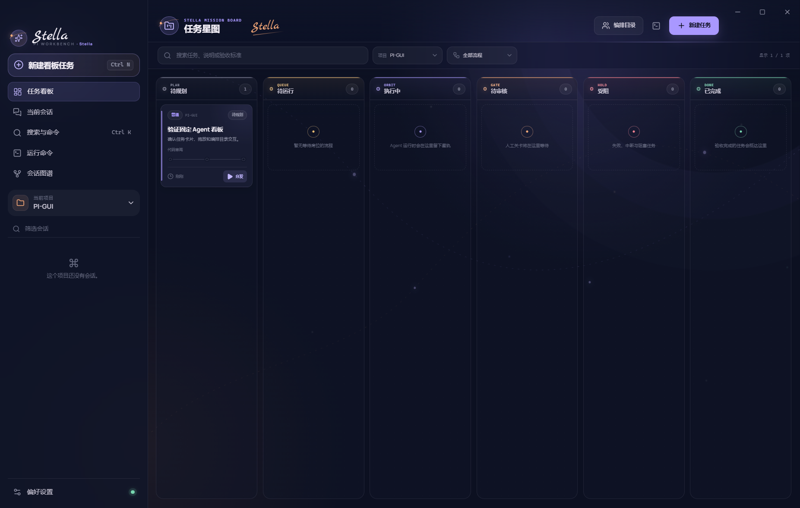
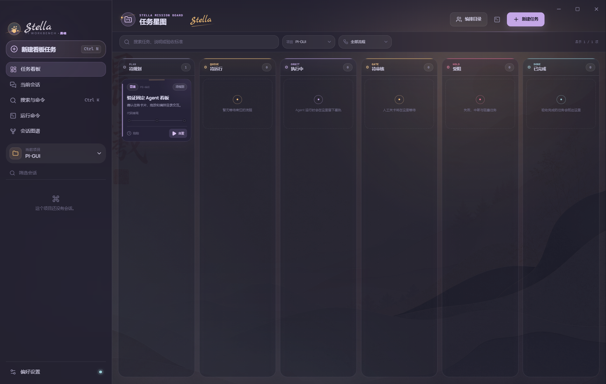
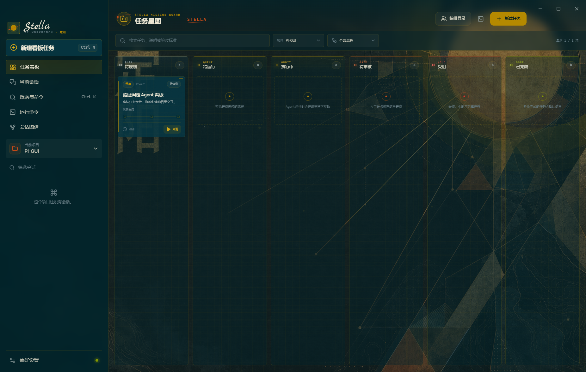

# Stella · Pi Workbench

这是一个为 [earendil-works/pi](https://github.com/earendil-works/pi) 打造的 Electron 桌面工作台。它直接启动 Pi 的 JSONL RPC 进程，不模拟回复、不绕开 Pi 的会话系统；除完整聊天界面外，还提供由真实 Pi 进程驱动的任务看板、固定 Agent、固定团队、版本化流程和人工关卡。界面提供 Stella、晨曦、定阳三套可持久化皮肤，并以贯穿界面的 **Stella 签名**保持统一识别度。



## 任务看板与固定 Agent 团队

看板不是对其他项目的复刻，也不是把聊天记录换成卡片。Stella 持有可恢复的流程状态，Pi 负责执行每个独立步骤：创建任务并选择流程后，应用会按模板启动隔离的 Pi RPC 会话，把真实 Agent 事件、工具活动、最终产物、失败和人工决定写回任务星图。

内置五个带版本的执行角色：

| Agent | 权限 | 固定职责 |
| --- | --- | --- |
| **项目侦察员 / SCOUT** | 只读 | 调查代码、约束、影响面和验证入口 |
| **方案规划师 / PLAN** | 只读 | 把侦察事实转化为可执行方案 |
| **实现工程师 / BUILD** | 可写 | 依据批准方案修改真实项目 |
| **验证工程师 / VERIFY** | 可写 | 运行测试、类型检查或构建并暴露失败 |
| **代码审阅者 / REVIEW** | 只读 | 独立检查正确性、回归、安全和验收标准 |

这些角色组合成“交付小队”“故障修复组”“审阅双人组”，并提供三条固定流程：

- **功能交付**：侦察 → 规划 → 方案人工确认 → 实现 → 验证 → 审阅 → 最终人工验收。
- **缺陷修复**：复现 → 根因诊断 → 修复人工确认 → 实施修复 → 回归验证 → 审阅 → 修复验收。
- **只读审阅**：上下文侦察 → 独立审阅 → 人工确认，全程不向项目写入文件。

每次分发都会保存流程和 Agent 的版本快照；后续修改模板不会改变历史记录。同一项目的可写 Agent 会排队串行执行，避免两个实现角色同时改动相同工作区；只读角色仍可并行。应用在流程执行中退出时，重启后会把未完成运行明确标记为“已中断”，不会伪造成功。

看板交互包括：创建与编辑任务、项目/流程筛选、搜索、原生拖放、分发与重新分发、实时星轨进度、Agent 与工具事件、Markdown 产物、会话文件定位、人工批准/驳回、中止流程、手动归档、删除，以及 Agent/团队/流程目录。待运行、执行中和待审核列由编排器维护；用户手动拖放只允许使用“待规划、受阻、已完成”这些不会伪造执行状态的列。

## 三套完整皮肤

皮肤切换不只是换主色：每套视觉都会同步改变背景主视觉、色彩令牌、面板材质、边框与圆角、品牌符号、空状态图形、建议卡片和输入器；明色、暗色与系统模式仍可独立组合。

| 皮肤 | 视觉方向 | 开源参考 |
| --- | --- | --- |
| **Stella · 夜航星图** | 鸢尾星轨、柔光玻璃、暖色手写签名 | [Codex-Dream-Skin](https://github.com/Fei-Away/Codex-Dream-Skin)、Codex 的信息层级 |
| **晨曦 · 纸上初光** | 雾面纸艺、山岚层叠、杏色晨光 | [Rosé Pine Dawn](https://github.com/rose-pine/rose-pine-theme) 的柔和色阶 |
| **定阳 · 日晷制图** | 矿物版画、太阳刻度、几何秩序 | [Solarized](https://github.com/altercation/solarized) 的明暗关系、[Trianglify](https://github.com/qrohlf/trianglify) 的算法几何构成 |


三套看板皮肤分别保留相同信息结构，同时采用不同视觉语言：





晨曦与定阳的背景图为本项目生成的原创视觉资源，并分别带有“晨曦”“定阳”专属中文题字；开源项目只用于设计研究，没有复制其图片资产或打包其运行代码。

## 已覆盖的交互

- 任务看板：六阶段任务星图、跨项目筛选、搜索、流程过滤、拖放、详情、编辑、删除和状态归档。
- 固定编排：五个 Agent、三个团队、三条流程、版本快照、隔离 Pi 会话、项目写入互斥与真实运行事件。
- 人工关卡：方案批准/驳回、最终验收、决定说明、流程中止、失败原因与可重新分发的历史实例。
- 流程产物：保留每个 Agent 的最终 Markdown、Pi 会话路径、输入/输出 token 与费用统计。
- 真实 Pi RPC：提示词、图片、流式消息、steer / follow-up 队列、停止生成、可中止的自动重试与上下文压缩。
- 模型与思考级别：读取 Pi 可用模型并即时切换，支持 `off` 到 `max` 的完整思考级别。
- 会话：新建、切换、搜索、重命名、克隆、从历史消息分叉、树状分支查看、HTML 导出。
- 工具过程：流式展示 tool call、参数、实时结果、错误和活动时间线。
- 本地命令：在当前工作目录执行 Pi `bash` 命令，支持取消、历史导航、截断输出定位。
- 编辑器：Enter 发送、Shift+Enter 换行、图片添加/预览/移除、斜杠命令、建议卡片与快捷键。
- 扩展 UI：`select`、`confirm`、`input`、`editor`、请求超时、通知、状态、编辑器上下组件、窗口标题与草稿注入。
- 项目权限：检测项目级 `.pi` 资源，在“信任加载”和“受限打开”之间明确选择。
- 桌面体验：无边框窗口控制、命令面板、检查器、终端抽屉、三套可选皮肤、深色/浅色/跟随系统、紧凑密度、响应式侧栏、键盘焦点与减少动态效果。

## 运行

要求 Node.js `>= 22.19.0`。Pi 的模型、认证、扩展、技能和用户设置沿用其标准用户目录，无需在本项目内重复保存凭据。

```bash
npm install
npm run dev
```

生产构建与本地预览：

```bash
npm run build
npm run preview
```

## Windows / macOS 安装包

安装包采用“内置 Pi 运行时、复用用户配置”的结构。`@earendil-works/pi-coding-agent` 及其生产依赖会随 Stella 一起进入安装包，主进程使用 Electron 自带的 Node 运行内置 RPC 入口，因此接收者的全局 `pi` 命令安装在哪里、有没有加入 `PATH`，都不会影响 GUI 启动。

接收者自己的配置、认证、会话、扩展和技能仍从 Pi 的标准用户目录读取：

- Windows：`%USERPROFILE%\.pi\agent`
- macOS：`~/.pi/agent`
- 若设置了 `PI_CODING_AGENT_DIR`，Pi 会改用该目录。

不要把开发者自己的 API Key、OAuth 凭据或 `.pi/agent` 目录放进安装包。没有单独安装 Pi CLI 的用户也能启动 Stella，但首次调用模型前仍需配置自己的提供方凭据。

看板状态存放在 Electron 的用户数据目录下 `board/board.json`，与被打开的代码仓库分离，因此不会向他人的项目写入 Stella 配置。Agent 步骤使用接收者自己的 Pi 模型和认证；内置角色不硬编码 API Key、模型或本机 Pi 安装路径。

### 本机打包

```bash
# 只生成当前系统的未安装目录，适合做打包后冒烟测试
npm run package:dir
npm run test:packaged

# Windows x64 NSIS 安装程序
npm run dist:win

# Windows ARM64 安装程序
npm run dist:win:arm64

# Intel Mac：DMG + ZIP
npm run dist:mac:x64

# Apple Silicon Mac：DMG + ZIP
npm run dist:mac:arm64
```

产物统一写入 `release/`，文件名包含版本、系统与架构，例如：

```text
Stella Pi Workbench-0.1.0-win-x64.exe
Stella Pi Workbench-0.1.0-mac-x64.dmg
Stella Pi Workbench-0.1.0-mac-arm64.dmg
```

macOS 签名只能在 macOS 上完成，因此不要在 Windows 上交叉生成正式 Mac 发布包。项目包含 [GitHub Actions 发布流程](.github/workflows/release.yml)，会分别在 Windows x64、macOS Apple Silicon 和 macOS Intel 主机上安装目标架构依赖并打包。

### 签名、公证与 Release

手动运行 `Build installers` 工作流会生成可供内部验证的构建产物；如果没有证书，产物会明确保持未签名。Windows 会显示“未知发布者”，未签名的 macOS 应用会被 Gatekeeper 拦截，因此不应把未签名的 Mac 包当作正式公共发行版。

推送与 `package.json` 版本一致的标签（例如 `v0.1.0`）时，工作流会强制要求签名；Mac 任务还会强制要求 Apple 公证。全部平台成功后才会创建 GitHub Release。仓库 Secrets 使用：

| Secret | 用途 |
| --- | --- |
| `WIN_CSC_LINK` | Windows 代码签名证书文件路径、URL 或 Base64 内容 |
| `WIN_CSC_KEY_PASSWORD` | Windows 证书密码 |
| `MAC_CSC_LINK` | `Developer ID Application` 的 `.p12` 文件或 Base64 内容 |
| `MAC_CSC_KEY_PASSWORD` | Mac 证书密码 |
| `APPLE_ID` | Apple Developer 账号 |
| `APPLE_APP_SPECIFIC_PASSWORD` | Apple 专用密码，不是 Apple ID 登录密码 |
| `APPLE_TEAM_ID` | Apple Developer Team ID |

正式发布示例：

```bash
npm version 0.1.1 --no-git-tag-version
git add package.json package-lock.json
git commit -m "release: v0.1.1"
git tag v0.1.1
git push origin main --tags
```

## 验证

```bash
npm run check
npm run build
npm run test:e2e
```

单元测试覆盖看板持久化与严格校验、重启中断恢复、任务状态约束、流程进度、隔离 Agent 顺序、人工关卡、用户中止，以及原有的运行态归并、流式消息、工具调用、消息队列、扩展 UI、皮肤偏好和输入器行为。Electron 端到端测试使用真实 Pi RPC 冷启动，并检查任务创建、流程选择、跨列拖放、编排目录、三套看板皮肤、聊天切换、命令面板、设置、检查器、终端、图片附件和响应式侧栏。`test:packaged` 会清空可执行文件搜索路径后直接启动 `release/` 中的打包应用，只有安装包内置 Pi RPC 成功返回状态后才通过。

## 结构

```text
src/
├─ main/                 Electron 主进程、看板存储、工作流编排、Pi RPC 生命周期
├─ preload/              contextBridge 白名单 API
├─ renderer/src/
│  ├─ components/        会话、输入器、检查器、终端、弹窗和导航
│  ├─ features/kanban/   看板、任务详情、编排目录与任务编辑器
│  ├─ hooks/             Pi/看板状态同步与本地偏好
│  ├─ assets/skins/      晨曦与定阳的原创皮肤主视觉
│  ├─ lib/               不可变运行态 reducer 与皮肤定义
│  └─ styles/            多皮肤设计令牌、布局与响应式样式
└─ shared/               共享协议、看板领域模型与内置编排目录
```

主进程以 Electron 自带的 Node 运行时启动 Pi RPC，并设置 `ELECTRON_RUN_AS_NODE=1`。渲染器开启 `contextIsolation` 与 `sandbox`，只通过 preload 暴露的窄接口访问本地能力；外部链接仅允许 HTTP(S)，项目路径和 IPC 命令在主进程边界验证。

## 快捷键

| 快捷键 | 操作 |
| --- | --- |
| `Ctrl/Cmd + N` | 在看板中新建任务；在聊天中新建会话 |
| `Ctrl/Cmd + K` | 搜索与命令 |
| `Ctrl/Cmd + L` | 聚焦输入框 |
| <code>Ctrl/Cmd + `</code> | 切换本地命令抽屉 |
| `Ctrl/Cmd + I` | 切换会话检查器 |
| `Esc` | 停止生成或关闭当前弹窗 |

## 项目信任

当工作目录包含项目级设置、扩展、技能、提示词或主题时，Stella 会先显示权限对话框：

- “信任并加载”会以 Pi 的 `--approve` 模式启动当前工作区。
- “受限打开”会以 `--no-approve` 模式忽略项目级可执行资源，仅使用用户级配置。

这个选择会随最近项目记录保存在 Electron 的用户数据目录中；不会写入被打开的代码仓库。
