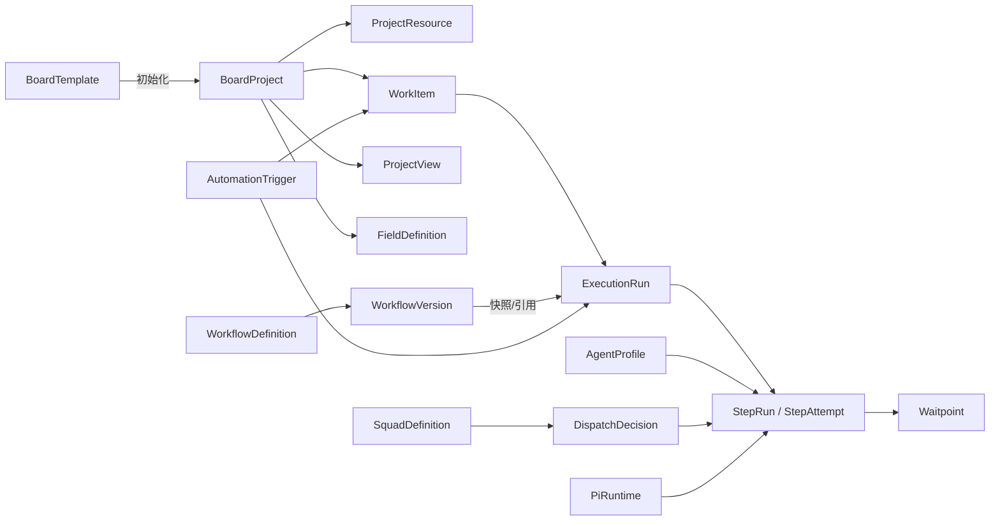

# Stella Pi Workbench 整体结构转变：高 Star 开源项目架构参考

> 核对日期：2026-07-17（Asia/Shanghai）  
> 目标：为 Stella 从“目录任务看板”转向 `Project + Resource + WorkItem + ExecutionRun + configurable Agent/Squad/Workflow` 选择可借鉴的架构，而不是寻找一个可以直接复刻的项目。

## 研究方法与边界

- 只使用项目自己的 GitHub 仓库、README、源码、LICENSE 和官方文档；没有采用媒体文章、聚合榜单或二手教程。
- Star、仓库最后 push 时间、主要语言和 GitHub 识别的许可证来自各仓库的官方 GitHub REST metadata；它们是 2026-07-17 的快照，之后会变化。
- “最后 push”只说明仓库最近收到 Git push，不等于已经发布稳定版本；Focalboard、AutoGen 等项目还需要服从其 README 中更明确的维护状态声明。
- 代码路径尽量固定到本次核验的 commit，以防默认分支继续变化；许可证仍链接项目当前官方 LICENSE。
- 这里的许可证判断只用于工程筛选，不构成法律意见。借鉴抽象思想与复制源码是两件不同的事。

当前仓库只有 `docs/adr/` 和截图，没有研究笔记目录惯例，因此本报告放在 `docs/research/`。本地核验还发现当前 Stella 仓库没有 `LICENSE` 文件，`package.json` 也没有 `license` 字段；在选择 Stella 自身许可证之前，不应直接复制任何候选项目的实现代码。

## 一页结论

没有一个高 Star 项目同时满足 Stella 的全部条件：Electron 本地优先、Pi 专用、可安装到 Windows/macOS、通用项目看板、可配置 Agent 团队、确定性 Workflow、人工关卡和可恢复执行。

最合适的是“组合借鉴”，而不是挑一个母项目：

| Stella 目标层 | 首选参考 | 借鉴内容 | 采用强度 |
| --- | --- | --- | --- |
| `Project / WorkItem` | Plane + OpenProject | Project 与工作项分离、父子项、关系、活动、状态、优先级、自定义属性 | 高，重新实现模型 |
| `ProjectView / BoardTemplate` | Vikunja + AppFlowy | 同一数据集上的多个视图；视图保存布局、过滤、排序、分组；模板只初始化项目 | 最高，直接影响 v2 模型 |
| 本地持久化 | AppFlowy + Focalboard（仅历史参考） | 本地事务存储、数据库与视图层分离、桌面打包经验 | 高；采用 SQLite，不采用 CRDT |
| `WorkflowDefinition / WorkflowVersion / ExecutionRun / StepRun` | Activepieces | Flow、不可变版本、Run、Step Run、Waitpoint、版本迁移分离 | 最高，最贴近当前缺口 |
| Run 状态正确性 | XState + LangGraph | 显式状态机、guard、actor；checkpoint、interrupt、pending writes、fork lineage | 最高，先于新增功能 |
| `Squad` 与确定性 `Workflow` 的边界 | CrewAI | Crew 的 sequential/hierarchical process 与 Flow DSL 是两种不同抽象 | 高，映射到 Pi，不引入 Python runtime |
| Runtime/Resource/Trust | OpenHands | 前端控制面与 Agent Server 解耦；本机/容器/远程 backend；明确无沙箱风险 | 中高，借鉴边界 |
| 可视化 DAG、Automation | Activepieces + xyflow；补看 n8n/Windmill/Dify | Trigger、节点图、等待点、重试、执行历史、版本迁移 | 中，v2 后段再做 |
| Agent 配置器 UI | Dify/Flowise/Langflow | 节点注册、配置 schema、试运行、版本/执行分离 | 中低，只借鉴编辑器交互 |

对 Stella 最重要的判断是：

1. 不应该把 Plane、AppFlowy 或 Dify 嵌入进来；它们的服务器、多租户和协作体量不适合本地 Pi 桌面应用。
2. `BoardTemplate` 不应该成为封闭的 `software | research | content` 项目类型枚举。模板应只初始化列、字段、视图和推荐 Workflow，创建后仍可编辑。
3. `WorkflowDefinition` 必须再拆出不可变 `WorkflowVersion`；每次分发产生独立 `ExecutionRun`，人工关卡是持久化 `Waitpoint`，不能只是内存回调。
4. 当前最大的工程风险是 Run 终态可被异步结算复活。应先引入显式状态机、revision/CAS 和交错测试，再开放用户自定义 Workflow。
5. 单用户 v2 使用 SQLite 和显式 migration 足够；AppFlowy/AFFiNE 的 CRDT、云同步和多租户 ACL 现在都属于过度设计。

## 候选仓库快照

### 项目、工作项和看板

| 项目 | Star | 最后 push | 主要栈 | 许可证 | 结论 |
| --- | ---: | --- | --- | --- | --- |
| [Plane](https://github.com/makeplane/plane) ([metadata](https://api.github.com/repos/makeplane/plane)) | 54,641 | 2026-07-17 | TypeScript/Next.js + Python/Django | [AGPL-3.0](https://github.com/makeplane/plane/blob/preview/LICENSE.txt) | **A：首选领域/UI 参考；不复制源码** |
| [OpenProject](https://github.com/opf/openproject) ([metadata](https://api.github.com/repos/opf/openproject)) | 15,580 | 2026-07-17 | Ruby/Rails + TypeScript/Angular | [GPL-3.0](https://github.com/opf/openproject/blob/dev/COPYING) | **B：成熟 WorkPackage/关系/自定义字段参考** |
| [Huly](https://github.com/hcengineering/platform) ([metadata](https://api.github.com/repos/hcengineering/platform)) | 26,928 | 2026-07-17 | TypeScript，插件化平台 | [EPL-2.0](https://github.com/hcengineering/platform/blob/develop/LICENSE) | **B：插件/模型注册参考；平台规模过重** |
| [Leantime](https://github.com/Leantime/leantime) ([metadata](https://api.github.com/repos/Leantime/leantime)) | 10,874 | 2026-07-17 | PHP，Domain 分包 + Blade | [AGPL-3.0](https://github.com/Leantime/leantime/blob/master/LICENSE) | **B：非研发项目模板与目标层级参考** |
| [Vikunja](https://github.com/go-vikunja/vikunja) ([metadata](https://api.github.com/repos/go-vikunja/vikunja)) | 4,790 | 2026-07-17 | Go + Web frontend | [AGPL-3.0](https://github.com/go-vikunja/vikunja/blob/main/LICENSE) | **A：最清晰、最紧凑的 ProjectView 参考** |
| [Wekan](https://github.com/wekan/wekan) ([metadata](https://api.github.com/repos/wekan/wekan)) | 20,995 | 2026-07-17 | Meteor/JavaScript + MongoDB | [MIT](https://github.com/wekan/wekan/blob/main/LICENSE) | **C：只看卡片交互；不作领域底座** |
| [PLANKA](https://github.com/plankanban/planka) ([metadata](https://api.github.com/repos/plankanban/planka)) | 12,243 | 2026-06-28 | React/Redux + Sails/PostgreSQL | [PLANKA Community License](https://github.com/plankanban/planka/blob/master/LICENSE.md) | **C：UI 参考；自定义 Fair Use 许可证** |
| [Taiga back](https://github.com/taigaio/taiga-back) ([metadata](https://api.github.com/repos/taigaio/taiga-back)) | 840 | 2026-07-13 | Python/Django | [MPL-2.0](https://github.com/taigaio/taiga-back/blob/main/LICENSE) | **C：传统敏捷实体参考，不作新底座** |
| [Taiga front](https://github.com/taigaio/taiga-front) ([metadata](https://api.github.com/repos/taigaio/taiga-front)) | 375 | 2026-05-14 | CoffeeScript/AngularJS | [AGPL-3.0](https://github.com/taigaio/taiga-front/blob/main/LICENSE) | **排除：前端技术与当前项目不匹配** |
| [Focalboard](https://github.com/mattermost-community/focalboard) ([metadata](https://api.github.com/repos/mattermost-community/focalboard)) | 26,294 | 2026-05-18 | Go + React + SQLite | [源代码 AGPL/部分 Apache](https://github.com/mattermost-community/focalboard/blob/main/LICENSE.txt) | **排除为基础：README 明示不再维护** |

### 本地优先、Workflow 和执行引擎

| 项目 | Star | 最后 push | 主要栈 | 许可证 | 结论 |
| --- | ---: | --- | --- | --- | --- |
| [AppFlowy](https://github.com/AppFlowy-IO/AppFlowy) ([metadata](https://api.github.com/repos/AppFlowy-IO/AppFlowy)) | 73,935 | 2026-06-26 | Flutter/Dart + Rust | [AGPL-3.0](https://github.com/AppFlowy-IO/AppFlowy/blob/main/LICENSE) | **A：本地数据与多视图分层首选参考** |
| [AFFiNE](https://github.com/toeverything/AFFiNE) ([metadata](https://api.github.com/repos/toeverything/AFFiNE)) | 70,536 | 2026-07-15 | TypeScript/Electron + Rust/Yjs | [混合 MIT/MPL/EE](https://github.com/toeverything/AFFiNE/blob/canary/LICENSE) | **B：local-first 同步参考；当前不引入 CRDT** |
| [Activepieces](https://github.com/activepieces/activepieces) ([metadata](https://api.github.com/repos/activepieces/activepieces)) | 23,303 | 2026-07-17 | TypeScript/Node | [社区代码 MIT、EE 例外](https://github.com/activepieces/activepieces/blob/main/LICENSE) | **A：最适合 Stella 的 Flow/Version/Run/Waitpoint 参考** |
| [XState](https://github.com/statelyai/xstate) ([metadata](https://api.github.com/repos/statelyai/xstate)) | 29,873 | 2026-07-17 | TypeScript | [MIT](https://github.com/statelyai/xstate/blob/main/LICENSE) | **A：Run 状态机与测试参考，可直接评估依赖** |
| [LangGraph](https://github.com/langchain-ai/langgraph) ([metadata](https://api.github.com/repos/langchain-ai/langgraph)) | 37,503 | 2026-07-16 | Python | [MIT](https://github.com/langchain-ai/langgraph/blob/main/LICENSE) | **A：checkpoint/interrupt/恢复语义参考** |
| [LangGraph.js](https://github.com/langchain-ai/langgraphjs) ([metadata](https://api.github.com/repos/langchain-ai/langgraphjs)) | 3,121 | 2026-07-15 | TypeScript | [MIT](https://github.com/langchain-ai/langgraphjs/blob/main/LICENSE) | **B：若采用库，优先评估 TS 版；不要为图而图** |
| [Temporal](https://github.com/temporalio/temporal) ([metadata](https://api.github.com/repos/temporalio/temporal)) | 21,693 | 2026-07-17 | Go 服务端 | [MIT](https://github.com/temporalio/temporal/blob/main/LICENSE) | **B：耐久执行原则参考；绝不内嵌服务器** |
| [n8n](https://github.com/n8n-io/n8n) ([metadata](https://api.github.com/repos/n8n-io/n8n)) | 196,798 | 2026-07-17 | TypeScript/Node | [Sustainable Use License + EE](https://github.com/n8n-io/n8n/blob/master/LICENSE.md) | **B/C：概念参考；不复制、不作为依赖** |
| [Windmill](https://github.com/windmill-labs/windmill) ([metadata](https://api.github.com/repos/windmill-labs/windmill)) | 17,172 | 2026-07-17 | Rust + Svelte + PostgreSQL | [后端/前端 AGPL；OpenFlow spec Apache-2.0](https://github.com/windmill-labs/windmill/blob/main/LICENSE) | **B：Job/Flow 状态和公开 spec 参考** |
| [xyflow / React Flow](https://github.com/xyflow/xyflow) ([metadata](https://api.github.com/repos/xyflow/xyflow)) | 37,679 | 2026-07-17 | TypeScript/React/Svelte | [MIT](https://github.com/xyflow/xyflow/blob/main/LICENSE) | **B：未来节点画布的 UI 库；不承担执行语义** |

### Agent、团队和可视化编排

| 项目 | Star | 最后 push | 主要栈 | 许可证/状态 | 结论 |
| --- | ---: | --- | --- | --- | --- |
| [CrewAI](https://github.com/crewAIInc/crewAI) ([metadata](https://api.github.com/repos/crewAIInc/crewAI)) | 55,680 | 2026-07-17 | Python | [MIT](https://github.com/crewAIInc/crewAI/blob/main/LICENSE) | **A：Crew 与 Flow 抽象边界首选** |
| [OpenHands](https://github.com/OpenHands/OpenHands) ([metadata](https://api.github.com/repos/OpenHands/OpenHands)) | 81,081 | 2026-07-17 | 当前 Canvas 为 TypeScript，Agent SDK 为 Python | [非 enterprise MIT](https://github.com/OpenHands/OpenHands/blob/main/LICENSE) | **B：Runtime backend、sandbox 和控制面参考；仓库正在迁移** |
| [Dify](https://github.com/langgenius/dify) ([metadata](https://api.github.com/repos/langgenius/dify)) | 149,146 | 2026-07-17 | TypeScript + Python | [修改版 Apache-2.0](https://github.com/langgenius/dify/blob/main/LICENSE) | **B/C：节点/HITL 概念参考；不复制前端或平台** |
| [Flowise](https://github.com/FlowiseAI/Flowise) ([metadata](https://api.github.com/repos/FlowiseAI/Flowise)) | 54,687 | 2026-07-17 | TypeScript/Node | [社区代码 Apache-2.0、enterprise 例外](https://github.com/FlowiseAI/Flowise/blob/main/LICENSE.md) | **C：可视化 Agentflow 编辑器参考** |
| [Langflow](https://github.com/langflow-ai/langflow) ([metadata](https://api.github.com/repos/langflow-ai/langflow)) | 151,946 | 2026-07-17 | Python/FastAPI + React | [MIT](https://github.com/langflow-ai/langflow/blob/main/LICENSE) | **C：Flow/FlowVersion/Job UI 参考；运行栈不适配** |
| [Microsoft AutoGen](https://github.com/microsoft/autogen) ([metadata](https://api.github.com/repos/microsoft/autogen)) | 59,790 | 2026-04-15 | Python/.NET | [代码 MIT、文档 CC-BY-4.0](https://github.com/microsoft/autogen#legal-notice)；**maintenance mode** | **排除：官方建议新项目使用 successor** |
| [AG2](https://github.com/ag2ai/ag2) ([metadata](https://api.github.com/repos/ag2ai/ag2)) | 4,782 | 2026-07-16 | Python | [Apache-2.0/历史代码 MIT](https://github.com/ag2ai/ag2/blob/main/LICENSE) | **B/C：多 Agent pattern 参考；v1 API 正在变动** |
| [Microsoft Agent Framework](https://github.com/microsoft/agent-framework) ([metadata](https://api.github.com/repos/microsoft/agent-framework)) | 12,180 | 2026-07-17 | Python/.NET | [MIT](https://github.com/microsoft/agent-framework/blob/main/LICENSE) | **C：AutoGen successor 跟踪项；不替换 Pi** |

## 第一梯队：直接影响 Stella v2 领域设计

### 1. Plane：Project、Issue 与 View 的产品边界

Plane 是目前最接近 Linear/Jira 体验的高 Star 开源项目，也是最值得借鉴信息架构和 Project/Issue 边界的候选。

本次固定源码：`7cef741c29cf61d3bca18dc892e6af11a1e7becc`。

值得借鉴：

- [`Project`](https://github.com/makeplane/plane/blob/7cef741c29cf61d3bca18dc892e6af11a1e7becc/apps/api/plane/db/models/project.py) 是独立聚合，不靠路径字符串充当身份。
- [`Issue`](https://github.com/makeplane/plane/blob/7cef741c29cf61d3bca18dc892e6af11a1e7becc/apps/api/plane/db/models/issue.py) 持有 parent、state、priority、assignees、type、sequence、sort order；阻塞关系、一般关系、评论、活动、标签、附件和版本记录是独立关系表。
- [`IssueView`](https://github.com/makeplane/plane/blob/7cef741c29cf61d3bca18dc892e6af11a1e7becc/apps/api/plane/db/models/view.py) 不复制 Issue，而是保存 `filters`、`display_filters`、`display_properties`、`rich_filters` 和排序位置。
- Issue 编号生成使用 project 级事务锁，说明“项目内顺序号”和“全局 UUID”是两种不同身份。
- Web 端把 board/list/calendar 等组织成 issue layouts，而不是为每种项目复制一套 WorkItem 表。

映射到 Stella：

- `BoardProject` 成为一等对象，`WorkItem` 只引用 `projectId`。
- `WorkItem` 的业务状态、标签、父子关系、评论和附件独立于 Agent 执行。
- `ProjectView` 保存过滤/分组/卡片字段；“研发、调研、内容”由模板初始化视图，不进入核心枚举。

不可照搬：

- Plane 是多用户 Web 平台，带 Workspace、成员、权限、通知、Cycles、Modules 和服务端部署；这些不是 Stella 单用户 v2 的前置条件。
- AGPL-3.0 不适合在未明确 Stella 许可证前复制实现代码。应以 clean-room 方式重写领域模型和 UI。
- Plane 的前端组件数量和状态层远超当前应用，不能把其 store/API 组织完整移植进 Electron。

适配优先级：**A（领域与产品结构）**。

### 2. Vikunja：ProjectView 应成为一等实体

Vikunja 的 Star 低于 Plane，但其视图模型比多数大型平台更紧凑，更适合作为 Stella 的直接 schema 参考。

本次固定源码：`95b7e673fb5ee407498fa4b13e8b4c57847a4a0b`。

核心代码 [`pkg/models/project_view.go`](https://github.com/go-vikunja/vikunja/blob/95b7e673fb5ee407498fa4b13e8b4c57847a4a0b/pkg/models/project_view.go) 明确提供：

- `ProjectViewKind = list | gantt | table | kanban`。
- View 归属于 Project，带自己的 `filter` 和 `position`。
- Kanban bucket 支持 `manual` 与 `filter` 两种模式。
- `filter` 模式每列保存独立过滤条件；同一 WorkItem 可以通过数据属性自然落入列中。
- 创建 Project 时生成默认 Views，但这些 Views 后续是可编辑数据，不是硬编码页面。
- [`Project`](https://github.com/go-vikunja/vikunja/blob/95b7e673fb5ee407498fa4b13e8b4c57847a4a0b/pkg/models/project.go)、[`Task`](https://github.com/go-vikunja/vikunja/blob/95b7e673fb5ee407498fa4b13e8b4c57847a4a0b/pkg/models/tasks.go)和 ProjectView 分离。

这正好回答“能否创建其他类型看板”：

- 软件项目可以创建按 `status` 手工拖放的 board。
- 内容项目可以按自定义 `stage` 分组。
- 调研项目可以用 table/list，并另建按负责人或结论状态分组的 board。
- 同一个 Project 可以拥有多个 View，无需改变 WorkItem schema。

不可照搬：Go/xorm 服务端、账户权限和 Web API；AGPL 源码也只作概念研究。

适配优先级：**A+（v2 schema 的最直接参考）**。

### 3. AppFlowy：数据、视图和本地通知分层

AppFlowy 是桌面 local-first 候选中与 Stella 分发形态最接近的项目。其 README 明确采用 Flutter + Rust 的跨平台本地应用，并强调用户控制数据。

本次固定源码：`5cf3a365dec0d59f64bad1ee4bb1050471a39b93`。

值得借鉴的不是 Flutter，而是 Database View 的分层：

- [`DatabaseViews`](https://github.com/AppFlowy-IO/AppFlowy/blob/5cf3a365dec0d59f64bad1ee4bb1050471a39b93/frontend/rust-lib/flowy-database2/src/services/database_view/views.rs) 按 `view_id` 管理 View Editor，与底层 Database 分离。
- [`view_filter.rs`](https://github.com/AppFlowy-IO/AppFlowy/blob/5cf3a365dec0d59f64bad1ee4bb1050471a39b93/frontend/rust-lib/flowy-database2/src/services/database_view/view_filter.rs)、[`view_sort.rs`](https://github.com/AppFlowy-IO/AppFlowy/blob/5cf3a365dec0d59f64bad1ee4bb1050471a39b93/frontend/rust-lib/flowy-database2/src/services/database_view/view_sort.rs)、[`view_group.rs`](https://github.com/AppFlowy-IO/AppFlowy/blob/5cf3a365dec0d59f64bad1ee4bb1050471a39b93/frontend/rust-lib/flowy-database2/src/services/database_view/view_group.rs)把过滤、排序、分组拆成独立 controller/delegate。
- Board 只是在 View 层对某个可分组字段的投影，不是另一套 Task 数据。
- 变更通过细粒度 row/view 通知传播，不需要每个工具事件都重新发送整个数据库快照。

映射到 Stella：

- SQLite 表保存规范化实体；Renderer 订阅 `Project/WorkItem/Run/Activity` 增量事件。
- ProjectView 保存 layout/filter/sort/group/card properties。
- BoardTemplate 只创建初始 FieldDefinition 和 ProjectView。
- 不再在每个 Pi tool event 后序列化和广播完整 `BoardState`。

不可照搬：

- AppFlowy 的 Rust bridge、协作数据库和同步协议对单用户 Stella 过重。
- AGPL-3.0 限制直接复制。
- v2 不应为了“未来可能同步”预先引入 CRDT；先保证 SQLite migration、事务和备份。

适配优先级：**A（本地持久化与 View 分层）**。

### 4. Activepieces：最匹配的 WorkflowVersion/Run/Waitpoint 参考

Activepieces 的总 Star 不如 n8n，但对 Stella 更有价值：TypeScript 技术栈接近，社区代码为 MIT（enterprise 目录除外），并且源码把定义、版本、运行和等待点清晰分开。

本次固定源码：`6476870ac1ec945308b0fe6bbabde19518bf42ac`。

最值得阅读的路径：

- [`flow.entity.ts`](https://github.com/activepieces/activepieces/blob/6476870ac1ec945308b0fe6bbabde19518bf42ac/packages/server/api/src/app/flows/flow/flow.entity.ts)：Flow 稳定身份。
- [`flow-version-entity.ts`](https://github.com/activepieces/activepieces/blob/6476870ac1ec945308b0fe6bbabde19518bf42ac/packages/server/api/src/app/flows/flow-version/flow-version-entity.ts)：可发布/执行的版本化定义。
- [`flow-version/migrations/`](https://github.com/activepieces/activepieces/tree/6476870ac1ec945308b0fe6bbabde19518bf42ac/packages/server/api/src/app/flows/flow-version/migrations)：节点 schema 演进有显式逐版本迁移，不靠兼容分支猜测旧数据。
- [`flow-run-entity.ts`](https://github.com/activepieces/activepieces/blob/6476870ac1ec945308b0fe6bbabde19518bf42ac/packages/server/api/src/app/flows/flow-run/flow-run-entity.ts)：每次执行独立留痕。
- [`run-timeline.ts`](https://github.com/activepieces/activepieces/blob/6476870ac1ec945308b0fe6bbabde19518bf42ac/packages/server/api/src/app/flows/flow-run/run-timeline.ts)：运行时间线。
- [`waitpoint-entity.ts`](https://github.com/activepieces/activepieces/blob/6476870ac1ec945308b0fe6bbabde19518bf42ac/packages/server/api/src/app/flows/flow-run/waitpoint/waitpoint-entity.ts)与[`resume-service.ts`](https://github.com/activepieces/activepieces/blob/6476870ac1ec945308b0fe6bbabde19518bf42ac/packages/server/api/src/app/flows/flow-run/waitpoint/resume-service.ts)：等待与恢复是持久化协议。

建议 Stella 直接采用同类对象边界：

```text
WorkflowDefinition   稳定身份、名称、归属、draftVersionId/publishedVersionId
WorkflowVersion      不可变步骤图、version、schemaVersion、createdAt
ExecutionRun         某一版本的一次执行；拥有 revision/cancellationGeneration
StepRun              每一步的 attempt、输入/输出、session、错误和统计
Waitpoint            human_gate/timer/webhook；带 resume token 和决策记录
```

现有 `WorkflowRun.workflow` 快照可以迁移为 `WorkflowVersion.snapshot`；但用户编辑 Workflow 时应产生新版本，不能直接修改正被历史 Run 引用的对象。

不可照搬：Activepieces 的服务端队列、租户、连接器市场和云 worker。Stella 只需要其对象边界、migration 风格和等待点语义。

适配优先级：**A+（Workflow v2 首选参考）**。

### 5. XState + LangGraph：状态机与 checkpoint 是两层能力

两者解决的问题不同，应组合借鉴：

- XState 解决“哪些状态转换合法、哪个事件能在当前状态生效”。
- LangGraph 解决“运行中间状态如何持久化、暂停、恢复和派生”。

XState 本次固定源码：`7ba5acf89a970c9ebcfa24d1eb00132354dffcfe`。

- [`StateMachine.ts`](https://github.com/statelyai/xstate/blob/7ba5acf89a970c9ebcfa24d1eb00132354dffcfe/packages/core/src/StateMachine.ts)和[`createMachine.ts`](https://github.com/statelyai/xstate/blob/7ba5acf89a970c9ebcfa24d1eb00132354dffcfe/packages/core/src/createMachine.ts)展示 machine、guard、action、actor 的显式建模。
- Stella 可以实际采用 XState，也可以只采用同等严格的纯函数 reducer；关键是不再让 `settle/abort/fail/complete` 分别随意写状态。

LangGraph 本次固定源码：`49ae27c2ae983cfb92091b0dea9f7bc37a716479`。

- [`BaseCheckpointSaver`](https://github.com/langchain-ai/langgraph/blob/49ae27c2ae983cfb92091b0dea9f7bc37a716479/libs/checkpoint/langgraph/checkpoint/base/__init__.py)以 `thread_id` 和 `checkpoint_id` 取回 checkpoint，保存 channel versions 和 pending writes，并支持 parent chain/copy/fork。
- [`PregelLoop`](https://github.com/langchain-ai/langgraph/blob/49ae27c2ae983cfb92091b0dea9f7bc37a716479/libs/langgraph/langgraph/pregel/_loop.py)把循环、checkpoint、interrupt、retry 等从业务节点中抽离。

映射到 Stella 当前竞态：

```text
settle_started 读取 runRevision = 7
abort          CAS 7 -> 8，状态 running -> interrupted
settle_commit  只能 CAS 7 -> 8，因此失败并丢弃旧结算结果
```

必须定义的不变量：

- terminal Run 不得回到非 terminal。
- 一个 WorkItem 最多一个 active execution（若未来允许并行，则显式用策略控制）。
- Step settle 必须匹配 `runId + stepId + attempt + revision`。
- Human Gate 恢复必须消费一次性 waitpoint/token。
- Retry 新建 StepAttempt；Rerun 新建 ExecutionRun；两者不覆盖旧历史。

不可照搬：LangGraph 的 Pregel 图执行器、Python runtime 和 LLM channel abstraction。Stella 已经有适合 Pi 的轻量顺序编排器，不需要换成 LangGraph。

适配优先级：**A+（在自定义 Workflow 之前完成）**。

### 6. CrewAI：Squad 和 Workflow 不应混成一个 `teamId`

CrewAI 的核心价值不是让 Stella 增加一个 Python Agent 框架，而是其源码明确区分：

- Crew：Agent 与 Task 的组织和执行 process。
- Flow：事件/状态驱动的控制流。

本次固定源码：`4e23bf6d4599a96568b0a27ea7bafdeb87bf3a24`。

第一手路径：

- [`crew.py`](https://github.com/crewAIInc/crewAI/blob/4e23bf6d4599a96568b0a27ea7bafdeb87bf3a24/lib/crewai/src/crewai/crew.py)的 Crew 持有 agents、tasks、process，并区分 sequential 与 hierarchical；hierarchical 要求 manager agent/LLM，并允许 delegation。
- [`flow/dsl/`](https://github.com/crewAIInc/crewAI/tree/4e23bf6d4599a96568b0a27ea7bafdeb87bf3a24/lib/crewai/src/crewai/flow/dsl)提供 start/listen/router/human feedback 等控制流构件。
- [`flow/persistence/sqlite.py`](https://github.com/crewAIInc/crewAI/blob/4e23bf6d4599a96568b0a27ea7bafdeb87bf3a24/lib/crewai/src/crewai/flow/persistence/sqlite.py)说明 Flow 状态持久化可以独立于 Crew。

映射到 Stella：

- `SquadDefinition = leaderAgentId + members + roles + routingInstructions`。
- 分发给 Squad 时先产生 Leader Step，Leader 的路由结果成为持久化 `DispatchDecision`。
- `WorkflowVersion` 是确定性控制流；某个 Step 的 target 可以是 Agent 或 Squad。
- 内置“交付小队”若仍只是角色清单，应更名；只有真正参与路由后才称 Squad。

不可照搬：CrewAI 自己的模型调用、工具、memory、Python runtime 和 prompt 协议。Stella 应继续使用 Pi RPC，每个 Agent/Squad 只是 Pi 配置与编排规则。

适配优先级：**A（Agent/Squad/Workflow 边界）**。

## 第二梯队：用于校验模型，不作为主底座

### OpenProject：成熟 WorkPackage 关系和自定义属性

固定源码：`513e62c4a068796b453482ea5602747498d6b80a`。

- [`WorkPackage`](https://github.com/opf/openproject/blob/513e62c4a068796b453482ea5602747498d6b80a/app/models/work_package.rb)明确属于 Project、Type、Status、Priority，并包含关系、自定义字段和项目阶段。
- [`modules/boards`](https://github.com/opf/openproject/tree/513e62c4a068796b453482ea5602747498d6b80a/modules/boards)把 basic/status/assignee/subproject/subtask/version board 作为同一 WorkPackage 数据的不同板视图。
- 借鉴：WorkItem relation、custom field、board type 作为 view preset。
- 不借鉴：Rails/Angular 单体、多用户权限、工时/Gantt/portfolio 全量功能；GPL 代码不直接复制。

适配优先级：**B**。

### Huly：插件化模型注册的上限样本

固定源码：`4c5d2d578e3aceb380db511e4b73848af4f14937`。

- [`models/tracker/src/types.ts`](https://github.com/hcengineering/platform/blob/4c5d2d578e3aceb380db511e4b73848af4f14937/models/tracker/src/types.ts)和[`viewlets.ts`](https://github.com/hcengineering/platform/blob/4c5d2d578e3aceb380db511e4b73848af4f14937/models/tracker/src/viewlets.ts)展示 tracker domain 与 view registration 分离。
- `models/*`、`plugins/*`、`server-plugins/*` 的结构适合观察“领域 schema、客户端行为、服务端行为”三层插件边界。
- Stella 目前不需要通用插件平台；只需先将 built-in 与 user-defined catalog 合并到同一接口，并用 `origin`、`version`、`archivedAt` 管理。
- EPL-2.0 需要逐文件谨慎处理。

适配优先级：**B-**。

### Leantime：证明“非研发项目”不等于更多硬编码状态

固定源码：`f5a06e2f0f1b4fec4a556b7ddaf63e6c4eae948c`。

- [`app/Domain/Projects`](https://github.com/Leantime/leantime/tree/f5a06e2f0f1b4fec4a556b7ddaf63e6c4eae948c/app/Domain/Projects)、[`Ideas`](https://github.com/Leantime/leantime/tree/f5a06e2f0f1b4fec4a556b7ddaf63e6c4eae948c/app/Domain/Ideas)、Goals/Strategy/Tickets 等边界体现“目标—想法—项目—任务”的非纯研发路径。
- 借鉴：提供“内容生产”“调研”“个人规划”模板时，可以初始化不同 field/view/workflow，而不是污染通用 WorkItem。
- 不借鉴：PHP/Blade 单体和其整套业务模块；AGPL 源码只研究概念。

适配优先级：**B-（模板产品设计）**。

### AFFiNE：local-first 同步的未来参考

固定源码：`427db3986223d244828ebad4ffffe284e8da42c1`。

- README 明确 local-first、实时协作，并列出 Yjs、Rust y-octo、OctoBase 和 Electron。
- [`packages/common/nbstore/src/storage`](https://github.com/toeverything/AFFiNE/tree/427db3986223d244828ebad4ffffe284e8da42c1/packages/common/nbstore/src/storage)区分 document/blob/indexer storage；[`sync`](https://github.com/toeverything/AFFiNE/tree/427db3986223d244828ebad4ffffe284e8da42c1/packages/common/nbstore/src/sync)再处理 peer sync。
- 借鉴：本地 authoritative storage 与可选 sync adapter 分离。
- 不借鉴：CRDT、实时多人协作和混合许可证体系。Stella v2 只需要本地 SQLite；若将来同步，应新建 `SyncProvider`，不要改变领域主键。

适配优先级：**B（长期）**。

### Windmill 与 Temporal：耐久执行的原则参考

Windmill 固定源码：`97f44770698eb3dd9e296012360b7d9a4492e28d`。

- [`backend/windmill-types/src/flows.rs`](https://github.com/windmill-labs/windmill/blob/97f44770698eb3dd9e296012360b7d9a4492e28d/backend/windmill-types/src/flows.rs)、[`flow_status.rs`](https://github.com/windmill-labs/windmill/blob/97f44770698eb3dd9e296012360b7d9a4492e28d/backend/windmill-types/src/flow_status.rs)和[`windmill-queue`](https://github.com/windmill-labs/windmill/tree/97f44770698eb3dd9e296012360b7d9a4492e28d/backend/windmill-queue)可用于理解 Flow definition、status 和 queue 的边界。
- 其 LICENSE 明确 OpenFlow spec/openapi 为 Apache-2.0，而 backend/frontend 主要为 AGPL；若需要读取 schema，优先只依赖公开 spec。

Temporal 固定源码：`3aec474f48ab52a2f8299bdfdf030143f8514800`。

- [`service/history/workflow`](https://github.com/temporalio/temporal/tree/3aec474f48ab52a2f8299bdfdf030143f8514800/service/history/workflow)和[`service/history/api`](https://github.com/temporalio/temporal/tree/3aec474f48ab52a2f8299bdfdf030143f8514800/service/history/api)展示 durable history、cancel、terminate、retry、pause/unpause 与 stale task validation。
- 借鉴原则：命令先落 history，再产生副作用；取消、失败、完成是条件化状态转换；外部工作者带 generation/lease。
- 不借鉴：服务集群、Go server、分片、复制和 task queue。把 Temporal 嵌进 Electron 会把安装和运维复杂度放大几个数量级。

适配优先级：**B（可靠性原则）**。

## 第三梯队：适合看交互或节点 schema，不适合作为 Stella 主架构

### n8n：高 Star 不等于最适合

固定源码：`97433c91638b011f36447a86ed9af6248ce2aeb4`。

可借鉴：

- [`workflow-history.ts`](https://github.com/n8n-io/n8n/blob/97433c91638b011f36447a86ed9af6248ce2aeb4/packages/%40n8n/db/src/entities/workflow-history.ts)、[`workflow-published-version.ts`](https://github.com/n8n-io/n8n/blob/97433c91638b011f36447a86ed9af6248ce2aeb4/packages/%40n8n/db/src/entities/workflow-published-version.ts)和[`execution-entity.ts`](https://github.com/n8n-io/n8n/blob/97433c91638b011f36447a86ed9af6248ce2aeb4/packages/%40n8n/db/src/entities/execution-entity.ts)再次验证“编辑历史、发布版本、执行实例”应是三个不同对象。
- [`packages/workflow`](https://github.com/n8n-io/n8n/tree/97433c91638b011f36447a86ed9af6248ce2aeb4/packages/workflow)中的 Workflow/Node/connection schema。
- [`packages/core/src/execution-engine`](https://github.com/n8n-io/n8n/tree/97433c91638b011f36447a86ed9af6248ce2aeb4/packages/core/src/execution-engine)中的 execution context 与 lifecycle hooks。
- [`packages/cli/src/active-executions.ts`](https://github.com/n8n-io/n8n/blob/97433c91638b011f36447a86ed9af6248ce2aeb4/packages/cli/src/active-executions.ts)中的 active execution 管理。

不作为主参考的原因：

- n8n 面向数百集成和自动化节点，不是 Project/WorkItem 看板。
- 其 Sustainable Use License 只允许内部业务或非商业/个人等受限用途，并另有 enterprise 目录；不是标准 OSI 宽松许可证。
- Stella 初期只有少量 Agent/Human Gate/Trigger 节点，完整 canvas、credential、webhook、worker 和 marketplace 都是过度设计。

结论：**概念 B、源码/依赖 C**。相同能力优先研究 MIT 社区部分的 Activepieces。

### Dify、Flowise、Langflow：只借鉴编辑器和节点契约

Dify 固定源码：`5c6372d2f76d240265b92fd27c16bc772ffcb107`。

- [`api/models/workflow.py`](https://github.com/langgenius/dify/blob/5c6372d2f76d240265b92fd27c16bc772ffcb107/api/models/workflow.py)保存 Workflow/Run/NodeExecution 等持久化模型；[`graph_topology.py`](https://github.com/langgenius/dify/blob/5c6372d2f76d240265b92fd27c16bc772ffcb107/api/core/workflow/graph_topology.py)、[`node_factory.py`](https://github.com/langgenius/dify/blob/5c6372d2f76d240265b92fd27c16bc772ffcb107/api/core/workflow/node_factory.py)、[`human_input_adapter.py`](https://github.com/langgenius/dify/blob/5c6372d2f76d240265b92fd27c16bc772ffcb107/api/core/workflow/human_input_adapter.py)可用于研究 node registry、拓扑和 HITL。
- Dify 使用修改版 Apache-2.0，限制多租户服务并保护前端 Logo/版权；不应复制其前端或将其作为 Stella 底座。

Flowise 固定源码：`ed9e100fb71643cd3922b005908f9732bc0e07dc`。

- [`ChatFlow`](https://github.com/FlowiseAI/Flowise/blob/ed9e100fb71643cd3922b005908f9732bc0e07dc/packages/server/src/database/entities/ChatFlow.ts)和[`Execution`](https://github.com/FlowiseAI/Flowise/blob/ed9e100fb71643cd3922b005908f9732bc0e07dc/packages/server/src/database/entities/Execution.ts)再次证明 definition/run 要分离。
- Apache-2.0 社区代码相对友好，但 enterprise 路径和特定文件是商业许可证；只看非 enterprise 节点表单和执行详情。

Langflow 固定源码：`54281f7cef4f57de25ab0c0a69f6402f6236fbbc`。

- [`flow/model.py`](https://github.com/langflow-ai/langflow/blob/54281f7cef4f57de25ab0c0a69f6402f6236fbbc/src/backend/base/langflow/services/database/models/flow/model.py)、[`flow_version`](https://github.com/langflow-ai/langflow/tree/54281f7cef4f57de25ab0c0a69f6402f6236fbbc/src/backend/base/langflow/services/database/models/flow_version)、[`jobs`](https://github.com/langflow-ai/langflow/tree/54281f7cef4f57de25ab0c0a69f6402f6236fbbc/src/backend/base/langflow/services/database/models/jobs)适合校验 Flow/Version/Job 边界。
- Python/FastAPI + React 平台不适合被打进 Stella；其 LLM component graph 也不同于长期 Project/WorkItem。

这三者的共同适配优先级：**C（Workflow Editor 阶段）**。

### xyflow：适合作为画布，不应成为 Workflow 领域模型

xyflow 在 2026-07-17 为 37,679 Star、当天仍有 push，MIT；其 React Flow 与 Stella 当前 React Renderer 技术栈直接兼容。

本次固定源码：`dd308ab401d49518f73d1e91c43faf254ff5a4c9`。

- [`packages/react/src/components`](https://github.com/xyflow/xyflow/tree/dd308ab401d49518f73d1e91c43faf254ff5a4c9/packages/react/src/components)提供节点、边、连线、选择、MiniMap 和 Controls 等画布能力。
- [`packages/system`](https://github.com/xyflow/xyflow/tree/dd308ab401d49518f73d1e91c43faf254ff5a4c9/packages/system)提供独立于 React/Svelte 的图形系统能力。
- 借鉴方式：等 `WorkflowVersion`、节点 schema、校验、migration、Run/StepRun 和 Waitpoint 已经稳定后，用 React Flow 编辑 `WorkflowDraft`。
- 不可承担：流程版本、拓扑合法性、循环约束、权限、重试、运行状态、CAS、checkpoint 和人工恢复。画布上的 nodes/edges 只是编辑投影，不能直接作为 authoritative runtime state。

适配优先级：**B（只在 P4 可视化编辑器阶段）**。

### AG2、AutoGen 和 Microsoft Agent Framework

AutoGen 固定源码：`027ecf0a379bcc1d09956d46d12d44a3ad9cee14`。

- 其 [`autogen_agentchat/teams`](https://github.com/microsoft/autogen/tree/027ecf0a379bcc1d09956d46d12d44a3ad9cee14/python/packages/autogen-agentchat/src/autogen_agentchat/teams)包含 round-robin、selector、swarm、graph、Magentic-One 等团队 pattern；[`base/_team.py`](https://github.com/microsoft/autogen/blob/027ecf0a379bcc1d09956d46d12d44a3ad9cee14/python/packages/autogen-agentchat/src/autogen_agentchat/base/_team.py)和 termination conditions 可用于理解团队运行边界。
- 但官方 README 已明确 AutoGen 进入 maintenance mode，不再增加功能，并建议新用户使用 Microsoft Agent Framework。因此 Star 不能抵消维护状态，**排除为新架构依赖**。

AG2 官方 README 说明它由 AutoGen 演进而来，支持 swarm、group chat、nested/sequential chat 和 HITL；同时又明确正在走向 v1.0，旧 `ConversableAgent/GroupChat` 已移除，import 名也发生变化。

- 借鉴：多 Agent conversation patterns 和 termination policy。
- 风险：API 正在大改、Python runtime 与 Pi 重叠。
- 结论：**只作 pattern 目录，优先级 C**。

Microsoft Agent Framework 是 AutoGen 官方 successor，2026-07-17 为 12,180 Star、当天仍有 push、MIT，但它面向 Python/.NET 多 Agent 与企业运行时。Stella 应跟踪其协议思想，不应让它替换 Pi RPC 或增加第二套 Agent runtime。

### OpenHands：借鉴 backend 和 sandbox 边界，而不是旧仓库结构

本次固定 OpenHands umbrella README：`f012a4017c27cefbc8c1f22fa0ac87aac2028d1a`。

官方 README 当前明确说明源码正在迁移：

- Agent Canvas 位于 [`OpenHands/agent-canvas`](https://github.com/OpenHands/agent-canvas)。
- Agent 与 Agent Server 位于 [`OpenHands/software-agent-sdk`](https://github.com/OpenHands/software-agent-sdk/tree/main/openhands-agent-server/openhands/agent_server)。
- Canvas 默认本地运行，也可以连接本机、Docker、VM 或远端 backend。
- README 对“无沙箱直接运行会获得完整文件系统访问”作了明确警告，并要求 Docker 模式显式挂载 `PROJECTS_PATH`。

这对 Stella 的启示：

- `ProjectResource` 负责描述允许访问的目录；Runtime 每次执行解析当前授权，而不是相信任务创建时保存的旧 `trusted`。
- `AgentRuntime` 接口与 Board/Workflow domain 分离；当前只有 `PiLocalRuntime`，未来可增加 sandboxed backend，而不改 WorkItem。
- UI 必须明确展示“本机直接执行 / 受限 / 容器”及真实访问范围。

不可照搬：OpenHands 当前正在仓库拆分，81,081 Star 属于 umbrella 历史，新的 Agent Canvas（196 Star）和 software-agent-sdk（906 Star）仍在快速演进；不能把 umbrella Star 当成新 API 稳定性证明。其多 backend/automation server 也超过 Stella 当前需求。

适配优先级：**B（Runtime/Trust 设计）**。

## 明确筛掉的项目及原因

### Focalboard：形态很像，但官方已明确不维护

Focalboard 曾经是很贴近 Stella 的 Go + React + SQLite 桌面/服务端看板。其 [`server/model/board.go`](https://github.com/mattermost-community/focalboard/blob/a84bbb65e32edf972856b329417096ac413518e9/server/model/board.go)和[`block.go`](https://github.com/mattermost-community/focalboard/blob/a84bbb65e32edf972856b329417096ac413518e9/server/model/block.go)仍可作为历史阅读材料。

但官方 [README 第一段](https://github.com/mattermost-community/focalboard/blob/main/README.md#L1-L3)明确写明 repository currently not maintained。即使 metadata 显示 26,294 Star 和 2026-05-18 push，也不能把它作为新 v2 的架构基线。

### Wekan：活跃且 MIT，但模型过于传统

固定源码：`63a8657e0a23d50bc00a3f04ab02a6e180129c0a`。

- [`models/boards.js`](https://github.com/wekan/wekan/blob/63a8657e0a23d50bc00a3f04ab02a6e180129c0a/models/boards.js)、[`cards.js`](https://github.com/wekan/wekan/blob/63a8657e0a23d50bc00a3f04ab02a6e180129c0a/models/cards.js)、[`lists.js`](https://github.com/wekan/wekan/blob/63a8657e0a23d50bc00a3f04ab02a6e180129c0a/models/lists.js)、[`swimlanes.js`](https://github.com/wekan/wekan/blob/63a8657e0a23d50bc00a3f04ab02a6e180129c0a/models/swimlanes.js)可以检查成熟 Kanban 交互的数据需求。
- 但 Meteor/Mongo 的 reactive document 模型不适合成为 Electron/TypeScript/SQLite 新内核，也没有 WorkItem 与 Agent Execution 分层。
- 仅保留 checklist、swimlane、card activity 等 UI 需求，不采用其架构。

### PLANKA：体验可参考，许可证使直接复用价值下降

固定源码：`856768c45e60bb42eb54edb44a0d59a67118347f`。

- [`client/src/models`](https://github.com/plankanban/planka/tree/856768c45e60bb42eb54edb44a0d59a67118347f/client/src/models)覆盖 Project/Board/List/Card/Label/CustomField/TaskList，适合核对传统 Kanban UI。
- 但 PLANKA Community License 的 Fair Use 对商业托管、分发和企业文件有额外限制，不是通用宽松开源许可证。
- 它仍然是 Project→Board→List→Card 的传统模型，对 ExecutionRun/Squad 没有直接帮助。

### Taiga：敏捷模型成熟，前端和目标方向不匹配

固定 backend 源码：`546baa9b65f13637664364c212ce9980520750cb`。

- [`taiga/projects/models.py`](https://github.com/taigaio/taiga-back/blob/546baa9b65f13637664364c212ce9980520750cb/taiga/projects/models.py)、[`userstories`](https://github.com/taigaio/taiga-back/tree/546baa9b65f13637664364c212ce9980520750cb/taiga/projects/userstories)、[`tasks`](https://github.com/taigaio/taiga-back/tree/546baa9b65f13637664364c212ce9980520750cb/taiga/projects/tasks)、[`issues`](https://github.com/taigaio/taiga-back/tree/546baa9b65f13637664364c212ce9980520750cb/taiga/projects/issues)对 Scrum/Kanban 业务很成熟。
- 但它强化 User Story/Task/Issue/Epic 等敏捷专属实体，与 Stella 要支持任意项目类型的目标相反；CoffeeScript/AngularJS 前端也不应作为新实现参考。

### Linear/Jira 本身

Linear 和 Jira 是闭源产品，不符合本研究“可审查官方开源代码与许可证”的证据标准，因此没有把产品表面交互当作代码架构依据。Plane、OpenProject、Huly、Leantime、Vikunja 是本报告中的开源替代样本。

## 推荐给 Stella 的组合式目标模型

下面不是照抄任何一个项目，而是把多个一手实现中反复出现的稳定边界映射到当前 Stella：



### 建议对象及其参考来源

| Stella v2 对象 | 核心职责 | 主要参考 |
| --- | --- | --- |
| `BoardProject` | 稳定 ID、名称、说明、生命周期、默认视图；不要求目录 | Plane/OpenProject/Vikunja |
| `ProjectResource` | `local_directory/repository/url/document` 多态引用、canonical identity、当前 trust | Multica + OpenHands backend/sandbox 边界 |
| `FieldDefinition` | text/select/date/checkbox/number/user 等可扩展字段 | AppFlowy/OpenProject/Plane |
| `ProjectView` | layout、filter、sort、group、visible fields、card properties | Vikunja/AppFlowy/Plane |
| `BoardTemplate` | 初始化 Project 的字段、视图和推荐 Workflow；不锁死类型 | Vikunja default views + Leantime 场景模板 |
| `WorkItem` | 业务卡片、状态、优先级、标签、parent/relations；不持有运行态 | Plane/OpenProject |
| `WorkflowDefinition` | 稳定身份、draft/published 指针、归属和元数据 | Activepieces |
| `WorkflowVersion` | 不可变步骤定义与 schema version；显式 migration | Activepieces/n8n/Langflow |
| `ExecutionRun` | 某版本的一次执行，独立状态、revision、trigger 和取消代次 | Activepieces/LangGraph/Temporal |
| `StepRun/Attempt` | Agent/Human Step 的每次尝试、session、artifact、错误与统计 | Activepieces/LangGraph |
| `Waitpoint` | 一次性人工决定、timer 或 webhook 恢复点 | Activepieces/Dify |
| `AgentProfile` | Pi 指令、工具/技能/模型策略、权限、版本和来源 | Dify/Flowise；执行仍用 Pi |
| `SquadDefinition` | Leader、成员、角色与路由指令 | CrewAI/AG2/Multica |
| `DispatchDecision` | 记录 Leader 为什么选择某成员，保证历史可解释 | CrewAI/Multica |
| `AutomationTrigger` | manual/cron/webhook，目标是创建 WorkItem 或启动 Run | Activepieces/Windmill/n8n |

### 内置与用户配置目录

参考 Plane 的模板、Activepieces 的 FlowVersion 和 CrewAI 的可配置 Crew，建议统一为：

```text
CatalogItem {
  id
  kind: agent | squad | workflow | board_template
  origin: builtin | user
  version
  name
  archivedAt?
  payload
}
```

- 内置项只读、随应用版本发布。
- 用户可以复制内置项，复制后形成独立 user item。
- Workflow 编辑产生新 WorkflowVersion；正在运行和历史 Run 永远引用旧版本快照。
- 删除改为归档，历史引用保持可读。
- Agent/Squad/Workflow 都不再通过源代码常量成为唯一目录。

## 持久化与运行时取舍

### 推荐：SQLite + migration + append-only activity

对 Stella 单用户桌面应用，建议：

- SQLite 是 authoritative store。
- 所有 schema 变更用单向、带版本的 migration；迁移失败明确报错并保留原始备份。
- `activities`、`step_events` 采用追加式记录，Project/WorkItem/Run 保存当前快照。
- 主进程发布增量 domain events，Renderer 按 ID 更新，不再广播整个 BoardState。
- Artifact 大文本独立存储或文件化，由表中保存引用、摘要和 hash。
- `ProjectResource.canonicalIdentity` 使用 realpath/平台规范化结果，锁和去重不再用展示路径。

### 暂不采用

- AppFlowy/AFFiNE 的 CRDT 与实时多人协作。
- Temporal/Windmill 的独立服务器和 worker 集群。
- Plane/Huly 的多租户 Workspace/RBAC。
- n8n/Flowise/Dify 的连接器市场和通用 credential vault。
- 任意 DAG 循环与动态节点插件。v2 先支持顺序、条件分支、并行只读步骤、Human Gate 已足够。

## 按实施顺序落地的架构决策

### P0：执行正确性

1. 把 `settle/abort/fail/complete/approve/reject` 收口到一个 Run state machine。
2. 增加 `revision` 或 `cancellationGeneration`，每次异步提交必须 CAS。
3. 引入 `StepAttempt`，终态不可覆盖，retry/rerun 不修改旧历史。
4. 为 settle×abort、fail×abort、approve×abort、重复 settle、旧 Runtime 回调增加交错测试。
5. 每次 Dispatch 从当前 ProjectResource/TrustResolver 解析权限，历史任务的旧 `trusted` 不再授权。

参考：XState、LangGraph、Temporal。

### P1：领域和存储

1. 建立 SQLite schema 和 migration runner。
2. 引入 BoardProject、ProjectResource、WorkItem、ProjectView、FieldDefinition。
3. 将旧 `board.json` 按 canonical path 迁移成 Project + local_directory Resource。
4. 拆开 WorkItem business status 与 ExecutionRun runtime status。
5. “全部项目”改为真正的 Project 导航和 CRUD。

参考：Plane、Vikunja、AppFlowy、OpenProject。

### P2：开放目录

1. 引入 CatalogRepository。
2. 内置 Agent/Squad/Workflow 作为只读 CatalogItem。
3. 支持复制、编辑、版本化、归档用户项。
4. WorkflowDefinition 与 WorkflowVersion 分离。
5. Human Gate 迁移为持久化 Waitpoint。

参考：Activepieces、CrewAI。

### P3：多类型看板

1. BoardTemplate 初始化字段和视图。
2. 支持 board/list/table 三种 View；Gantt/Swimlane 后置。
3. Board 支持手工列和 filter 列。
4. 首批模板：软件研发、缺陷修复、调研、内容生产、个人规划。
5. 模板创建后允许自由调整，不把类型写死到核心 enum。

参考：Vikunja、AppFlowy、Leantime、Plane。

### P4：Squad 与 Automation

1. Squad 增加 Leader 和持久化 DispatchDecision。
2. Workflow Step target 支持 Agent/Squad。
3. 增加 manual/cron/webhook Trigger；默认创建 WorkItem 后分发。
4. 最后再提供可视化 Workflow Editor。

参考：CrewAI、Activepieces、Windmill；Dify/Flowise/Langflow 只作 UI 对照。

## 许可证筛选结论

从“未来可能直接采用少量实现或依赖”的角度：

- 优先候选：XState（MIT）、LangGraph/LangGraph.js（MIT）、CrewAI（MIT）、Activepieces 非 EE 部分（MIT）、AG2（Apache-2.0）、Flowise 非 enterprise 部分（Apache-2.0）、Langflow（MIT）、OpenHands 非 enterprise 部分（MIT）、Wekan（MIT）。即使是宽松许可证也必须保留 notice，并检查具体文件头。
- 只借鉴思想、clean-room 重写：Plane/AppFlowy/Vikunja/Leantime（AGPL）、OpenProject（GPL）、Huly（EPL）、Windmill backend/frontend（AGPL）、Focalboard 源码（AGPL）。
- 高风险自定义/混合许可证：n8n Sustainable Use、PLANKA Community License、Dify 修改版 Apache、AFFiNE 混合 MIT/MPL/EE。没有逐文件确认和明确用途前不要复制。
- AutoGen 的 GitHub 顶层 LICENSE 是文档 CC-BY-4.0，代码另由 `LICENSE-CODE` 以 MIT 授权；同时它已进入 maintenance mode，因此没有采用价值。

这进一步支持“组合借鉴抽象边界、以 Stella 自己的 TypeScript/Electron/SQLite 代码实现”的路线。

## 最终推荐

Stella 的最佳参考组合不是 Star 最高的 n8n、Langflow 或 Dify，而是：

```text
Plane          → Project / WorkItem / Activity / View 产品边界
Vikunja        → 一等 ProjectView、手工列与过滤列
AppFlowy       → 本地数据、View controller、增量通知分层
Activepieces   → WorkflowDefinition / Version / Run / Step / Waitpoint
XState         → 显式且可测试的运行状态机
LangGraph      → checkpoint / interrupt / pending writes / fork lineage
CrewAI         → Crew/Squad 与 Flow/Workflow 两种抽象的边界
OpenHands      → Runtime backend、Resource、Trust 和 sandbox 边界
xyflow         → WorkflowDraft 的可视化编辑画布（不参与执行）
```

其中最先落地的不是更多界面，而是 `ExecutionRun` 状态正确性和 SQLite 领域迁移；最先开放的配置能力则应是“复制内置模板形成用户定义”，而不是一开始实现完整节点画布。

这条路线能够保留 Stella 已有的 Pi RPC、确定性步骤、人工关卡、三套皮肤和桌面安装优势，同时把固定研发看板提升为真正可创建任意项目、任意视图并可安全分发 Agent/Squad/Workflow 的本地工作台。
