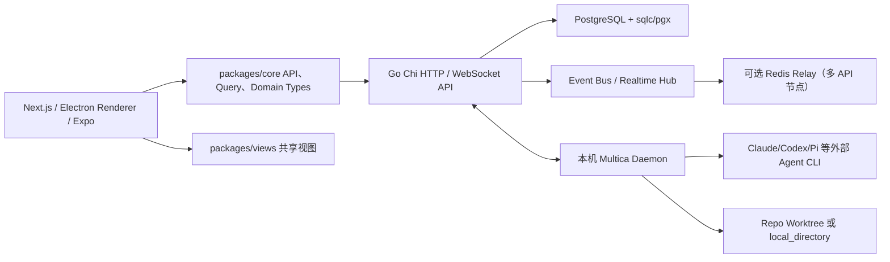
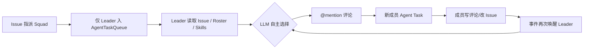
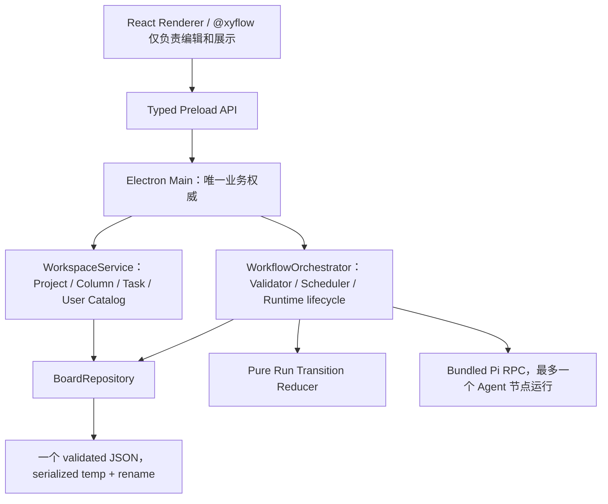

# Multica 源码审计与 Stella 看板设计复核

> 审计日期：2026-07-17（Asia/Shanghai）  
> 审计对象：`multica-ai/multica` 的 `main`、Stella 当前实现与本地 v2 技术方案  
> Multica 固定提交：`002ea0d87949d112d96586bd8b42c779142cf77d`  
> Stella 当前代码固定提交：`fbe2c78e049a08fb9b82b8f14e748292fb3874e1`  
> 结论口径：数据库迁移、当前生成模型、后端服务与路由优先于 README、注释和前端旧类型

## 1. 审计范围、方法与证据分级

本报告不是根据产品宣传、二手文章或界面截图推测 Multica，而是对固定提交的完整仓库树做源码级核查。固定提交可在 [GitHub commit tree](https://github.com/multica-ai/multica/tree/002ea0d87949d112d96586bd8b42c779142cf77d) 和 [GitHub recursive tree API](https://api.github.com/repos/multica-ai/multica/git/trees/002ea0d87949d112d96586bd8b42c779142cf77d?recursive=1) 复核。

审计覆盖：

- Monorepo、Web、桌面、移动端、Go API、Daemon 与 PostgreSQL 的进程边界。
- Project、Issue、ProjectResource、自定义属性和 Kanban 视图。
- Agent、Squad、AgentTaskQueue、任务领取、并发、取消和恢复。
- Autopilot、Issue Stage、所谓 Workflow/DAG/HITL 的真实实现边界。
- 分支上下文、产物传递、Session/Workdir、权限与许可证。
- 上述事实对 Stella 最小可视化 DAG 方案的直接影响。

证据标签采用以下固定含义：

- **[已实现]**：当前生成模型、迁移后的最终结构、路由和运行路径能够互相印证。
- **[占位/路线图]**：只存在注释、保留枚举、未来 target 或 README 意图，当前运行路径不支持。
- **[历史/已移除]**：早期迁移曾加入，但后续迁移明确删除或收窄。
- **[未发现实现]**：在固定提交的迁移、模型、API、前后端类型和依赖中均无一等能力，同时有正向源码证据说明系统不具备它。
- **[推断/建议]**：由源码事实推导出的 Stella 设计建议，不声称为 Multica 已实现能力。

对 DAG 能力另外执行了固定提交全仓字面检索，检索项包括 `@xyflow`、`reactflow`、`WorkflowDefinition`、`workflow_node`、`workflow_edge`、`NodeRun`、`HumanGate`、`approval_request`；排除 lockfile 后产品源码零命中。负向检索不能单独证明不存在，因此本报告同时引用服务端明确写出的“没有声明式工作流模型”和实际 Autopilot/Task schema 作为正向证据。

## 2. 执行摘要

### 2.1 最重要的判断

Multica 当前不是“通用可视化 DAG 工作流平台”。它的真实产品结构是：

```text
固定状态 Issue/Kanban
  + PostgreSQL 持久 Agent 任务队列
  + Squad Leader 提示词与 @mention 事件分发
  + Schedule/Webhook/Manual Autopilot 入口
  + 本地 Daemon 调用多种 Agent CLI
```

它没有一等 `WorkflowDefinition / WorkflowNode / WorkflowEdge / WorkflowRun / NodeRun`，没有图编辑器、分支/汇合调度器，也没有持久化 `HumanGate / ApprovalDecision`。最直接的源码证据是：Multica 自己在 Stage 完成逻辑中写明，服务端“没有声明式工作流模型”，后续阶段由 Agent 动态创建和判断，服务端不能知道流程是否真正结束。[issue_child_done.go L436-L451](https://github.com/multica-ai/multica/blob/002ea0d87949d112d96586bd8b42c779142cf77d/server/internal/handler/issue_child_done.go#L436-L451)

因此：

1. Stella 加入最小可视化 DAG 是合理的产品升级，但属于对 Multica 思想的**简化和延伸**，不是复刻 Multica 已有 DAG。
2. Multica 最值得借鉴的是状态分离、不可变运行快照、任务终态 CAS、恢复语义、Session/Workdir 持久化和工作目录互斥。
3. Multica 最不适合照搬的是多租户、Redis/PostgreSQL 分布式队列、复杂归因、Agent 调用权限、Webhook/Autopilot 和 LLM Leader 自由分发。
4. Stella v2 方案“单机、单用户、一个 JSON、确定性 Team Role、四类 DAG 节点、稳定拓扑串行执行”方向正确，而且比把 Multica 缩小移植更简单。
5. Stella v2 方案仍有四个必须在实现前补齐的 P0 语义：**分支产物输入契约、HumanGate 决策记录、取消/终态节点归档规则、所有异步回调的预期状态 CAS**。

### 2.2 能力真实性总表

| 能力 | Multica 当前状态 | 源码判断 |
|---|---|---|
| Project / Issue | **[已实现]** | Project 是 Issue 容器；Issue 是主要协作对象 |
| Kanban / List / Table / Gantt / Swimlane | **[已实现]** | 多视图与拖拽完整，但业务状态仍以固定七状态为主 |
| 项目自有可编辑列 | **[未作为一等模型实现]** | 可用 workspace Select Property 视觉分组，但不是 Project-owned Columns |
| Project Resource | **[部分实现]** | schema 多态；API 当前只接受 `github_repo` 和 `local_directory` |
| Agent Profile / Runtime | **[已实现]** | 多 CLI Provider，由本地 Daemon 拉起 |
| Squad | **[已实现]** | Leader Agent + Roster + 自由文本角色 + 提示词委派 |
| 固定 Agent 团队流程 | **[未实现]** | Squad 由 Leader LLM 决策，不是确定性 role-to-node 编排 |
| AgentTaskQueue | **[已实现且成熟]** | PostgreSQL 原子 claim、lease、CAS、重试血缘、恢复 |
| Autopilot | **[已实现]** | 触发后创建一个 Issue 或一条 Agent Task |
| Autopilot 通用 DAG | **[未实现]** | Run 只有一个 `issue_id` 或 `task_id`，没有 node/edge |
| Issue Stage | **[已实现]** | 子 Issue 的顺序屏障与父 Agent 唤醒，不是执行图 |
| 可视化 Workflow DAG | **[未发现实现]** | 无图 schema、API、前端依赖或调度器 |
| 分支 / Join Scheduler | **[未发现实现]** | Agent 通过评论、子 Issue 和 stage 自主协调 |
| 持久 NodeRun | **[未发现实现]** | AgentTaskQueue 是单次 Agent 执行，不属于图节点实例 |
| HITL / HumanGate | **[未发现实现]** | blocked/status/comment/cancel 是人工操作点，不是可恢复审批节点 |
| 分支边上的类型化 Artifact | **[未发现实现]** | 共享 Issue 评论、metadata、文件与 workdir，无 per-edge artifact |
| 多用户权限与归因 | **[已实现且复杂]** | Workspace RBAC + view/invoke 分离 + originator/accountable |

## 3. 真实系统架构

### 3.1 Monorepo 与应用边界

**[已实现]** Multica 使用 pnpm workspace/Turborepo，根 workspace 包含 `apps/*` 与 `packages/*`。[pnpm-workspace.yaml L1-L3](https://github.com/multica-ai/multica/blob/002ea0d87949d112d96586bd8b42c779142cf77d/pnpm-workspace.yaml#L1-L3) 根脚本分别启动 Web、Docs、Desktop，并在构建时排除 Mobile。[package.json L7-L26](https://github.com/multica-ai/multica/blob/002ea0d87949d112d96586bd8b42c779142cf77d/package.json#L7-L26)

主要边界如下：



README 的架构图也明确是 Next.js → Go Backend → PostgreSQL，而非桌面单进程本地数据库。[README L157-L177](https://github.com/multica-ai/multica/blob/002ea0d87949d112d96586bd8b42c779142cf77d/README.md#L157-L177)

### 3.2 后端与实时层

**[已实现]** Go server 必须连接 PostgreSQL；连接失败直接退出。[main.go L180-L198](https://github.com/multica-ai/multica/blob/002ea0d87949d112d96586bd8b42c779142cf77d/server/cmd/server/main.go#L180-L198) 启动时同时创建进程内事件总线、WebSocket Hub 和 Daemon Hub。[main.go L201-L205](https://github.com/multica-ai/multica/blob/002ea0d87949d112d96586bd8b42c779142cf77d/server/cmd/server/main.go#L201-L205)

**[已实现]** 未配置 Redis 时实时广播仅支持单 API 节点；配置 Redis 后启用跨节点 relay。[main.go L207-L284](https://github.com/multica-ai/multica/blob/002ea0d87949d112d96586bd8b42c779142cf77d/server/cmd/server/main.go#L207-L284) 后台还运行 Runtime sweeper、heartbeat scheduler、Autopilot failure monitor、Webhook worker 和 DB-backed cron scheduler。[main.go L369-L436](https://github.com/multica-ai/multica/blob/002ea0d87949d112d96586bd8b42c779142cf77d/server/cmd/server/main.go#L369-L436)

**审查判断：**这些都是云端、多 Runtime、多 API 节点所需复杂度，不是 Stella 单机 DAG 的必要条件。Stella 不应因为“参考 Multica”而引入 Go API、PostgreSQL、Redis、后台 lease manager 或独立 Daemon。

### 3.3 Daemon API 是真正的执行边界

**[已实现]** Daemon 不是一个 UI helper，而是独立执行代理。受 DaemonAuth 保护的接口包含注册、心跳、WebSocket、领取任务、启动、等待本地目录、进度、完成、失败、取消确认、孤儿恢复和 Session pinning。[router.go L765-L810](https://github.com/multica-ai/multica/blob/002ea0d87949d112d96586bd8b42c779142cf77d/server/cmd/server/router.go#L765-L810)

这意味着 Multica 的执行状态跨越：

```text
API 数据库状态
  ↔ Daemon 领取/心跳
  ↔ 本地 Agent 子进程
  ↔ Session/Workdir
```

Stella 的 Electron main 已经同时承担本地权威状态与 Pi 子进程生命周期，因此不需要复刻这层网络协议；只需在同一进程内保留相同的状态严谨性。

### 3.4 桌面应用不是完整离线服务

**[已实现]** Desktop 构建脚本打包的是 `server/cmd/multica` CLI/Daemon 二进制，且只为构建机当前平台/架构编译；没有打包完整 Go API + PostgreSQL。[bundle-cli.mjs L1-L14](https://github.com/multica-ai/multica/blob/002ea0d87949d112d96586bd8b42c779142cf77d/apps/desktop/scripts/bundle-cli.mjs#L1-L14) [bundle-cli.mjs L108-L145](https://github.com/multica-ai/multica/blob/002ea0d87949d112d96586bd8b42c779142cf77d/apps/desktop/scripts/bundle-cli.mjs#L108-L145)

**[已实现但不宜借鉴]** Multica Desktop Renderer 明确设置 `sandbox: false`、`webSecurity: false`、`plugins: true`，源码把它记录为主动接受的安全权衡。[apps/desktop/src/main/index.ts L211-L243](https://github.com/multica-ai/multica/blob/002ea0d87949d112d96586bd8b42c779142cf77d/apps/desktop/src/main/index.ts#L211-L243)

**Stella 结论：**不要因为参考 Multica UI 而复制这些 Electron WebPreferences。Stella 应继续使用 typed preload、最小 IPC 面和更严格 Renderer 隔离。

### 3.5 前端状态边界

**[已实现]** Server 数据通过共享 `packages/core` API/Query 层进入各前端；WebSocket token 不放 URL，而是在连接建立后的首条消息发送，减少代理日志和历史记录泄漏。[ws-client.ts L73-L99](https://github.com/multica-ai/multica/blob/002ea0d87949d112d96586bd8b42c779142cf77d/packages/core/api/ws-client.ts#L73-L99)

Kanban 视图偏好由 Zustand/local storage 保存，而 Project/Issue/Task 等业务数据在 PostgreSQL。这个边界很重要：视图分组并不是服务端“看板定义”。

## 4. Project、Issue、Resource 与 Kanban 数据模型

### 4.1 Project 是容器，不是 Board Definition

**[已实现]** Project 初始字段为 title、description、icon、固定状态和 person/agent lead；Issue 通过 nullable `project_id` 归属一个 Project。[034_projects.up.sql L1-L20](https://github.com/multica-ai/multica/blob/002ea0d87949d112d96586bd8b42c779142cf77d/server/migrations/034_projects.up.sql#L1-L20) 当前生成模型后来又包含 priority、start_date、due_date，但仍没有 `columns`、`board_id`、`workflow_id` 或项目级状态定义。[models.go L766-L780](https://github.com/multica-ai/multica/blob/002ea0d87949d112d96586bd8b42c779142cf77d/server/pkg/db/generated/models.go#L766-L780)

官方文档对语义也很清楚：Project 是把多个 Issue 归在一起的容器，一个 Issue 最多属于一个 Project。[issues.mdx L68-L74](https://github.com/multica-ai/multica/blob/002ea0d87949d112d96586bd8b42c779142cf77d/apps/docs/content/docs/issues.mdx#L68-L74)

**对 Stella：**Stella 将 `Project.columns` 设为一等、项目自有、可编辑的数据，比照搬 Multica 固定状态更符合“创建不同类型看板”的用户目标，应保留。

### 4.2 Issue 同时承载协作状态，但不等于 Agent Run

**[已实现]** 初始 Issue 有固定七状态、priority、assignee/creator、parent、acceptance criteria、context refs 和 position。[001_init.up.sql L51-L72](https://github.com/multica-ai/multica/blob/002ea0d87949d112d96586bd8b42c779142cf77d/server/migrations/001_init.up.sql#L51-L72) 当前模型又增加 project、origin、metadata、stage、custom properties 等字段。[models.go L554-L581](https://github.com/multica-ai/multica/blob/002ea0d87949d112d96586bd8b42c779142cf77d/server/pkg/db/generated/models.go#L554-L581)

Issue Dependency 只记录 `blocks / blocked_by / related` 关系。[001_init.up.sql L88-L94](https://github.com/multica-ai/multica/blob/002ea0d87949d112d96586bd8b42c779142cf77d/server/migrations/001_init.up.sql#L88-L94) 它没有：

- 节点执行器。
- 输入输出端口。
- 条件边。
- 分支/汇合调度。
- 每次运行的节点状态。

因此 Issue Dependency 不能直接当 `WorkflowEdge`。

Multica 还主动把 Issue 状态和 Agent Task 状态分开：`StartTask` 与 `CompleteTask` 都明确“不修改 Issue status，由 Agent 通过 CLI 管理”。[task.go L2475-L2493](https://github.com/multica-ai/multica/blob/002ea0d87949d112d96586bd8b42c779142cf77d/server/internal/service/task.go#L2475-L2493) [task.go L2573-L2581](https://github.com/multica-ai/multica/blob/002ea0d87949d112d96586bd8b42c779142cf77d/server/internal/service/task.go#L2573-L2581)

**对 Stella：**`Task.columnId`、`WorkflowRun.status` 和 `NodeRun.status` 必须继续分开。拖卡片只能修改业务列，不能取消、完成或重启 Agent Run。

### 4.3 ProjectResource：schema 可扩展，当前实现很窄

**[已实现]** ProjectResource 数据库设计是 `resource_type + resource_ref JSONB`。迁移注释写明当前 GitHub，未来可扩展 Notion/GDoc/URL/File。[065_project_resources.up.sql L1-L19](https://github.com/multica-ai/multica/blob/002ea0d87949d112d96586bd8b42c779142cf77d/server/migrations/065_project_resources.up.sql#L1-L19)

**[占位/路线图]** 当前 API 只接受：

- `github_repo`
- `local_directory`

未知类型直接报错。[project_resource.go L66-L81](https://github.com/multica-ai/multica/blob/002ea0d87949d112d96586bd8b42c779142cf77d/server/internal/handler/project_resource.go#L66-L81) 所以 Notion/GDoc/URL/File 是迁移注释里的扩展方向，不是已完成连接器。

**[已实现]** `local_directory` 要求绝对路径和 `daemon_id`；服务器接受 POSIX、UNC、Windows drive path 的并集，实际存在性由 Daemon 运行时验证。[project_resource.go L111-L166](https://github.com/multica-ai/multica/blob/002ea0d87949d112d96586bd8b42c779142cf77d/server/internal/handler/project_resource.go#L111-L166) 同一 Project 在每台 Daemon 上最多一个 local directory，不同设备可以有不同路径。[project_resource.go L443-L487](https://github.com/multica-ai/multica/blob/002ea0d87949d112d96586bd8b42c779142cf77d/server/internal/handler/project_resource.go#L443-L487)

**对 Stella：**

- 当前 v2 方案每个 Project 只有一个 managed/external workspace，适合 YAGNI。
- 外部绝对路径只保存在当前安装的本地状态，Task/Run 只引用 `projectId`，是正确的跨 Windows/macOS 做法。
- 如果未来支持“一个项目多个资源/多台设备同步”，再引入 portable definition + machine binding；当前版本无需预先复制 Multica 的多态资源层。

### 4.4 Custom Properties 与“自定义看板”的真实边界

**[已实现]** Multica 新增 workspace 级 Property Definition，Issue 在 JSONB value bag 中按 definition UUID 保存值；类型包括 text、number、select、multi_select、date、checkbox、url。[191_issue_properties.up.sql L1-L29](https://github.com/multica-ai/multica/blob/002ea0d87949d112d96586bd8b42c779142cf77d/server/migrations/191_issue_properties.up.sql#L1-L29) 当前 handler 还限制每 workspace 20 个 active property、每个 select 最多 50 个选项。[property.go L39-L49](https://github.com/multica-ai/multica/blob/002ea0d87949d112d96586bd8b42c779142cf77d/server/internal/handler/property.go#L39-L49)

**[已实现]** Board 可按 status、assignee 或某个 select property 分组。[view-store.ts L12-L20](https://github.com/multica-ai/multica/blob/002ea0d87949d112d96586bd8b42c779142cf77d/packages/core/issues/stores/view-store.ts#L12-L20) 如果持久化的 property 已失效，前端回退到 status 分组。[board-view.tsx L185-L205](https://github.com/multica-ai/multica/blob/002ea0d87949d112d96586bd8b42c779142cf77d/packages/views/issues/components/board-view.tsx#L185-L205)

但分组选择是本地视图偏好：默认 `board + status`，并由 workspace-aware local storage 持久化。[view-store.ts L239-L278](https://github.com/multica-ai/multica/blob/002ea0d87949d112d96586bd8b42c779142cf77d/packages/core/issues/stores/view-store.ts#L239-L278) [view-store.ts L470-L515](https://github.com/multica-ai/multica/blob/002ea0d87949d112d96586bd8b42c779142cf77d/packages/core/issues/stores/view-store.ts#L470-L515)

官方文档仍说明 Issue 有固定七状态，而且任意状态可以直接跳到任意状态，Multica“不强制工作流”。[issues.mdx L22-L36](https://github.com/multica-ai/multica/blob/002ea0d87949d112d96586bd8b42c779142cf77d/apps/docs/content/docs/issues.mdx#L22-L36)

**结论：**Multica 可以用 Select Property 做出不同视觉列，但这仍是 workspace 属性目录 + 本地 View Preference，不是项目拥有的命名看板、列定义或可执行流程。Stella 不应为了支持“软件、研究、内容、个人”等看板而引入通用 Custom Field Engine；`Project.columns` 已经是更简单、更直接的模型。

## 5. Agent、Squad 与任务分发

### 5.1 Agent 是可配置 Runtime Profile

**[已实现]** Agent 最初包含 runtime mode/config、visibility、status、max concurrency 和 owner，后续又增加 runtime binding、instructions、custom env/args、MCP config、model、thinking、permission mode 等。[001_init.up.sql L35-L49](https://github.com/multica-ai/multica/blob/002ea0d87949d112d96586bd8b42c779142cf77d/server/migrations/001_init.up.sql#L35-L49) 当前 `AgentTaskQueue` 会把实际 Runtime、Session、Workdir、触发来源、重试血缘、Squad 与归因一起持久化。[models.go L92-L151](https://github.com/multica-ai/multica/blob/002ea0d87949d112d96586bd8b42c779142cf77d/server/pkg/db/generated/models.go#L92-L151)

Multica 的 Agent 与 Stella Agent Catalog 有相似之处：名字、说明、模型、thinking、工具/扩展配置都可快照。但 Multica Agent 同时是多用户权限对象、远端任务领取目标和成本归因主体，这些部分不适合 Stella。

### 5.2 Squad 数据结构

**[已实现]** Squad 必须绑定一个 Leader Agent；成员可以是 Agent 或 Human Member，`role` 是自由文本，Issue assignee 扩展为 squad。[084_squad.up.sql L1-L33](https://github.com/multica-ai/multica/blob/002ea0d87949d112d96586bd8b42c779142cf77d/server/migrations/084_squad.up.sql#L1-L33) 当前生成模型也只有 leader、instructions 和 member role，没有节点、边、固定任务序列或角色执行规则。[models.go L836-L858](https://github.com/multica-ai/multica/blob/002ea0d87949d112d96586bd8b42c779142cf77d/server/pkg/db/generated/models.go#L836-L858)

### 5.3 Squad 的真实执行语义

**[已实现]** Issue 指派给 Squad 后，系统真正入队的是 Leader Agent 的一条 task；backlog 是停车场，不立即执行，并有 pending task 去重。[issue.go L481-L572](https://github.com/multica-ai/multica/blob/002ea0d87949d112d96586bd8b42c779142cf77d/server/internal/service/issue.go#L481-L572) 任务带 `is_leader_task=true` 与 `squad_id`，以便 Daemon 注入 Leader briefing。[task.go L1070-L1095](https://github.com/multica-ai/multica/blob/002ea0d87949d112d96586bd8b42c779142cf77d/server/internal/service/task.go#L1070-L1095)

Leader briefing 的核心规则是：

1. Leader 阅读 Issue、评论、附件和 Roster。
2. 根据成员 role/skills 自主选择成员。
3. 通过精确 `@mention` 评论触发成员。
4. 记录 `action / no_action / failed` 评估。
5. 分发后停止；新评论或成员完成会重新唤醒 Leader。

这些行为直接写在硬编码的 Operating Protocol 中。[squad_briefing.go L12-L97](https://github.com/multica-ai/multica/blob/002ea0d87949d112d96586bd8b42c779142cf77d/server/internal/handler/squad_briefing.go#L12-L97) Roster 是运行时拼进 prompt 的文本，包含 Leader、成员、角色、技能与可复制 mention。[squad_briefing.go L99-L175](https://github.com/multica-ai/multica/blob/002ea0d87949d112d96586bd8b42c779142cf77d/server/internal/handler/squad_briefing.go#L99-L175) Leader 的评估结果记录到统一 activity log，并验证只能由该 Squad Leader 对该 Issue/Task 写入。[squad.go L883-L980](https://github.com/multica-ai/multica/blob/002ea0d87949d112d96586bd8b42c779142cf77d/server/internal/handler/squad.go#L883-L980)

真实流程因此是：



它不是：

```text
Graph Validator
  -> deterministic Scheduler
  -> Node A
  -> Node B/C
  -> Join
  -> Human Gate
```

**对 Stella：**

- 可借鉴 Agent Profile、Team 名称、Role label 和 Instructions。
- 不应借鉴 Leader LLM 作为固定流程路由器。
- Stella `TeamRole.agentId` 的确定性映射更适合固化“规划→调研→实现→验收”等流程。
- 如果未来单独加入“自主 Squad 模式”，也应作为另一种执行模式，不应改变确定性 DAG 的语义。

## 6. AgentTaskQueue：Multica 最值得借鉴的部分

### 6.1 Task Row 同时是队列项和执行尝试

**[已实现]** 当前 AgentTaskQueue 持久化：

- 生命周期：status、priority、dispatched/started/completed timestamps。
- 结果：result、error、failure_reason。
- 执行上下文：context、runtime_id、session_id、work_dir。
- Lease：prepare_lease_expires_at、wait_reason。
- 重试/重跑/委派：attempt、max_attempts、parent/retry/rerun/delegated IDs。
- 来源：Issue、Chat、Autopilot、Comment、Squad。
- 多用户审计：originator、accountable user、evidence kind/ref。

生成模型可直接复核完整字段。[models.go L92-L151](https://github.com/multica-ai/multica/blob/002ea0d87949d112d96586bd8b42c779142cf77d/server/pkg/db/generated/models.go#L92-L151)

Stella 不需要复制五十多个字段，但应该学习“一次尝试是一条不可变历史记录”的原则。失败后新建 Run，而不是把旧 Run 改回 queued；这与 Stella v2 取消自动 retry 的决定一致。

### 6.2 原子 Claim 与并发

**[已实现]** `ClaimAgentTask` 使用 `FOR UPDATE SKIP LOCKED`，按 priority DESC、created_at ASC 领取；同一 agent + issue/chat session 串行，但不同 Agent 可以在同一 Issue 上并行。[agent.sql L445-L483](https://github.com/multica-ai/multica/blob/002ea0d87949d112d96586bd8b42c779142cf77d/server/pkg/db/queries/agent.sql#L445-L483)

TaskService 在事务内锁 Agent、统计 running 数，并与 `max_concurrent_tasks` 比较后 claim。[task.go L1985-L2067](https://github.com/multica-ai/multica/blob/002ea0d87949d112d96586bd8b42c779142cf77d/server/internal/service/task.go#L1985-L2067)

**对 Stella：**单机串行 DAG 不需要数据库 `SKIP LOCKED`。等价的最小约束是：

- 所有 Run/Node 状态修改进入一个 serialized repository update。
- 每次调度只允许一个 `AgentRole NodeRun` 进入 running。
- 领取必须检查“最新持久状态仍为 pending/ready + 当前 Run 非终态”。
- Runtime callback 必须带 `runId + nodeId + runtimeToken + expectedStatus`。

### 6.3 Claim 丢响应与 CAS

**[已实现]** Claim payload finalization 失败时，Multica 用 `task_id + runtime_id + dispatched_at + expected status` 做 CAS，只回滚那一代 claim，避免旧 handler 把后来重新领取的任务退回队列。[agent.sql L510-L526](https://github.com/multica-ai/multica/blob/002ea0d87949d112d96586bd8b42c779142cf77d/server/pkg/db/queries/agent.sql#L510-L526) 丢失 claim response 的 `dispatched` 任务可在 prepare lease 过期后重新投递。[agent.sql L528-L572](https://github.com/multica-ai/multica/blob/002ea0d87949d112d96586bd8b42c779142cf77d/server/pkg/db/queries/agent.sql#L528-L572)

这套“执行代次”思想比具体 SQL 更值得 Stella 借鉴：`runtimeToken` 就是本地版 generation/lease。只凭 `runId` 不够，因为同一个 Run 中后续节点或异步 settle 可能晚到。

### 6.4 Waiting、Start 与完成 CAS

**[已实现]** Task 在 Daemon 准备阶段可以从 dispatched 进入 `waiting_local_directory`，获得目录锁后再进入 running；Start 只接受 dispatched/waiting，Complete 只接受 running。[agent.sql L574-L623](https://github.com/multica-ai/multica/blob/002ea0d87949d112d96586bd8b42c779142cf77d/server/pkg/db/queries/agent.sql#L574-L623)

**[已实现]** Complete 与 Chat resume pointer 在同一事务；重复或迟到 terminal callback 如果更新不到 running row，会读取现有 task 并按幂等成功返回，绝不把 cancelled/failed 恢复成 completed。[task.go L2573-L2665](https://github.com/multica-ai/multica/blob/002ea0d87949d112d96586bd8b42c779142cf77d/server/internal/service/task.go#L2573-L2665)

**对 Stella：**HumanGate waiting 与资源等待不是一回事。Stella v2 只保留可跨重启的 `waiting = current snapshotted HumanGate`，是合理简化；缺目录、无权限、Pi 启动失败都应显式 fail，不应悄悄塞进一个通用 waiting。

### 6.5 Session、Workdir 与恢复

**[已实现]** 任务运行中会 pin `session_id/work_dir`；失败任务如果 failure reason 属于可恢复类别，下一次自动 retry 可以恢复 Session。已知污染 Session 的错误会被排除。[agent.sql L625-L677](https://github.com/multica-ai/multica/blob/002ea0d87949d112d96586bd8b42c779142cf77d/server/pkg/db/queries/agent.sql#L625-L677) 失败时也通过 COALESCE 保留中途建立的 Session/Workdir。[agent.sql L691-L720](https://github.com/multica-ai/multica/blob/002ea0d87949d112d96586bd8b42c779142cf77d/server/pkg/db/queries/agent.sql#L691-L720)

**[已实现]** Daemon 重启后不会假装继续旧 OS 进程，而是把该 Runtime 仍处于 dispatched/running/waiting_local_directory 的 row 统一标为 `failed + runtime_recovery`，再交给 retry 路径。[agent.sql L722-L737](https://github.com/multica-ai/multica/blob/002ea0d87949d112d96586bd8b42c779142cf77d/server/pkg/db/queries/agent.sql#L722-L737)

**对 Stella：**v2 方案“启动时 queued/running → interrupted；只有 HumanGate waiting 保留”比尝试恢复未知 Pi 子进程更可靠，应保留。Session path 可以作为历史产物，但 v2 不需要自动续跑。

### 6.6 本地目录锁

**[已实现]** Multica 在 Daemon 内以 real path 为 key，锁覆盖 task prepare、context 写入、Agent 执行和结果回报的整个生命周期，而不只是子进程运行时间。[local_directory.go L355-L376](https://github.com/multica-ai/multica/blob/002ea0d87949d112d96586bd8b42c779142cf77d/server/internal/daemon/local_directory.go#L355-L376) Acquire 可取消，释放幂等。[local_directory.go L399-L492](https://github.com/multica-ai/multica/blob/002ea0d87949d112d96586bd8b42c779142cf77d/server/internal/daemon/local_directory.go#L399-L492)

**对 Stella：**v2 已规定全局最多一个 Agent Role 运行，因而天然比 per-project lock 更严格。MVP 不需要 writer queue/map；全局串行执行器已经消除两个 Agent 同写工作区的风险。

## 7. 取消与终态语义

### 7.1 Issue Cancel 不等于 Task Cancel

**[已实现]** Multica 刻意取消“Issue status flip 隐式停止所有 run”的行为；只有删除 Issue 等生命周期清理路径才批量取消 task。源码明确要求不要重新加入 status-driven cancel。[task.go L1598-L1623](https://github.com/multica-ai/multica/blob/002ea0d87949d112d96586bd8b42c779142cf77d/server/internal/service/task.go#L1598-L1623)

这再次证明业务状态与执行状态必须分离。Stella 用户把卡片拖到某个业务列，不应隐式 kill Pi；“中止 Run”必须是单独命令。

### 7.2 Server 先持久终态，Daemon 再停止进程

**[已实现]** `CancelAgentTask` 仅允许 active states → cancelled。[agent.sql L841-L845](https://github.com/multica-ai/multica/blob/002ea0d87949d112d96586bd8b42c779142cf77d/server/pkg/db/queries/agent.sql#L841-L845) 重复 cancel 读回现有终态并幂等返回，然后广播取消。[task.go L1713-L1758](https://github.com/multica-ai/multica/blob/002ea0d87949d112d96586bd8b42c779142cf77d/server/internal/service/task.go#L1713-L1758)

Daemon 通过轮询/WS reconcile 发现 server 已是 completed/failed/cancelled 或 row 已不存在，然后中断本地 Agent；网络抖动本身不会杀掉运行。[daemon.go L2993-L3065](https://github.com/multica-ai/multica/blob/002ea0d87949d112d96586bd8b42c779142cf77d/server/internal/daemon/daemon.go#L2993-L3065)

正确顺序是：

```text
持久化 terminal cancelled
  -> 从 active runtime registry 注销/失效 token
  -> 请求停止 Pi
  -> 晚到 callback 因 terminal CAS/token 不匹配被拒绝
```

Stella 当前 v1 `abort` 先删除 active runtime、等待 `runtime.stop()`，之后才写 interrupted；同时 settle/fail commit 缺少 expected-status guard，存在 late callback 与 abort 互相覆盖的竞态。[Stella workflow-orchestrator.ts L238-L275](https://github.com/ZY-LI-F/stella-pi-workbench/blob/fbe2c78e049a08fb9b82b8f14e748292fb3874e1/src/main/workflow-orchestrator.ts#L238-L275) [Stella workflow-orchestrator.ts L475-L590](https://github.com/ZY-LI-F/stella-pi-workbench/blob/fbe2c78e049a08fb9b82b8f14e748292fb3874e1/src/main/workflow-orchestrator.ts#L475-L590)

这是当前实现的真实 P0，而 v2 方案第 327-332 行提出的 terminal transition + token + stale diagnostic 正是根因修复方向。实现时必须把“先提交终态再停进程”写成测试可验证的不变量。

## 8. Autopilot、Issue Stage 与 DAG/HITL 的硬边界

### 8.1 Autopilot 是 Trigger，不是 Workflow Definition

**[已实现]** 初始 Autopilot schema 表达：

- 一个 automation definition。
- 一个 schedule/webhook/api trigger。
- 一条 run。
- run 最多关联一个 `issue_id` 或 `task_id`。

它没有 node、edge、node run 或 graph snapshot。[042_autopilot.up.sql L3-L69](https://github.com/multica-ai/multica/blob/002ea0d87949d112d96586bd8b42c779142cf77d/server/migrations/042_autopilot.up.sql#L3-L69)

**[历史/已移除]** 初始 migration 曾有 `concurrency_policy = skip/queue/replace`，但下一次 migration 明确说明三种实现都有问题并删除该列；同时清理 orphan run 和 legacy pending/skipped。[043_fix_orphaned_autopilot_runs.up.sql L1-L30](https://github.com/multica-ai/multica/blob/002ea0d87949d112d96586bd8b42c779142cf77d/server/migrations/043_fix_orphaned_autopilot_runs.up.sql#L1-L30) 后来 `skipped` 仅作为“Runtime 离线而主动拒绝 dispatch”的终态重新加入，不代表恢复并发策略。[079_autopilot_run_skipped_status.up.sql L1-L16](https://github.com/multica-ai/multica/blob/002ea0d87949d112d96586bd8b42c779142cf77d/server/migrations/079_autopilot_run_skipped_status.up.sql#L1-L16)

当前生成模型中 Autopilot 已经没有 concurrency_policy；AutopilotRun 仍只是 source/status/issue/task/payload/result 等单层记录。[models.go L176-L230](https://github.com/multica-ai/multica/blob/002ea0d87949d112d96586bd8b42c779142cf77d/server/pkg/db/generated/models.go#L176-L230)

### 8.2 Autopilot 的两条真实执行路径

**[已实现]** 核心入口明说：每次 dispatch 创建一条 run，然后根据 execution mode “创建 Issue 或直接 enqueue Agent Task”。[autopilot.go L96-L127](https://github.com/multica-ai/multica/blob/002ea0d87949d112d96586bd8b42c779142cf77d/server/internal/service/autopilot.go#L96-L127)

`create_issue`：

1. 创建一个 todo Issue。
2. 把 AutopilotRun 链接到该 Issue。
3. 走已有 Issue assignment → Agent/Squad Leader queue 路径。

[autopilot.go L619-L750](https://github.com/multica-ai/multica/blob/002ea0d87949d112d96586bd8b42c779142cf77d/server/internal/service/autopilot.go#L619-L750)

`run_only`：

1. 解析目标 Agent 或 Squad Leader。
2. 创建一条 `AgentTaskQueue`。
3. 把 AutopilotRun 的 `task_id` 指向该 row。

[autopilot.go L852-L955](https://github.com/multica-ai/multica/blob/002ea0d87949d112d96586bd8b42c779142cf77d/server/internal/service/autopilot.go#L852-L955)

Run 的最终状态只是从 linked Issue 或 Task 同步而来。[autopilot.go L958-L1045](https://github.com/multica-ai/multica/blob/002ea0d87949d112d96586bd8b42c779142cf77d/server/internal/service/autopilot.go#L958-L1045)

**结论：**Autopilot 是 trigger/admission/audit layer，不是 graph executor。Stella 的固定流程模板已经承担用户当前要的“固化流程”，MVP 无需 schedule、webhook、cron 或 Autopilot。

### 8.3 Autopilot Rule Version 值得借鉴，但不是 Workflow Version

**[已实现]** Autopilot 后来加入 append-only `autopilot_rule_version`，保存 publisher 和 effective config summary，以便每次自动触发有准确的人类责任归属。[186_autopilot_rule_version.up.sql L1-L43](https://github.com/multica-ai/multica/blob/002ea0d87949d112d96586bd8b42c779142cf77d/server/migrations/186_autopilot_rule_version.up.sql#L1-L43)

这不是可执行图版本；但“运行时冻结配置而不继续引用可变编辑态”的思想完全适合 Stella。Stella v2 的 `workflowSnapshot + teamSnapshot + agentSnapshots + executionOrder` 已经采用更直接的本地实现，无需再造单独 WorkflowVersion 表。

### 8.4 Issue Stage 是 Barrier，不是 DAG Stage Engine

**[已实现]** `issue.stage` 是 parent 下 sibling sub-issues 的 1-based barrier group；最低未完成 stage 全部到达 done/cancelled 后，才通知或唤醒 parent assignee。[123_issue_stage.up.sql L1-L15](https://github.com/multica-ai/multica/blob/002ea0d87949d112d96586bd8b42c779142cf77d/server/migrations/123_issue_stage.up.sql#L1-L15)

但服务器不创建“下一节点”。源代码明确说 stage 常由 Agent 懒创建，服务器无法区分“暂无下个 stage”和“流程真正结束”。[issue_child_done.go L436-L451](https://github.com/multica-ai/multica/blob/002ea0d87949d112d96586bd8b42c779142cf77d/server/internal/handler/issue_child_done.go#L436-L451)

所以 Stage 最多可以启发 Stella 的 “fan-in 所有 predecessor succeeded 才 ready”，不能替代 Node/Edge/Run。

### 8.5 通用可视化 DAG：当前没有

**[未发现实现]** 固定提交中没有：

- `WorkflowDefinition`、`WorkflowGraph`。
- `WorkflowNode`、`WorkflowEdge`。
- `WorkflowRun`、`NodeRun`。
- 图保存/校验/拓扑排序 API。
- branch/join scheduler。
- `@xyflow/react` 或 React Flow 产品依赖。

这一负向结果由三个正向证据加固：

1. Issue 文档明确说系统不强制 workflow。[issues.mdx L22-L36](https://github.com/multica-ai/multica/blob/002ea0d87949d112d96586bd8b42c779142cf77d/apps/docs/content/docs/issues.mdx#L22-L36)
2. Stage 服务明确说没有 declarative workflow model。[issue_child_done.go L436-L451](https://github.com/multica-ai/multica/blob/002ea0d87949d112d96586bd8b42c779142cf77d/server/internal/handler/issue_child_done.go#L436-L451)
3. Autopilot 与 AgentTask 当前模型只有单 Issue/Task 关系，没有 node/edge。[models.go L92-L151](https://github.com/multica-ai/multica/blob/002ea0d87949d112d96586bd8b42c779142cf77d/server/pkg/db/generated/models.go#L92-L151) [models.go L176-L230](https://github.com/multica-ai/multica/blob/002ea0d87949d112d96586bd8b42c779142cf77d/server/pkg/db/generated/models.go#L176-L230)

不能把这些对象误称为 DAG：

| Multica 对象 | 真实语义 | 不等于 |
|---|---|---|
| IssueDependency | blocks/related 工作项关系 | WorkflowEdge |
| parent/child Issue | 工作分解树 | Graph scheduler |
| Issue.stage | sibling barrier + parent wake | Node stage engine |
| Squad | Leader prompt + mention delegation | Deterministic Agent DAG |
| AgentTaskQueue | 单次 Agent 执行/队列记录 | NodeRun graph |
| Autopilot | Trigger → one Issue/Task | WorkflowDefinition |
| AutopilotRun | 一次自动触发审计 | Generic WorkflowRun |

### 8.6 HITL：人工参与存在，一等 HumanGate 不存在

**[未发现实现]** 没有 ApprovalRequest、ApprovalDecision、HumanGate、Reviewer、Gate timeout/escalation 等持久化实体或 API。

当前最接近人工控制的是：

- 人工评论。
- 手动改 Issue status/assignee。
- Issue `blocked`。
- Agent task cancel/rerun。
- Agent 因需要人类输入而以 `agent_blocked` 失败。

`agent_blocked` 在 failure classifier 中是一个 failure reason，不是可以重启后继续的 waiting node。[failure.go L89-L92](https://github.com/multica-ai/multica/blob/002ea0d87949d112d96586bd8b42c779142cf77d/server/pkg/taskfailure/failure.go#L89-L92)

Provider 内部（例如 Codex）出现的工具审批也只是某个 Agent CLI 的运行协议，不是 Multica 看板上的持久 HumanGate。

**对 Stella：**HumanGate 是 Stella 真正新增的核心能力，必须有自己明确、可恢复、可审计的 Decision 数据，而不能复用 business blocked 或 error string。

## 9. 分支上下文、产物与“交接”的实际机制

### 9.1 Multica 传递的是共享上下文，不是 Graph Edge Artifact

**[已实现]** Daemon 为每次 task 构造 `TaskContextForEnv`，内容包含 Issue、触发评论、Agent、Skills、Repos、Project、ProjectResource、Autopilot、handoff note、workspace context 等。[execenv.go L87-L140](https://github.com/multica-ai/multica/blob/002ea0d87949d112d96586bd8b42c779142cf77d/server/internal/daemon/execenv/execenv.go#L87-L140)

**[已实现]** 工作目录中会写 `.agent_context/issue_context.md`、skills，以及 `.multica/project/resources.json`。[context.go L143-L195](https://github.com/multica-ai/multica/blob/002ea0d87949d112d96586bd8b42c779142cf77d/server/internal/daemon/execenv/context.go#L143-L195) [context.go L272-L312](https://github.com/multica-ai/multica/blob/002ea0d87949d112d96586bd8b42c779142cf77d/server/internal/daemon/execenv/context.go#L272-L312)

**[已实现]** Agent 被提示在进入任务时读取 Issue、metadata 和 recent comments，退出时把重要结果写评论或少量 metadata；Project description/resources 也会注入 brief。[runtime_config_sections.go L258-L317](https://github.com/multica-ai/multica/blob/002ea0d87949d112d96586bd8b42c779142cf77d/server/internal/daemon/execenv/runtime_config_sections.go#L258-L317) [runtime_config_sections.go L375-L424](https://github.com/multica-ai/multica/blob/002ea0d87949d112d96586bd8b42c779142cf77d/server/internal/daemon/execenv/runtime_config_sections.go#L375-L424)

所以 Multica 的交接渠道是：

- Issue description / acceptance criteria。
- Comments 与 @mention。
- Issue metadata。
- Child Issues / stage。
- 同一 repo/workdir 中的真实文件。
- Agent Session。
- Project Resource pointers。

这些是“共享协作状态”，不是：

- `edge.inputMapping`。
- `fromNode.output → toNode.input`。
- typed artifact。
- join 时的 deterministic merge。
- 每条边独立的持久 payload。

### 9.2 Stella 必须补上最小分支输入契约

Stella v2 方案已经定义 `NodeRun.output` 和 `artifacts[]`，也规定 predecessor 全成功后节点才 ready；但尚未明确“一个 Agent Role 节点究竟收到哪些上游产物，以及顺序如何”。

这是当前方案最重要的语义缺口。若继续沿用 v1 “把所有已完成步骤的 artifact 全部拼入 prompt”，在 DAG 中会产生两个问题：

1. 分支 B 可能看到不属于其祖先链的分支 A 产物，图的边失去语义。
2. Fan-in 时不同 predecessor 的输出合并顺序不明确，重放可能产生不同 prompt。

v1 当前确实把 run 中所有有 artifact 的步骤按数组顺序拼接为“上游产物”。[Stella workflow-orchestrator.ts L593-L619](https://github.com/ZY-LI-F/stella-pi-workbench/blob/fbe2c78e049a08fb9b82b8f14e748292fb3874e1/src/main/workflow-orchestrator.ts#L593-L619)

**P0 规则建议：**

```text
AgentRole input =
  Task title/description/acceptance criteria
  + snapshotted Agent/Role objective
  + 仅直接 predecessor 的 succeeded output/artifacts
  + predecessor 按 Run.executionOrder 排序
  + 当前 Project workspace 中的文件
```

对 fan-in 节点，所有直接 predecessor 都必须 succeeded，并按 persisted executionOrder 合并。若需要跨多层完整背景，由 predecessor 的独立产物负责总结；不要隐式把所有祖先和旁支全部灌入 prompt。这个规则简单、确定、可测试，也真正让边具有交接含义。

Artifact 建议保持最小：

```ts
type Artifact = {
  id: string
  kind: "text" | "file"
  title: string
  content?: string
  relativePath?: string
}
```

`file.relativePath` 必须是相对 Project workspace 的路径；不要把另一台电脑无效的绝对路径快照进可移植定义。v2 若只需要 text 产物，也可以先只支持 `text`，不要预先做 Artifact Registry。

## 10. Pi Runtime 集成审查

### 10.1 Multica 的 Pi 适配

**[已实现]** Multica Daemon 探测 `MULTICA_PI_PATH` 或全局 `pi`，如果所有 Agent CLI 都不在 PATH 则启动配置失败。[config.go L277-L343](https://github.com/multica-ai/multica/blob/002ea0d87949d112d96586bd8b42c779142cf77d/server/internal/daemon/config.go#L277-L343)

**[已实现]** Pi backend 通过 `pi -p --mode json --session <path>` 以非交互 JSON event stream 运行。[pi.go L17-L19](https://github.com/multica-ai/multica/blob/002ea0d87949d112d96586bd8b42c779142cf77d/server/pkg/agent/pi.go#L17-L19) 它用 `exec.LookPath` 找 binary，以 session file path 作为 resume id，启动子进程后关闭 stdin。[pi.go L176-L243](https://github.com/multica-ai/multica/blob/002ea0d87949d112d96586bd8b42c779142cf77d/server/pkg/agent/pi.go#L176-L243)

**[已实现]** 适配器解析 text/thinking/tool/usage/error 事件；context cancel 记为 aborted。[pi.go L248-L389](https://github.com/multica-ai/multica/blob/002ea0d87949d112d96586bd8b42c779142cf77d/server/pkg/agent/pi.go#L248-L389) Daemon 屏蔽会破坏协议的自定义 flags，并把 session JSONL 放在 `~/.multica/pi-sessions`。[pi.go L475-L576](https://github.com/multica-ai/multica/blob/002ea0d87949d112d96586bd8b42c779142cf77d/server/pkg/agent/pi.go#L475-L576)

### 10.2 文档漂移

官方 Runtime 文档正确说明 CLI 必须在 PATH，且 API keys/工具留在本机。[install-agent-runtime.mdx L15-L24](https://github.com/multica-ai/multica/blob/002ea0d87949d112d96586bd8b42c779142cf77d/apps/docs/content/docs/install-agent-runtime.mdx#L15-L24)

但同一文档把 Pi 标成 “Inflection AI” 并链接 pi.ai。[install-agent-runtime.mdx L143-L151](https://github.com/multica-ai/multica/blob/002ea0d87949d112d96586bd8b42c779142cf77d/apps/docs/content/docs/install-agent-runtime.mdx#L143-L151) 实际 backend 所期待的 flags/event protocol 与源码内部引用的 `badlogic/pi-mono` coding-agent skills 文档一致。[local_skills.go L97](https://github.com/multica-ai/multica/blob/002ea0d87949d112d96586bd8b42c779142cf77d/server/internal/daemon/local_skills.go#L97)

**结论：**这是官方文档漂移；审计 Pi 行为应以 backend 源码为准。

### 10.3 Stella 的做法更适合安装包

Stella 当前 `PiRpcRuntime` 由依赖注入的 Electron executable path + bundled RPC entry 启动，不依赖接收者全局 PATH；启动前验证 cwd，停止时 SIGTERM 后升级 SIGKILL，并按 request id 管理 RPC promise。[Stella pi-rpc-runtime.ts L1-L70](https://github.com/ZY-LI-F/stella-pi-workbench/blob/fbe2c78e049a08fb9b82b8f14e748292fb3874e1/src/main/pi-rpc-runtime.ts#L1-L70) [Stella pi-rpc-runtime.ts L91-L156](https://github.com/ZY-LI-F/stella-pi-workbench/blob/fbe2c78e049a08fb9b82b8f14e748292fb3874e1/src/main/pi-rpc-runtime.ts#L91-L156)

**对 Stella：**继续打包 `@earendil-works/pi-coding-agent` 及生产依赖，并在每台电脑只重新绑定 Project workspace。不要改为 Multica 的“探测用户全局 pi CLI”，否则会重新引入用户最初担心的安装位置差异。

## 11. 权限、安全与多租户

### 11.1 Workspace RBAC

**[已实现]** 基础角色为 owner/admin/member。[001_init.up.sql L25-L33](https://github.com/multica-ai/multica/blob/002ea0d87949d112d96586bd8b42c779142cf77d/server/migrations/001_init.up.sql#L25-L33) 受保护 API 先过 Auth，再按 member/admin/owner 做 workspace scope。[router.go L812-L895](https://github.com/multica-ai/multica/blob/002ea0d87949d112d96586bd8b42c779142cf77d/server/cmd/server/router.go#L812-L895)

**[已实现]** per-task/per-chat WebSocket scope 还会检查资源属于 caller workspace；Chat 只允许 creator 订阅。[scope_authorizer.go L21-L95](https://github.com/multica-ai/multica/blob/002ea0d87949d112d96586bd8b42c779142cf77d/server/cmd/server/scope_authorizer.go#L21-L95)

### 11.2 Agent 查看权限与调用权限分开

**[已实现]** 迁移 130 将 Agent invoke 从 legacy visibility 拆成：

- `private`：只允许 Agent owner invoke，admin 不绕过。
- `public_to`：workspace/member allow-list。
- `team` target：可存储但 V1 不生效。

[130_agent_invocation_permission.up.sql L1-L26](https://github.com/multica-ai/multica/blob/002ea0d87949d112d96586bd8b42c779142cf77d/server/migrations/130_agent_invocation_permission.up.sql#L1-L26) [130_agent_invocation_permission.up.sql L31-L69](https://github.com/multica-ai/multica/blob/002ea0d87949d112d96586bd8b42c779142cf77d/server/migrations/130_agent_invocation_permission.up.sql#L31-L69)

**[占位/路线图]** `target_type=team` 明确是 future concept，当前 permission evaluator 对它 fail closed。[agent_access.go L90-L107](https://github.com/multica-ai/multica/blob/002ea0d87949d112d96586bd8b42c779142cf77d/server/internal/handler/agent_access.go#L90-L107)

**[已实现]** A2A invoke 以调用链顶端的人类 originator 为准，防止 Agent 绕过另一个 Agent owner 的 allow-list。[agent_access.go L12-L64](https://github.com/multica-ai/multica/blob/002ea0d87949d112d96586bd8b42c779142cf77d/server/internal/handler/agent_access.go#L12-L64) 查看 private Agent 则允许 workspace owner/admin，和 invoke 是两套判断。[agent_access.go L110-L177](https://github.com/multica-ai/multica/blob/002ea0d87949d112d96586bd8b42c779142cf77d/server/internal/handler/agent_access.go#L110-L177)

官方 roles 文档仍写 private Agent 可由 owner/admin 指派。[members-roles.mdx L8-L25](https://github.com/multica-ai/multica/blob/002ea0d87949d112d96586bd8b42c779142cf77d/apps/docs/content/docs/members-roles.mdx#L8-L25) 这与当前 migration/backend 的“admin 不能 invoke owner 以外 private agent”不一致，属于文档漂移，当前后端行为优先。

**对 Stella：**本地单用户产品无需 RBAC、originator/accountable 双归因、A2A permission waterfall 或 member allow-list。保留：

- Renderer 不能直接写文件/启动任意命令。
- Main process 重新校验 Project path/trust。
- Workflow/Team/Agent 引用在 dispatch 时校验并快照。
- Artifact 相对路径边界。

这已经覆盖 Stella 当前风险，不要借多租户权限系统制造复杂性。

## 12. 扩展性边界

Multica 的扩展能力主要有四类：

1. **Provider backend**：Go interface + switch 注册不同 CLI。[agent.go L209-L249](https://github.com/multica-ai/multica/blob/002ea0d87949d112d96586bd8b42c779142cf77d/server/pkg/agent/agent.go#L209-L249)
2. **ProjectResource**：free string + JSONB schema，但 API allow-list 决定真实支持类型。
3. **Skills/MCP/Connected Apps**：运行时上下文注入，不等于 workflow node plugin。
4. **Autopilot trigger**：schedule/webhook/manual，仍只落一个 Issue/Task。

这些都不是“插件化 DAG Node SDK”。Stella v2 把 node kind 固定为 Start、Agent Role、Human Gate、End 符合 YAGNI。若未来新增 condition/loop/tool node，应单独升级 schema，而不是先放任 `config: Record<string, unknown>` 承载未定义语义。

## 13. 许可证边界

### 13.1 不是无附加条件的 Apache 2.0

Multica 根 LICENSE 自称 “modified Apache License 2.0”，但附加了：

- 未经书面授权，不得把 Multica 源码用于向第三方提供 hosted service。
- 不得作为商业出售/许可产品的 embedded component。
- 使用 `apps/web` frontend 时不得移除或修改 logo/copyright。

[LICENSE L1-L30](https://github.com/multica-ai/multica/blob/002ea0d87949d112d96586bd8b42c779142cf77d/LICENSE#L1-L30) 贡献者条款和“其余遵循 Apache 2.0”在后半部分。[LICENSE L32-L44](https://github.com/multica-ai/multica/blob/002ea0d87949d112d96586bd8b42c779142cf77d/LICENSE#L32-L44)

Desktop package 自身还标记 `"license": "UNLICENSED"`。[apps/desktop/package.json L1-L18](https://github.com/multica-ai/multica/blob/002ea0d87949d112d96586bd8b42c779142cf77d/apps/desktop/package.json#L1-L18)

### 13.2 对 Stella 的约束

本报告只建议学习公开源码体现的架构思想和状态机原则，不建议复制 Multica 代码、前端资产、Logo、文本协议或把 Multica 作为组件嵌入 Stella。

Stella 若作为 GitHub 公共仓库发布：

- 必须选择并提交自己的 LICENSE。
- README 不应暗示 Multica 官方授权或兼容。
- 可以在“设计参考/致谢”中链接 Multica，但不要把其 modified license 当作普通 Apache 2.0。
- 若计划复制具体实现或商业分发包含其代码，应单独做许可证/法律审查。

这部分是工程风险识别，不构成法律意见。

## 14. Stella 当前实现与 v2 方案不是同一状态

### 14.1 当前已提交代码仍是 v1 线性流程

Stella 当前提交 `fbe2c78e049a08fb9b82b8f14e748292fb3874e1` 的真实模型是：

- `BOARD_SCHEMA_VERSION = 1`。
- Task status 同时包含 planned/queued/running/review/failed/interrupted/completed。
- Workflow 是有序 `steps[]`。
- Agent step 直接引用 `agentId`，没有通过 Team Role。
- Task 直接持有 `projectPath/projectName/trusted`，Workflow 为必选。
- Run 只有线性 StepRun，没有 Graph/Edge/NodeRun。

[Stella kanban.ts L1-L23](https://github.com/ZY-LI-F/stella-pi-workbench/blob/fbe2c78e049a08fb9b82b8f14e748292fb3874e1/src/shared/kanban.ts#L1-L23) [Stella kanban.ts L44-L102](https://github.com/ZY-LI-F/stella-pi-workbench/blob/fbe2c78e049a08fb9b82b8f14e748292fb3874e1/src/shared/kanban.ts#L44-L102) [Stella kanban.ts L113-L138](https://github.com/ZY-LI-F/stella-pi-workbench/blob/fbe2c78e049a08fb9b82b8f14e748292fb3874e1/src/shared/kanban.ts#L113-L138)

当前 orchestrator 每次找到第一个 pending step 顺序执行，Human Gate 是线性暂停点。[Stella workflow-orchestrator.ts L283-L305](https://github.com/ZY-LI-F/stella-pi-workbench/blob/fbe2c78e049a08fb9b82b8f14e748292fb3874e1/src/main/workflow-orchestrator.ts#L283-L305)

当前 dispatch 会快照 Workflow 和直接引用的 Agents，这是可保留的好基础，但同时把 Task status 改为 queued/running，说明业务列与执行状态仍耦合。[Stella workflow-orchestrator.ts L122-L166](https://github.com/ZY-LI-F/stella-pi-workbench/blob/fbe2c78e049a08fb9b82b8f14e748292fb3874e1/src/main/workflow-orchestrator.ts#L122-L166)

### 14.2 当前已有的可靠基础

当前 BoardStore 已具备：

- 单 writer promise queue。
- 每次 update 重新读取当前内存 state。
- 完整 state parse/validation。
- temp file + rename。
- 启动时 queued/running → interrupted。

[Stella board-store.ts L34-L121](https://github.com/ZY-LI-F/stella-pi-workbench/blob/fbe2c78e049a08fb9b82b8f14e748292fb3874e1/src/main/board-store.ts#L34-L121)

这些能力足以支撑本地单用户 DAG。Multica 的 PostgreSQL/Redis 复杂性并没有证明 Stella 必须换数据库。

### 14.3 本地 v2 技术方案是“待实现设计”

本地 [`stella-v2-simple-technical-spec.md`](../stella-v2-simple-technical-spec.md) 当前尚未包含在上述 Git commit 中，且当前产品依赖清单也尚无 `@xyflow/react`。[Stella package.json L31-L56](https://github.com/ZY-LI-F/stella-pi-workbench/blob/fbe2c78e049a08fb9b82b8f14e748292fb3874e1/package.json#L31-L56) 因此审查必须明确：

- v1 看板/线性 Workflow：**当前已实现**。
- Project-owned columns、User Catalog、Team Role DAG、NodeRun、HumanGate restart persistence：**v2 设计已形成，但当前源码尚未实现**。

不能把技术方案中的验收项当作已完成能力写入 README 或截图说明。

## 15. 对 Stella v2 总体设计的审查结论

### 15.1 总体判断：通过，保持简单路线

v2 方案的总体结构应通过：



这条路线满足：

- 一个桌面应用进程。
- 一个本地权威文件。
- 一个 Pi Runtime。
- 一个确定性调度器。
- 四种节点。
- 无数据库、无后台服务、无账号、无云同步。

它没有为了追随 Multica 而引入 Multica 的部署复杂度，符合“尽可能简单”的用户要求。

### 15.2 应保留的方案决定

| 决定 | 审查结果 | 理由 |
|---|---|---|
| `Project.columns` 一等模型 | **保留** | 直接满足多类型看板；比 Custom Property Engine 简单 |
| `Task.columnId` 与 Run 状态分离 | **保留，硬约束** | Multica 的 Issue/Task/Autopilot 状态也分层 |
| Task 可不选 Workflow | **保留** | 看板仍可作为普通任务管理器 |
| Built-in + User Catalog | **保留** | 内置即用，复制后编辑，不污染历史 |
| Team Role → Agent 确定映射 | **保留** | 比 Squad Leader prompt 可预测、可校验 |
| Start/AgentRole/HumanGate/End | **保留** | 足够表达固定流程，避免 node plugin 平台 |
| Fan-out/fan-in，但串行执行 | **保留** | 图表达依赖；单工作区无并发写冲突 |
| Stable topological order 快照 | **保留** | 运行可解释、可重放、编辑不改历史 |
| Run 快照 Workflow/Team/Agents | **保留** | 对应 Multica rule/session 可审计思想 |
| 一个 JSON + pure reducer | **保留** | 单机规模足够，打包简单 |
| queued/running 重启后 interrupted | **保留** | 不虚构进程恢复 |
| HumanGate waiting 跨重启 | **保留并增强决策记录** | 这是 Stella 的核心差异化 |
| Bundled Pi，不依赖全局 PATH | **保留** | 解决 Windows/macOS 安装位置差异 |

### 15.3 明确拒绝的 Multica 复杂度

| Multica 能力 | Stella v2 决定 |
|---|---|
| Go API + PostgreSQL + sqlc | 不引入 |
| Redis realtime relay | 不引入 |
| 独立 Daemon 注册/心跳/claim | 不引入 |
| Workspace owner/admin/member | 不引入 |
| Agent invocation allow-list | 不引入 |
| Originator/accountable/evidence attribution | 不引入 |
| Schedule/Webhook/Autopilot | 不引入 |
| Dynamic Squad Leader routing | 不引入 |
| Generic Custom Properties | 不引入 |
| 多资源/多目录/多设备绑定 | 当前版本不引入 |
| 并行 Agent 节点 | 不引入 |
| 条件表达式、循环、脚本节点 | 不引入 |
| Event sourcing / projection | 不引入 |
| 自动 retry | 不引入；新建 Run 保存旧历史 |

## 16. 必须补齐的 P0 设计语义

### P0-1：定义 DAG 输入与 Artifact 传播

如第 9 节所述，AgentRole 只接收直接 predecessor 的 succeeded outputs/artifacts，并按 persisted executionOrder 排序。禁止“所有已完成节点产物全量注入”。

建议把 prompt 构造做成纯函数：

```ts
buildNodePrompt({
  taskSnapshot,
  nodeSnapshot,
  agentSnapshot,
  predecessorRunsInExecutionOrder
})
```

必须覆盖测试：

- 两条 sibling branch 不互相看到产物。
- Join 同时看到所有直接 predecessor。
- 合并顺序在重放中稳定。
- 某 predecessor 非 succeeded 时 join 不 ready。

### P0-2：HumanGate 要有独立 Decision

当前概念模型只有 `NodeRun.output/artifacts/error`，不足以表达审批审计。建议最小加入：

```ts
type GateDecision = Readonly<{
  decision: "approved" | "rejected"
  comment: string
  decidedAt: string
}>

type HumanGateNodeRun = NodeRun & {
  gateDecision?: GateDecision
}
```

规则：

- 只有 `run.status=waiting` 且 `currentNodeId` 指向 waiting HumanGate 才可提交。
- Approve：写 decision，node → succeeded，run → running，再调度。
- Reject：写 decision，node → failed，run → failed。
- Decision 一次性；重复请求返回明确冲突，不覆盖历史。
- 重启后 waiting gate 仍能显示 instructions 和已无/有 decision 的准确状态。

不需要 `decidedByUserId`，因为当前单用户；不要为了未来多人场景引入用户表。

### P0-3：统一 Run/Node 纯状态转换与 CAS

所有异步路径都只能发 transition command：

```ts
transitionRun(state, {
  type,
  runId,
  nodeId,
  expectedRunStatus,
  expectedNodeStatus,
  runtimeToken
})
```

Repository 在 serialized update 内重新定位最新 Run/Node，再校验：

- Run 未终态。
- `task.activeRunId === run.id`。
- current node 一致。
- expected statuses 一致。
- active runtime token 一致。

任何不匹配都生成显式 stale-event diagnostic，不能无声成功，更不能覆盖 terminal state。

当前 v1 `#settleAgent` 在 RPC 查询后拿旧 step，然后在 commit 中直接把 latestRun 写回 running；没有 expected terminal guard。[Stella workflow-orchestrator.ts L475-L531](https://github.com/ZY-LI-F/stella-pi-workbench/blob/fbe2c78e049a08fb9b82b8f14e748292fb3874e1/src/main/workflow-orchestrator.ts#L475-L531) 这是 v2 reducer 必须消除的具体竞态。

### P0-4：终态与未执行节点的归档规则

建议明确如下，不额外引入 skipped：

| Run 结束原因 | 当前 Node | 其余 pending Node |
|---|---|---|
| Agent 失败 | `failed` | 保持 `pending` |
| Gate 拒绝 | Gate `failed` | 保持 `pending` |
| 用户取消 | running/waiting → `cancelled` | 保持 `pending` |
| 应用重启 | running → `interrupted` | 保持 `pending` |
| queued 时取消 | 无 current node | 全部保持 `pending` |
| 成功 | 所有 node `succeeded` | 不应存在 pending |

Run terminal status 已经解释为什么剩余节点没有执行，MVP 不需要额外 `skipped` 状态。UI 应显示“未执行（Run 已取消/失败）”，但持久状态仍是 pending。

取消顺序固定为：

1. 在 repository transition 中把 Run/当前 Node 写入 terminal。
2. 清除 Task.activeRunId。
3. 失效 runtime token，并从 active registry 移除。
4. 再调用 `runtime.stop()`。
5. stop/settle/exit 的晚到 callback 只能记录 stale diagnostic。

## 17. P1 设计补充

### P1-1：Ready 是派生条件，不是第二个权威状态

概念文档写“pending node becomes ready”，但 NodeRun 状态列表没有 ready。建议不持久化 ready：

```text
isReady(node) =
  node.status == pending
  AND every direct predecessor.status == succeeded
  AND run.status == running
```

Scheduler 在每次 transition 后从 executionOrder 找第一个 `isReady` 节点。这样不需要维护 pending↔ready 双状态，也不会出现 persisted ready 与 predecessor 不一致。

`currentNodeId` 只在一个节点 `running` 或 HumanGate `waiting` 时存在；它不是 DAG readiness 的来源。

### P1-2：Project Column 删除规则

v2 允许增删列，但必须定义：

- Project 至少一个 Column。
- Column id 在 Project 内唯一。
- position 规范化且排序稳定。
- 删除空列可直接执行。
- 删除含 Task 的列必须由用户明确选择目标列并在同一次 repository update 中迁移 Task；不能静默移动或留下 dangling `columnId`。
- archived Project 不允许新建/dispatch Task，但历史可读。

不需要通用 column transition rule 或自动状态映射。

### P1-3：Catalog 引用与归档

- Built-in item id 与 User item id 必须处于同一全局 namespace，冲突为显式错误。
- Built-in immutable；“编辑”实际是 copy 为 user item。
- 新 dispatch 不允许 archived Workflow/Team/Agent。
- 历史 Run 只读 snapshot，不再解析 live Catalog。
- 删除有历史引用的 user item 应归档，不硬删。
- Workflow 保存时验证 live Team Role；dispatch 时再次验证并完整 snapshot，防止 save 后引用变化。

### P1-4：迁移应是单一边界

v1→v2 迁移方案“先备份、完整转换、全状态校验、最后替换”正确。不要在 v2 business logic 中保留 `if schemaVersion===1` 的长期兼容分支。

另外应确保：

- canonical path 分组同时处理 Windows drive letter case、分隔符与 macOS/POSIX real path 可得性。
- 同一路径不同 trust 的迁移冲突必须显式报告或按最严格 `trusted=false`；不能静默扩大信任。
- waiting HumanGate 历史可迁移；queued/running legacy run 应在启动恢复规则中 interrupted。
- 迁移幂等测试不能创建重复 Project/Run/Activity。

### P1-5：活动日志不是状态来源

Activity 用于解释，不用于调度。先提交 Run/Node authoritative transition，再在同一次 immutable state update 追加 Activity。UI 收到完整 validated snapshot；丢失某个实时 event 不影响最终状态。

## 18. 推荐的最小最终数据模型

以下是对现有 v2 概念模型的收敛补丁，不是新增平台层：

```ts
type WorkspaceStateV2 = Readonly<{
  schemaVersion: 2
  projects: readonly Project[]
  tasks: readonly Task[]
  userCatalog: UserCatalog
  runs: readonly WorkflowRun[]
  activities: readonly Activity[]
}>

type Project = Readonly<{
  id: string
  name: string
  description: string
  columns: readonly Column[]
  workspace: ManagedWorkspace | ExternalWorkspace
  defaultWorkflowId?: string
  archived: boolean
  createdAt: string
  updatedAt: string
}>

type Task = Readonly<{
  id: string
  projectId: string
  columnId: string
  title: string
  description: string
  acceptanceCriteria: string
  priority: "low" | "medium" | "high" | "urgent"
  workflowId?: string
  activeRunId?: string
  createdAt: string
  updatedAt: string
}>

type WorkflowRunStatus =
  | "queued"
  | "running"
  | "waiting"
  | "succeeded"
  | "failed"
  | "cancelled"
  | "interrupted"

type NodeRunStatus =
  | "pending"
  | "running"
  | "waiting"
  | "succeeded"
  | "failed"
  | "cancelled"
  | "interrupted"

type WorkflowRun = Readonly<{
  id: string
  taskId: string
  status: WorkflowRunStatus
  currentNodeId?: string
  workflowSnapshot: WorkflowDefinition
  teamSnapshot: TeamDefinition
  agentSnapshots: readonly AgentDefinition[]
  executionOrder: readonly string[]
  nodes: readonly NodeRun[]
  createdAt: string
  updatedAt: string
  completedAt?: string
}>

type NodeRun = Readonly<{
  nodeId: string
  status: NodeRunStatus
  agentSnapshotId?: string
  output?: string
  artifacts: readonly Artifact[]
  gateDecision?: GateDecision
  error?: string
  startedAt?: string
  completedAt?: string
}>
```

明确不加入：

- `WorkflowVersion` 表。
- `NodeRunAttempt` 表。
- `EdgeRun`。
- `ready` 持久状态。
- `Device` / `MachineBinding`。
- `RolePermission`。
- `Trigger` / `Schedule`。
- `PluginNodeConfig`。

## 19. 最小调度算法

```text
dispatch(taskId):
  1. 读取最新 Task / Project / Workflow / Team / Agents
  2. 校验 Project workspace、Catalog 引用和 Graph
  3. 计算 stable topological order
  4. 原子创建 immutable Run snapshot + pending NodeRuns
  5. 设置 Task.activeRunId（不改 Task.columnId）
  6. schedule(runId)

schedule(runId):
  1. serialized read latest Run
  2. terminal -> return
  3. current running/waiting exists -> return
  4. 按 executionOrder 找第一个 derived-ready pending node
  5. Start/End -> 纯 transition succeeded，再循环
  6. HumanGate -> transition waiting，return
  7. AgentRole -> transition running + runtimeToken
  8. 提交状态后启动 bundled Pi

agentSettled(token, output):
  1. CAS run/node/token/expected statuses
  2. 保存 output/artifacts/session info
  3. node -> succeeded，清 currentNodeId
  4. schedule(runId)

abort(runId):
  1. CAS Run -> cancelled，current node -> cancelled
  2. 清 Task.activeRunId，失效 token
  3. stop Pi
```

Stable topological order 用节点数组顺序作 tie-breaker；Graph UI position 不参与执行顺序。用户拖动画布只改变 position，不应悄悄重排业务执行。若用户要改变同层串行顺序，应使用显式“执行顺序”操作或改变 node array order，并在保存前展示结果。

## 20. 必测审计清单

### 20.1 Graph 与 Catalog

- 恰好一个 Start 和 End。
- Start 无入边、End 无出边。
- 无 self edge、duplicate edge、dangling endpoint。
- 全图 acyclic。
- 所有 node 从 Start 可达并能到 End。
- AgentRole 的 roleId 在 Workflow Team 中存在。
- Role 对应的 Agent 存在且未 archived。
- Stable topo 对同一 snapshot 结果恒定。

### 20.2 分支与产物

- Fan-out 产生多个 derived-ready node，但 Pi 从不重叠运行。
- Sibling branch 不互相注入 artifact。
- Fan-in 在所有 direct predecessor succeeded 后才运行。
- Join prompt 的 predecessor 顺序稳定。
- Branch fail 立即 fail Run，其余 pending 保持 pending。

### 20.3 HumanGate

- Gate waiting 可重启恢复。
- Approve/Reject 只能对当前 waiting gate。
- Decision 内容与时间持久化。
- 重复 decision 明确冲突，不覆盖。
- Reject 后 late approve/Agent callback 都不能复活 Run。

### 20.4 Cancel、Crash 与 Stale Callback

- queued、runtime starting、prompt sending、tool running、settlement RPC 四个窗口都能 cancel。
- cancel 先持久 terminal，再 stop。
- late settled/runtime_exit 不改变 terminal。
- 应用重启 running → interrupted。
- 非 HumanGate waiting shape 启动校验失败并暴露错误。
- activeRunId 在所有 terminal path 清理。

### 20.5 Project 与安装包

- Task 创建不要求 Workflow。
- 拖卡片只改 columnId。
- 删除非空列要求显式目标列。
- external workspace 每次 dispatch 重新解析与校验。
- Windows/macOS 接收者无需全局 pi。
- 打包运行真实 bundled Pi RPC。
- 三套皮肤覆盖 Project、Board、Catalog、DAG、Run 和 Gate 全部状态。

## 21. 最终取舍矩阵

| 主题 | Multica 事实 | Stella 最终选择 |
|---|---|---|
| 看板 | 固定 status + property grouping | Project-owned editable columns |
| 项目 | Issue 容器 | Board/workspace/default workflow 一等对象 |
| 执行状态 | AgentTask 与 Issue 分离 | Task/Run/Node 三层分离 |
| Team | Leader prompt 自主路由 | deterministic role→agent |
| Workflow | 无声明式 graph | 四节点最小 DAG |
| 分支 | 评论/子 Issue/共享文件 | predecessor edge + serial scheduler |
| Join | stage barrier 后唤醒 Agent | all predecessors succeeded |
| HITL | 无一等 gate | persistent HumanGate + Decision |
| 触发 | Autopilot schedule/webhook/manual | v2 仅手动/task dispatch |
| 并发 | 多 Agent/Runtime + DB queue | 全局一个 AgentRole |
| 存储 | PostgreSQL + optional Redis | 单 validated JSON |
| 恢复 | failed runtime_recovery + retry/session | interrupted，用户新建 Run |
| Pi | 全局 CLI/PATH | bundled RPC |
| 路径 | absolute path + daemon_id | 每安装本地 Project workspace |
| 权限 | 多租户 RBAC/invoke attribution | 单用户 main-process validation |
| 许可证 | modified Apache + restrictions | 只学思想，不复制；Stella 自选 LICENSE |

## 22. 最终结论

对当前 Stella 设计的最终审查意见是：**整体转向 Project-owned Kanban + deterministic Team + minimal visual DAG 是正确的，可以实施；无需再扩大架构。**

Multica 的真实源码证明了三个重要原则：

1. 业务状态、自动化触发状态和 Agent 执行状态必须分开。
2. 每次执行必须有持久、不可被迟到回调改写的历史。
3. Agent 协作若只靠 prompt、评论和共享文件，会很灵活，但不是可验证的固定流程。

Multica 同时也证明：一个成熟云端队列会迅速引入 PostgreSQL transaction、lease、Daemon heartbeat、Redis relay、RBAC、归因和恢复复杂度。这些复杂度与 Stella 当前“交付一个可安装的本地 Pi GUI”目标不匹配。

因此 Stella 最终技术方案应继续限定为：

```text
Electron Main 单一权威
+ 一个 validated/atomic JSON
+ Project 自有可编辑列
+ Task 与 Run 状态分离
+ Built-in/User Agent、Team、Workflow Catalog
+ Start / AgentRole / HumanGate / End
+ stable topological serial scheduler
+ immutable Run snapshots
+ explicit HumanGate Decision
+ predecessor-only Artifact handoff
+ terminal CAS + runtimeToken
+ bundled Pi RPC
```

在补齐本报告四个 P0 后，这套设计已经足够表达用户需要的可视化 DAG、固定 Agent 团队、人工验收、可追溯运行和 Windows/macOS 可安装交付；没有必要引入 Multica 的服务端、Daemon、Autopilot、多租户或动态 Squad 体系。
