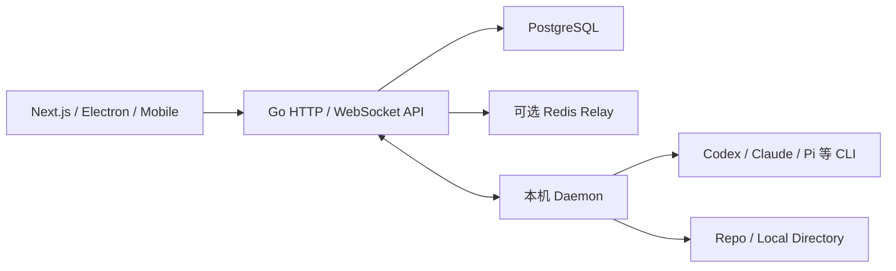
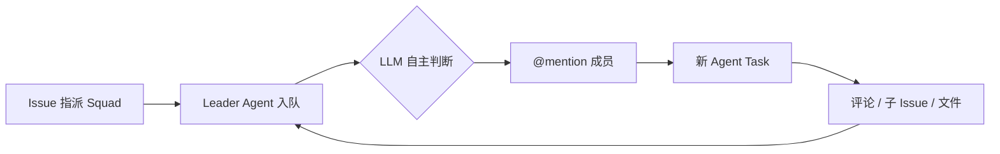
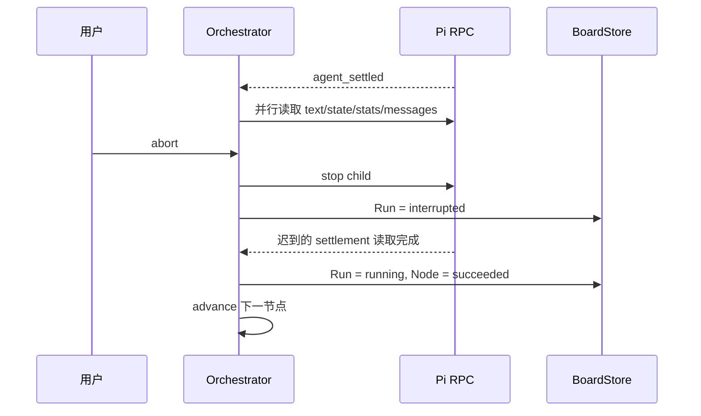
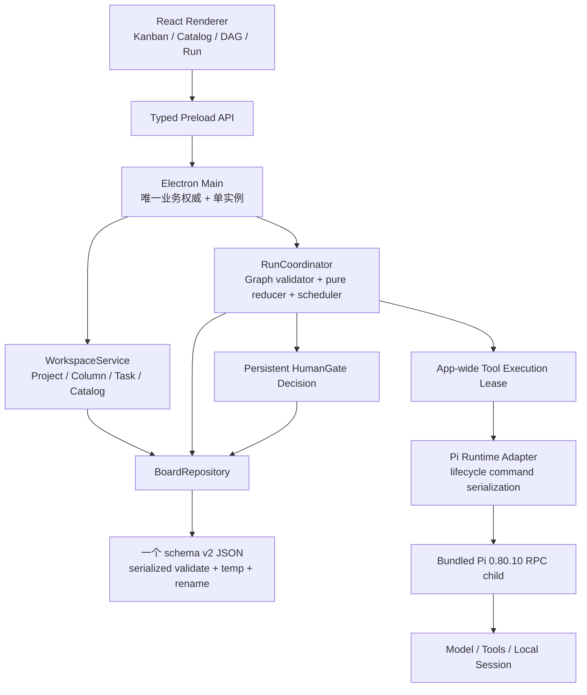

# Stella × Multica × Pi 源码审查与最终设计裁决

> 审查日期：2026-07-17（Asia/Shanghai）  
> 审查性质：源码级设计审查；本报告不把未实现方案描述为现有功能  
> Stella 当前提交：`fbe2c78e049a08fb9b82b8f14e748292fb3874e1`  
> Multica 固定提交：`002ea0d87949d112d96586bd8b42c779142cf77d`  
> Pi `main` 固定提交：`f1a466b19d59cde009bd2d6da57b063518e299b8`  
> Stella 实际依赖的 Pi：`@earendil-works/pi-coding-agent@0.80.10`，发布提交 `8dc78834cde4e329284cf505f9e3f99763df5529`

## 0. 最终结论

当前设计的**产品方向与总体架构通过审查**：Stella 应继续定位为“本地优先、可安装、可视化的 Pi Agent 工作台”，由 Stella 自己管理 Project、可编辑 Kanban、Agent/Team Catalog、最小 DAG、Human Gate 与运行历史；Pi 只执行一个 Agent 节点内部的模型循环和本地工具。

不需要引入 Multica 的 Go API、PostgreSQL、Redis、独立 Daemon、多租户、Autopilot、动态 Squad 或分布式任务领取。一个 Electron 应用、一个经过完整校验并原子写入的 JSON、一个确定性调度器、四种 DAG 节点和固定版本的 bundled Pi 足够完成目标。

但当前代码和现有 v2 方案都还不能直接进入实现/发布。必须先补齐以下硬契约：

1. 所有 Run/Node 状态变化经同一个纯 reducer 与 expected-state CAS；终态不可逆，迟到 callback 不能复活 Run。
2. 取消先持久化 terminal，再优先调用 Pi RPC `abort`，最后才做跨平台进程树兜底；旧进程完全退出前不得释放执行租约。
3. Pi project trust 与工具执行许可分开；`--no-approve` 不是沙箱，不能用“受限运行”误导用户。
4. Run 固定 Project workspace binding 快照；活动 Run 期间禁止重绑定/归档 Project。
5. DAG 节点只接收直接 predecessor 的成功产物，Sibling branch 不能因为实际串行顺序而互相泄漏上下文。
6. Human Gate 持久化独立 `GateDecision`；取消、失败、驳回和重启时每个 NodeRun 的历史状态必须有唯一规则。
7. Windows 安装包需要外部 Bash readiness、模型凭据 readiness、真实工具执行与孤儿进程测试；当前 `get_state` 烟测只证明 GUI 和 bundled RPC 能启动。

因此当前准确状态是：

| 层面 | 裁决 |
|---|---|
| 产品定位 | 通过 |
| 简化架构 | 通过，不扩大 |
| Project-owned Kanban | 通过 |
| 确定性 Team Role | 通过 |
| 四节点可视化 DAG | 通过，需补输入与顺序契约 |
| JSON 持久化 | 通过，前提是单实例、强校验和高层事件策略 |
| 当前 v1 运行正确性 | 不通过：存在 abort/settle 终态竞态 |
| Trust/安全文案 | 不通过：当前语义容易被误解为沙箱 |
| Windows/macOS 对外交付 | 尚未证明 |
| GitHub “开源”状态 | 不完整：仓库当前没有 LICENSE |

## 1. 审查方法与证据边界

本次审查以固定提交的数据库迁移、生成模型、后端服务、运行时源码、RPC 合同、当前 Stella 代码和可执行测试为依据。README、截图、注释或路线图只有在运行路径能够互相印证时才视为已实现。

证据分为四类：

- **已实现**：当前源码与测试可证明。
- **已设计**：出现在本地 `docs/stella-v2-simple-technical-spec.md`，但当前产品源码尚未实现。
- **未实现/不存在**：固定提交的模型、API、依赖和运行路径均无相应能力，或源码明确说明没有。
- **审查修正**：本报告为保证正确性、可解释性或可分发性而提出的最终契约。

专项审计报告：

- [Multica 源码专项审计](./multica-source-audit-2026-07-17.md)
- [Pi 0.80.10 / main 源码专项审计](./pi-source-audit-2026-07-17.md)
- [高 Star 架构参考研究](./high-star-architecture-references.md)

## 2. Multica 的真实实现，不是想象中的 DAG 平台

### 2.1 实际架构

Multica 当前是一个云端/多人协作体系：Next.js/Electron/Expo 客户端连接 Go API，服务端依赖 PostgreSQL，并以 WebSocket、可选 Redis relay、后台调度器和本地 Daemon 管理 Agent CLI。其 README 架构图也是 Web → Go Backend → PostgreSQL，而非离线桌面工作流引擎。[Multica README 架构](https://github.com/multica-ai/multica/blob/002ea0d87949d112d96586bd8b42c779142cf77d/README.md#L157-L177)



这些边界解决的是多用户、多 Runtime、多 API 节点和远端任务领取问题。它们不是 Stella 单机可视化 DAG 的前置条件。

### 2.2 Project、Issue 与看板

Multica 的 Project 是 Issue 容器，不拥有自己的列定义；Issue 使用固定七状态。Board 可以按 status、assignee 或 Select Property 分组，但这是 Issue 视图/分类，不是 Project-owned executable workflow。[Project schema](https://github.com/multica-ai/multica/blob/002ea0d87949d112d96586bd8b42c779142cf77d/server/migrations/034_projects.up.sql#L1-L20) [Issue 状态文档](https://github.com/multica-ai/multica/blob/002ea0d87949d112d96586bd8b42c779142cf77d/apps/docs/content/docs/issues.mdx#L22-L36) [Board grouping](https://github.com/multica-ai/multica/blob/002ea0d87949d112d96586bd8b42c779142cf77d/packages/core/issues/stores/view-store.ts#L12-L20)

因此 Stella 的 `Project.columns` 一等模型比照搬 Multica 更直接，也更符合用户希望创建软件、研究、内容、个人等不同看板的目标。无需为此引入通用 Custom Property Engine。

### 2.3 Squad 不是固定 Agent 团队流程

Multica Squad 的持久模型只有 Leader、成员、自由文本 Role 和 Instructions，没有节点、边或固定步骤。[Squad schema](https://github.com/multica-ai/multica/blob/002ea0d87949d112d96586bd8b42c779142cf77d/server/migrations/084_squad.up.sql#L1-L33)

Issue 指派给 Squad 后，首先入队的是 Leader Agent。Leader 读取 Roster 和 Issue，再由 LLM 自主选择成员并通过精确 `@mention` 评论触发新的 Agent Task；评论和子任务事件再次唤醒 Leader。[Squad Operating Protocol](https://github.com/multica-ai/multica/blob/002ea0d87949d112d96586bd8b42c779142cf77d/server/internal/handler/squad_briefing.go#L12-L97)



这是一种灵活的 Agent 自主协作，不是确定性的 Team Role 流程。Stella 应借鉴 Agent Profile、Team 名称、Role label 与 Instructions，但固定流程必须由 Stella DAG Scheduler 决定，不能依赖 Leader LLM 是否记得分发某一步。

### 2.4 AgentTaskQueue 值得借鉴的不是数据库，而是不变量

Multica 的 AgentTaskQueue 具备原子 claim、expected-status CAS、prepare lease、Session/Workdir、重试血缘、终态幂等和 Daemon 恢复。Claim 使用 `FOR UPDATE SKIP LOCKED`；完成回调只接受 running，迟到 terminal callback 不会把 cancelled/failed 恢复成 completed。[Claim SQL](https://github.com/multica-ai/multica/blob/002ea0d87949d112d96586bd8b42c779142cf77d/server/pkg/db/queries/agent.sql#L445-L483) [完成 CAS](https://github.com/multica-ai/multica/blob/002ea0d87949d112d96586bd8b42c779142cf77d/server/internal/service/task.go#L2573-L2665)

Stella 不需要复制 SQL/lease/daemon，只需保留等价的本地不变量：

- 一个 serialized authoritative state update。
- 一次 Node execution 有唯一 generation/runtime token。
- callback 必须验证 run、node、expected status 与 token。
- terminal state 不可逆。
- 应用重启不伪造旧 OS 进程仍在运行。
- 取消命令与业务列移动完全分开。

### 2.5 Autopilot、Issue Stage、DAG 和 HITL 的硬边界

Multica Autopilot 是 schedule/webhook/manual trigger，触发后只创建一个 Issue 或一条 Agent Task；AutopilotRun 没有 graph/node/edge。[Autopilot schema](https://github.com/multica-ai/multica/blob/002ea0d87949d112d96586bd8b42c779142cf77d/server/migrations/042_autopilot.up.sql#L3-L69)

初始 migration 曾加入 `skip/queue/replace` 并发策略，下一次 migration 明确因实现问题将其移除；当前不能把这段历史当作成熟 Workflow concurrency engine。[移除并发策略](https://github.com/multica-ai/multica/blob/002ea0d87949d112d96586bd8b42c779142cf77d/server/migrations/043_fix_orphaned_autopilot_runs.up.sql#L1-L30)

Issue `stage` 只是同一 Parent 下 sibling sub-issues 的顺序屏障。某一 stage 完成后，系统唤醒 Parent Agent，由 Agent 决定是否创建后续阶段。源码明确说明服务端没有声明式工作流模型。[Stage 说明](https://github.com/multica-ai/multica/blob/002ea0d87949d112d96586bd8b42c779142cf77d/server/internal/handler/issue_child_done.go#L436-L451)

固定提交中没有一等：

- `WorkflowDefinition / WorkflowNode / WorkflowEdge`。
- `WorkflowRun / NodeRun`。
- 图保存/校验/拓扑调度 API。
- branch/join executor。
- `HumanGate / ApprovalRequest / ApprovalDecision`。
- per-edge artifact mapping。

所以 Stella 可视化 DAG 和 Human Gate 是自己的新增能力，不是对 Multica 现成功能的复刻。

### 2.6 Multica 可以借什么、不能借什么

| 主题 | 借鉴 | 不照搬 |
|---|---|---|
| 状态 | Task business state、Agent execution、automation invocation 分层 | 用一个 status 同时驱动看板和运行 |
| 执行 | expected-status CAS、generation、终态幂等、恢复显式化 | PostgreSQL/Redis/Daemon 整套部署 |
| 团队 | Agent Profile、Role、Instructions | Leader LLM 作为固定流程路由器 |
| 快照 | Run 启动时冻结有效配置 | 运行中继续引用可变 Catalog |
| 资源 | 本地目录是机器绑定资源 | 把本机绝对路径当可移植项目身份 |
| 触发 | Trigger 与 execution 分层的思想 | 当前 v2 加 schedule/webhook/cron |
| 权限 | main-process 权威与路径校验 | 多租户 RBAC、归因、调用 allow-list |

### 2.7 许可证边界

Multica 根 LICENSE 是带 hosted service、embedded commercial component 和前端标识限制的 modified Apache 2.0；Desktop package 另标记 `UNLICENSED`。[Multica LICENSE](https://github.com/multica-ai/multica/blob/002ea0d87949d112d96586bd8b42c779142cf77d/LICENSE#L1-L44) [Desktop package](https://github.com/multica-ai/multica/blob/002ea0d87949d112d96586bd8b42c779142cf77d/apps/desktop/package.json#L1-L18)

Stella 可以 clean-room 借鉴公开架构思想，但不应复制或嵌入 Multica 代码、UI 资产、Logo、品牌或协议文本。Stella 当前公共仓库没有 LICENSE；在法律意义上，“GitHub 可见”不等于“已开源”。正式宣称开放仓库前必须提交自己的许可证。Pi 为 MIT，若 Stella 目标是宽松开源，MIT 是与当前方向一致的简单选择；本判断不构成法律意见。

## 3. Pi 的真实能力与集成边界

### 3.1 固定 0.80.10，不跟踪未发布 main

Stella `package.json` 精确固定 `@earendil-works/pi-coding-agent@0.80.10`，该包公开导出 `./rpc-entry`，Node 基线为 `>=22.19.0`，许可证为 MIT。[Pi 0.80.10 package exports](https://github.com/earendil-works/pi/blob/8dc78834cde4e329284cf505f9e3f99763df5529/packages/coding-agent/package.json#L9-L29)

审查时 Pi `main` 为 `f1a466b19...`，比 `0.80.10` 发布提交晚一个未发布提交，主要增加 llama.cpp router、文档和模型目录更新；核心 RPC、session、abort 与 bash 契约没有变化。[Pi main commit](https://github.com/earendil-works/pi/commit/f1a466b19d59cde009bd2d6da57b063518e299b8)

Stella 应继续把 npm 0.80.10、lockfile integrity 与 packaged runtime version 当作发布契约。未来只按正式 npm release 升级，并重新执行契约测试；不能直接追踪 `main`。

### 3.2 Pi 是单 Agent 节点执行引擎

Pi 的 core/coding-agent 负责模型循环、工具、资源加载、Session 和 RPC。Pi 自身明确把 subagent、permission UI、plan/todo 等留给 extension 或外层组合。[Pi philosophy](https://github.com/earendil-works/pi/blob/8dc78834cde4e329284cf505f9e3f99763df5529/packages/coding-agent/README.md#L488-L504)

Pi 仓库中的 subagent 是需要手工安装的示例扩展：它 spawn 新 `pi` 进程并实现示例自己的 parallel/chain，某些环境还会回退到 PATH 上的全局 `pi`。它不是稳定、内置、可持久化的团队运行时。[Subagent example](https://github.com/earendil-works/pi/blob/8dc78834cde4e329284cf505f9e3f99763df5529/packages/coding-agent/examples/extensions/subagent/README.md#L14-L65) [Subagent spawn](https://github.com/earendil-works/pi/blob/8dc78834cde4e329284cf505f9e3f99763df5529/packages/coding-agent/examples/extensions/subagent/index.ts#L239-L263)

`pi-orchestrator` 也明确标记 experimental，主要是多个 Pi RPC 实例的 supervisor，不提供 Stella 需要的 DAG、Team Role、Human Gate、Kanban 或 Run snapshot。[Pi orchestrator status](https://github.com/earendil-works/pi/blob/8dc78834cde4e329284cf505f9e3f99763df5529/packages/orchestrator/README.md#L1-L5)

最终边界应保持：

```text
Stella：Project / Board / Catalog / DAG / Gate / Run / Snapshot / Policy
Pi：一个 Agent 节点内的 Model Loop / Tools / Session / Provider
```

### 3.3 RPC 完成语义

RPC `prompt` 的 success 只表示 prompt 已通过 preflight 并被接受，后续模型或工具错误通过事件/消息体现。[RPC prompt](https://github.com/earendil-works/pi/blob/8dc78834cde4e329284cf505f9e3f99763df5529/packages/coding-agent/src/modes/rpc/rpc-mode.ts#L393-L430)

`agent_end` 后仍可能发生 retry、compaction 或 queue 处理；`agent_settled` 才是完整结算点。Pi 自带 RPC client 的 `waitForIdle()` 也使用它。[Agent settled](https://github.com/earendil-works/pi/blob/8dc78834cde4e329284cf505f9e3f99763df5529/packages/coding-agent/src/core/agent-session.ts#L1049-L1060) [RPC waitForIdle](https://github.com/earendil-works/pi/blob/8dc78834cde4e329284cf505f9e3f99763df5529/packages/coding-agent/src/modes/rpc/rpc-client.ts#L443-L483)

当前 Stella 在 `agent_settled` 后读取 final text、state、stats 与 messages 的方向正确。读取可以并行，但 prompt/abort/new session/switch session/standalone bash 等生命周期命令必须由 Stella adapter 串行化，因为 Pi RPC reader 本身不提供全局 command queue。[RPC reader](https://github.com/earendil-works/pi/blob/8dc78834cde4e329284cf505f9e3f99763df5529/packages/coding-agent/src/modes/rpc/rpc-mode.ts#L726-L785)

### 3.4 Pi 节点内部仍可能并行执行工具

Pi Agent 默认 `toolExecution = "parallel"`；一个模型响应中的多个非 sequential tool call 可能通过 `Promise.all` 并行。Pi 只对同一个文件的 write/edit 做 mutation queue，不提供 workspace transaction。[Agent 默认值](https://github.com/earendil-works/pi/blob/8dc78834cde4e329284cf505f9e3f99763df5529/packages/agent/src/agent.ts#L207-L229) [并行 tool batch](https://github.com/earendil-works/pi/blob/8dc78834cde4e329284cf505f9e3f99763df5529/packages/agent/src/agent-loop.ts#L491-L555) [File mutation queue](https://github.com/earendil-works/pi/blob/8dc78834cde4e329284cf505f9e3f99763df5529/packages/coding-agent/src/core/tools/file-mutation-queue.ts#L28-L60)

所以产品可承诺的是“Stella 不重叠运行两个工具型 Pi Agent 节点/会话”，不能承诺“某个 Pi Agent 内的所有工具写入都串行”。若要 tool-level 全串行，需要修改 Pi 集成方式，超出当前简单方案。

### 3.5 Project trust 不是沙箱

Pi project trust 只决定是否加载 `.pi` settings/resources/packages/extensions/skills/prompts/themes 等项目级资源。它不限制模型随后让 read/write/edit/bash 做什么，也不是操作系统安全边界。[Pi security](https://github.com/earendil-works/pi/blob/8dc78834cde4e329284cf505f9e3f99763df5529/packages/coding-agent/docs/security.md#L3-L37)

即使使用 `--no-approve`，Pi 仍可能加载 `AGENTS.md`/`CLAUDE.md`；只有显式 `--no-context-files` 才会关闭这些 context files。[Project trust 与 context files](https://github.com/earendil-works/pi/blob/8dc78834cde4e329284cf505f9e3f99763df5529/packages/coding-agent/docs/security.md#L20-L29)

Pi 内置工具可以接受绝对路径，bash 以启动 Stella 的本地用户权限运行；`allowedTools` 是角色能力配置，不是 workspace 沙箱。[Path resolution](https://github.com/earendil-works/pi/blob/8dc78834cde4e329284cf505f9e3f99763df5529/packages/coding-agent/src/core/tools/path-utils.ts#L40-L50)

因此 v2 必须至少在领域层区分：

```text
projectResourcesApproved
  是否加载项目级 Pi 配置、扩展、skill、prompt 与 context files

executionApproved
  是否允许 Pi 以当前操作系统用户权限运行工具
```

未获得 `executionApproved` 时可以浏览 Project/Kanban，但不得 dispatch、运行工具型聊天或 standalone bash。`projectResourcesApproved=false` 时至少应使用 `--no-approve --no-context-files`，避免 Pi 在拒绝 project resource trust 后仍隐式加载 `AGENTS.md`/`CLAUDE.md`。对 Stella 内置的确定性 Workflow Agent profile，继续使用下面的完整组合：

```text
--no-approve
--no-context-files
--no-extensions
--no-skills
--no-prompt-templates
```

其中 `--no-extensions/--no-skills/--no-prompt-templates` 会关闭相应类别的用户级资源，而不只是项目级资源；这是确定性 Agent profile 的明确策略，UI/Agent 定义必须如实说明，不能把它误写成仅对当前 Project 生效。

UI 应明确写“这不是沙箱，工具以当前用户权限运行”，不能继续使用容易让人误解为文件隔离的“受限打开”。

### 3.6 Session 是本地证据，不是跨电脑身份

Pi session 是 append-only JSONL tree，header 含绝对 cwd，parent session 也可能是绝对路径。[Session schema](https://github.com/earendil-works/pi/blob/8dc78834cde4e329284cf505f9e3f99763df5529/packages/coding-agent/src/core/session-manager.ts#L30-L125)

`sessionPath` 只能作为当前设备上的可选提示。Stella 业务身份必须使用自己的 Project/Task/Run/Node UUID；跨电脑重绑定 workspace 后创建新 Pi session。NodeRun 应保存 `sessionId`、`piVersion` 和可选 `localSessionPath`，但历史阅读不能依赖该文件仍存在。

### 3.7 内置 Pi 不等于内置完整开发环境

当前 `process.execPath + ELECTRON_RUN_AS_NODE=1 + import.meta.resolve(rpc-entry)` 的做法正确：接收者无需全局安装 Pi，也无需知道 Pi 在本机的路径。安装目录任意变化不影响 bundled RPC 定位。

但以下仍由接收者环境提供：

| Stella 内置 | 接收者环境 |
|---|---|
| Electron/Node、Pi 0.80.10 JS、生产依赖、GUI、RPC bridge | 模型凭据、网络、项目源码、Git/npm/Python/编译器、Windows Bash、用户扩展/skills |

Windows 上 Pi `bash` 按用户 `shellPath`、Git for Windows 的已知路径、PATH 中 `bash.exe` 查找；找不到时显式失败，不回退到 PowerShell/cmd。[Pi Windows requirement](https://github.com/earendil-works/pi/blob/8dc78834cde4e329284cf505f9e3f99763df5529/packages/coding-agent/docs/windows.md#L1-L17) [Shell resolution](https://github.com/earendil-works/pi/blob/8dc78834cde4e329284cf505f9e3f99763df5529/packages/coding-agent/src/utils/shell.ts#L60-L119)

RPC 没有 login/logout command；“无需全局 Pi”也不代表“无需配置 provider 凭据”。首启必须检测 shell 和模型/认证 readiness，并显示准确前置条件。Stella 状态文件不得保存开发者自己的 secret。

## 4. Stella 当前实现的事实审查

### 4.1 当前仍是 schema v1 线性流程

当前提交的真实状态：

- `BOARD_SCHEMA_VERSION = 1`。
- Task status 混合业务列与运行状态。
- Workflow 是有序 `steps[]`。
- Agent step 直接引用 `agentId`；Team 只展示，不参与 dispatch。
- Task 直接保存 `projectPath/projectName/trusted`，且 Workflow 必选。
- Run 是线性 StepRun，没有 Graph/Edge/NodeRun。

[Stella kanban model](https://github.com/ZY-LI-F/stella-pi-workbench/blob/fbe2c78e049a08fb9b82b8f14e748292fb3874e1/src/shared/kanban.ts#L1-L102) [Run model](https://github.com/ZY-LI-F/stella-pi-workbench/blob/fbe2c78e049a08fb9b82b8f14e748292fb3874e1/src/shared/kanban.ts#L127-L166)

当前 orchestrator 每次选择第一个 pending step，Human Gate 只是线性暂停点；dispatch 快照 Workflow 和直接引用的 Agents，但没有 Team snapshot。[Linear advance](https://github.com/ZY-LI-F/stella-pi-workbench/blob/fbe2c78e049a08fb9b82b8f14e748292fb3874e1/src/main/workflow-orchestrator.ts#L283-L305) [Dispatch snapshot](https://github.com/ZY-LI-F/stella-pi-workbench/blob/fbe2c78e049a08fb9b82b8f14e748292fb3874e1/src/main/workflow-orchestrator.ts#L122-L166)

`docs/stella-v2-simple-technical-spec.md` 是待实现设计；当前 package 也尚未依赖 `@xyflow/react`。README、截图和发布说明不能提前把 v2 设计写成现有能力。

### 4.2 可保留的可靠基础

当前实现已有：

- Electron main 负责 filesystem、child process 和持久化。
- typed preload 与 Renderer 隔离。
- BoardStore 内单 promise write queue。
- 每次 update 解析并验证完整 state。
- temp file + rename。
- 启动时 queued/running → interrupted。
- bundled Pi `rpc-entry` 和 request-id RPC。
- `agent_settled` 后读取产物。
- Windows packaged smoke 已证明不依赖全局 Pi 才能启动 RPC。

[BoardStore](https://github.com/ZY-LI-F/stella-pi-workbench/blob/fbe2c78e049a08fb9b82b8f14e748292fb3874e1/src/main/board-store.ts#L34-L121) [PiRpcRuntime](https://github.com/ZY-LI-F/stella-pi-workbench/blob/fbe2c78e049a08fb9b82b8f14e748292fb3874e1/src/main/pi-rpc-runtime.ts#L1-L156)

这些基础足够支撑 v2；没有证据要求换 PostgreSQL/SQLite、拆后台服务或引入事件溯源。

### 4.3 当前最严重的终态竞态

`abort()` 当前先从 active map 删除 runtime，等待 `runtime.stop()`，然后才提交 interrupted。与此同时，已进入 `#settleAgent()` 的路径可能完成四个 RPC 查询，再在 commit 中无条件把最新 Run 写回 running、当前 Step 写成 succeeded，随后调用 `#advance()`。`#failRun()` 也在 transaction 外检查终态，commit 内没有再次验证 expected status。[Abort](https://github.com/ZY-LI-F/stella-pi-workbench/blob/fbe2c78e049a08fb9b82b8f14e748292fb3874e1/src/main/workflow-orchestrator.ts#L238-L275) [Settle/fail](https://github.com/ZY-LI-F/stella-pi-workbench/blob/fbe2c78e049a08fb9b82b8f14e748292fb3874e1/src/main/workflow-orchestrator.ts#L475-L590)

可能时序：



实际 interleaving 还可能造成 Task status=running 但 `activeRunId` 已被清除的非法组合。这个问题必须在任何 schema/DAG/UI 改造前修复。

### 4.4 当前产物注入无法直接升级成 DAG

v1 prompt 会把 Run 中所有已有 artifact 全部拼成“上游产物”。在线性步骤中尚可，在 fan-out/fan-in DAG 中会让后执行的 sibling branch 看到先执行 sibling 的产物，产生图上不存在的隐藏依赖。[Current prompt](https://github.com/ZY-LI-F/stella-pi-workbench/blob/fbe2c78e049a08fb9b82b8f14e748292fb3874e1/src/main/workflow-orchestrator.ts#L593-L619)

### 4.5 当前 writer lock 不是完整隔离

writer lock 以原始 `projectPath` 字符串为 key，只限制 `workspaceAccess=write` 的 Workflow Agent。大小写、符号链接或不同 Project 指向同一真实目录可能绕过；read Agent、聊天和 standalone bash 仍可与 writer 并行。[Current writer lock](https://github.com/ZY-LI-F/stella-pi-workbench/blob/fbe2c78e049a08fb9b82b8f14e748292fb3874e1/src/main/workflow-orchestrator.ts#L622-L649)

为保持简单，v2 不应扩大这套 lock map；应改为一个 app-wide 工具执行租约，见第 7 节。

### 4.6 JSON 当前还缺单实例边界

BoardStore 的 queue 只在一个 Electron main 进程内串行。应用当前没有 `app.requestSingleInstanceLock()`；若同一用户打开两个实例，两个进程可同时写同一个固定 `.tmp` 与 `board.json`。保留一个 JSON 的前提是应用单实例。

此外当前 parser 对 Run 内嵌 Workflow/Agent/Step 只做浅层冻结，嵌套数组和对象仍可变；Run steps 与 Workflow steps 只验证成员归属，没有验证完整的一一对应顺序/类型。v2 parser 应重建并深度冻结持久模型，同时验证跨实体不变量。

## 5. 对 v2 方案的逐项裁决

| 方案项 | 裁决 | 必要修正 |
|---|---|---|
| Electron main 单一权威 | 保留 | 增加单实例锁；所有外部输入在 main 再验证 |
| 一个 validated JSON | 保留 | 单实例、完整 migration、深层不可变、高层事件策略 |
| Project 与目录解耦 | 保留 | Run 增加 workspace binding snapshot；活动时禁止 rebind |
| Project-owned columns | 保留 | 非空列删除必须显式选择迁移目标列 |
| Task 可无 Workflow | 保留 | dispatch 时才要求有效 Workflow |
| Task column 与 Run status 分离 | 保留，硬约束 | Run 事件绝不自动移动卡片 |
| Built-in + User Catalog | 保留 | built-in immutable；历史只读 snapshot |
| Team Role → Agent | 保留 | dispatch 时解析并冻结完整 Team/Agent |
| Start/AgentRole/HumanGate/End | 保留 | Edge 继续无条件；驳回直接 fail Run，不加条件语言 |
| Fan-out/fan-in | 保留 | 直接前驱产物；Join 等待全部前驱成功 |
| 稳定拓扑串行 | 保留 | tie-break 不依赖 React Flow nodes 数组的偶然顺序 |
| Human Gate 跨重启 | 保留 | 独立 GateDecision；定义全局暂停语义 |
| 每 Agent 节点一个 Pi child | 保留 | 一个 app-owned adapter；生命周期命令串行 |
| writer lock | 移除/替换 | 使用 app-wide 工具执行租约，覆盖 Workflow/chat/bash |
| bundled Pi 0.80.10 | 保留 | RPC-first abort、Bash/credential preflight、真实 packaged test |
| React Flow | 保留为 UI 库 | validator、toposort、scheduler 都是应用领域代码 |
| 自动 retry | 不加入 | 用户新建 Run，旧历史不覆盖 |
| condition/loop/plugin node | 不加入 | 当前 schema 只支持四类节点和无条件边 |

## 6. P0：实现前必须解决的正确性与安全问题

### P0-1：统一 RunCoordinator、纯 reducer 与终态 CAS

所有外部事件只能提交 command，不能直接构造下一份 Run：

```ts
type RunCommand = Readonly<{
  type: RunCommandType
  runId: string
  nodeId?: string
  expectedRunStatus: WorkflowRunStatus | readonly WorkflowRunStatus[]
  expectedNodeStatus?: NodeRunStatus | readonly NodeRunStatus[]
  runtimeToken?: string
  occurredAt: string
  payload?: unknown
}>
```

Repository 在 serialized update 内重新定位最新 Task/Run/Node，并验证：

- `task.activeRunId === run.id`，或 command 是允许的已终态 diagnostic。
- Run 尚未终态。
- current node 与 command node 一致。
- expected Run/Node status 一致。
- runtime token 一致。
- transition 在显式状态表中合法。

任何 mismatch 都不得返回伪成功，也不得覆盖 terminal state。它应返回结构化 stale/conflict 结果，并追加一条高层 diagnostic Activity。terminal Run 只能保持 terminal。

所有 `settled`、`runtime_exit`、`start_failed`、`abort`、`approve`、`reject`、`shutdown`、`restart_recovery` 都走同一个 reducer。Orchestrator 不再在多个异步方法里各自拼 Run 对象。

### P0-2：取消必须是 terminal-first、RPC-first、tree-kill-last

Pi 正常 RPC `abort` 会等待 `AgentSession.abort()`；Agent abort signal 会传播到正在执行的 tool。Pi bash 收到 signal 后在 Windows 使用 `taskkill /F /T`，在 Unix/macOS 使用 process group kill。[Pi RPC abort](https://github.com/earendil-works/pi/blob/8dc78834cde4e329284cf505f9e3f99763df5529/packages/coding-agent/src/modes/rpc/rpc-mode.ts#L417-L430) [AgentSession abort](https://github.com/earendil-works/pi/blob/8dc78834cde4e329284cf505f9e3f99763df5529/packages/coding-agent/src/core/agent-session.ts#L1527-L1541) [Pi bash cleanup](https://github.com/earendil-works/pi/blob/8dc78834cde4e329284cf505f9e3f99763df5529/packages/coding-agent/src/utils/shell.ts#L176-L224)

Stella 最小可靠顺序：

1. 在 BoardStore transaction 中 CAS Run → `cancelled`，当前 running/waiting Node → `cancelled`，清除 `Task.activeRunId`。
2. 立即使 `runtimeToken` 失效并从可调度 registry 移除。
3. 保留 app-wide execution lease，不启动下一工具型 Pi。
4. 若 standalone bash 正在运行，先发 `abort_bash`；Agent turn 发并等待 RPC `abort`。
5. 等待明确的 abort response、`agent_settled`/idle 证据和 child exit。
6. grace deadline 内失败时，Windows 执行并检查 `taskkill /PID <pid> /T /F`；macOS 先 SIGTERM grace，再 SIGKILL。
7. child 完全退出后释放 execution lease。
8. cleanup 失败追加明确 Activity/diagnostic，但不得把已经 cancelled 的 Run 改回 running 或伪装成清理成功。

`PiRpcRuntime` 应把职责拆成可测试接口：

```ts
interface PiNodeRuntime {
  start(options: PiRuntimeStartOptions): Promise<void>
  prompt(text: string): Promise<void>
  readSettlement(): Promise<PiSettlement>
  abortActiveTurn(): Promise<void>
  abortStandaloneBash(): Promise<void>
  dispose(): Promise<void>
}
```

Windows 上 Node `child.kill("SIGTERM")` 会突然终止目标，不能假设 Pi 的 POSIX SIGTERM cleanup handler 会执行。因此当前 `stop()` 不能继续作为唯一取消机制。

### P0-3：分开资源加载许可与执行许可

`ExternalWorkspace.trusted: boolean` 语义过载。最终模型至少使用：

```ts
type WorkspacePermissions = Readonly<{
  projectResourcesApproved: boolean
  executionApproved: boolean
}>
```

规则：

- `projectResourcesApproved` 只控制 Pi 项目级配置/扩展/skill/prompt/context 加载。
- `executionApproved` 控制是否允许工具型 Pi 以当前 OS 用户权限执行。
- 未执行许可时只允许浏览和编辑看板，不允许 dispatch/chat tool/standalone bash。
- read-only Agent 只是“不提供写工具”的配置，不是文件系统沙箱。
- UI 必须显示真实目录和权限说明；不能用“沙箱”“只限项目目录”等不真实承诺。

### P0-4：Run 固定 workspace binding 快照

现有 v2 Run 快照包含 Workflow/Team/Agents，但未包含执行目录。若 Project 在 Run 中途 rebind，后续节点可能进入另一个目录；历史也无法解释某节点实际在哪里执行。

Run 创建时必须冻结：

```ts
type WorkspaceBindingSnapshot = Readonly<{
  projectId: string
  bindingVersion: number
  mode: "managed" | "external"
  canonicalPath: string
  projectResourcesApproved: boolean
  executionApproved: boolean
}>
```

规则：

- active/waiting Run 存在时禁止 rebind、archive 或删除 Project。
- 每个节点启动前验证 snapshotted path 仍存在且为目录，binding version 未变化，execution permission 仍有效。
- 不允许静默切换到 Project 当前的新路径。
- path 不存在时显式 fail 当前 Run，并保留历史快照；用户重绑定后新建 Run。
- 导出/跨设备数据时，绝对路径是 device-local binding，不是 portable Project identity。

### P0-5：DAG 只传直接前驱产物

最终输入契约：

```text
AgentRole input =
  Task snapshot
  + Node objective
  + Agent/Team Role snapshot
  + 仅 direct predecessors 的 succeeded outputs/artifacts
  + predecessors 按 Run.executionOrder 稳定排序
  + Project workspace 中的实际文件
```

禁止把所有已完成 Node 的产物全量注入。Fan-out 的 sibling branches 不互相可见；Fan-in 只有在全部直接前驱 succeeded 后才运行，并按固定顺序合并。Prompt builder 必须是纯函数并有 snapshot 测试。

最小 Artifact：

```ts
type Artifact = Readonly<{
  id: string
  kind: "text" | "file"
  title: string
  content?: string
  relativePath?: string
}>
```

文件产物只能保存相对 workspace 的路径。第一版若暂时只支持 text，可以只实现 `text`，不要提前建设 Artifact Registry。

### P0-6：Human Gate 与未执行节点归档规则

Human Gate 持久化：

```ts
type GateDecision = Readonly<{
  decision: "approved" | "rejected"
  comment: string
  decidedAt: string
}>
```

规则：

- 只有 `run.status=waiting`、`currentNodeId` 指向 waiting HumanGate 时可决定。
- Approve：保存 decision，Gate → succeeded，Run → running，再调度。
- Reject：保存 decision，Gate → failed，Run → failed。
- Decision 一次性；重复/竞争请求返回明确 conflict，不覆盖历史。
- 为保持简单，任何 Human Gate 都是**整个 Run 的全局暂停点**；即使另一 sibling branch 已 ready，也等待 gate 决定后再继续。
- Edge 仍是无条件边；不加入 approved/rejected condition edge。驳回直接终止 Run。

终态归档：

| Run 结束原因 | 当前 Node | 其余 pending Node |
|---|---|---|
| Agent 失败 | `failed` | 保持 `pending`，UI 显示“未执行（Run 已失败）” |
| Gate 驳回 | Gate `failed` | 保持 `pending` |
| 用户取消 | running/waiting → `cancelled` | 保持 `pending` |
| 应用重启 | running → `interrupted` | 保持 `pending` |
| queued 时取消 | 无 current node | 全部保持 `pending` |
| 成功 | 所有 Node `succeeded` | 不允许残留 pending |

MVP 不需要额外 `skipped` 状态；Run terminal reason 已解释为何 pending Node 未执行。

## 7. P1：公开分发前必须完成的工程门禁

### P1-1：全应用工具执行租约

为避免 raw path alias、read-vs-write、不同 Run 以及聊天/终端冲突，最简单的最终政策是：

- 全应用同一时刻只允许一个**活动工具型 Pi turn/standalone bash**。
- Workflow Agent Node、手动 Pi chat 的工具阶段和 terminal bash 使用同一 app-wide lease。
- Human Gate waiting、纯看板操作和只读历史不持有 lease。
- Workflow 等待者按 `Run.createdAt + Run.id` 稳定 FIFO；Run 内仍按持久化 DAG 顺序。
- 手动 chat/bash 在 lease 被占用时显示明确 busy 原因，不隐式并发。
- lease 在 child/tool 真正结束后释放，不在状态刚 terminal 时提前释放。

这比继续维护 per-path writer map 更简单，也避免错误声称 read Agent 与 writer 并行一定安全。产品文案必须准确为“不重叠运行工具型 Pi 会话”；Pi 单个 Agent 内部工具仍可能并行。

### P1-2：稳定拓扑 tie-break 使用显式顺序

现有方案把 `WorkflowGraph.nodes` 数组顺序作为同层节点 tie-break。React Flow 操作、序列化或复制粘贴可能无意改变数组顺序，导致画布位置未表达的执行变化。

建议增加：

```ts
type WorkflowGraph = Readonly<{
  nodes: readonly WorkflowNode[]
  edges: readonly WorkflowEdge[]
  tieBreakOrder: readonly string[]
}>
```

`tieBreakOrder` 必须是全部 node id 的无重复排列；稳定拓扑排序只使用它，不使用 `position` 或 Renderer 当前数组顺序。UI 提供“提前/延后”和“按拓扑整理”，保存前展示计算后的执行顺序。

### P1-3：单实例是保留 JSON 的必要条件

Electron 启动最早阶段调用 `app.requestSingleInstanceLock()`：

- 第一实例持有 BoardStore。
- 第二实例不初始化 store，通知第一实例聚焦，然后退出。
- 所有写仍经单一 BoardStore queue。

这比引入跨进程 file lock/SQLite 简单。若未来明确需要多实例或多进程 worker，再重新评估存储；当前不提前建设。

### P1-4：Windows Bash 与模型凭据 readiness

Windows 首启/dispatch preflight 必须：

1. 验证 bundled Pi 版本与 `rpc-entry`。
2. 通过真实 RPC `bash` 执行无副作用命令并验证 stdout/exit code。
3. 找不到 Bash 时显示 Pi 原始搜索路径、Git for Windows 要求和修复入口。
4. 检测可用 provider/model/auth；无凭据时显示标准 Pi auth/env 配置说明。
5. 不把任何开发者 API key 打包进应用或源码。

当前简单方案可以要求接收者安装 Git for Windows，并沿用 Pi 标准 auth/env，不必立即实现完整 provider 登录 UI；但 readiness 必须在首次 dispatch 前明确暴露。

### P1-5：原生 packaged test 必须执行真实工具并验证取消

当前 `tests/e2e/packaged.spec.ts` 清空 PATH、启动 packaged app、读取 Pi 版本，证明“不依赖全局 Pi 才能 `get_state`”。它没有执行 bash、模型 prompt 或 abort。

Release matrix 的每个 native job 在 build 后、upload 前必须执行：

- Windows x64：bundled RPC、direct bash、长寿命子进程 abort、无遗留 PID。
- macOS x64：同上，并验证签名/公证产物。
- macOS arm64：同上。
- 安装目录和 workspace 含空格/中文。
- PATH 无全局 `pi`。
- 无认证时错误清晰；有测试凭据时最小 prompt 直到 `agent_settled`。

当前 release workflow 只运行 unit tests、构建并上传，没有运行 `test:packaged`；因此 macOS 可执行性、工具链和取消尚未被 CI 证明。

### P1-6：v1 → v2 migration 必须精确、一次性、可回滚

迁移流程：

1. 先读取 raw root，只按 `schemaVersion` 选择 parser；不能先用严格 v2 parser 读取 v1。
2. 把原 v1 文件复制为带时间戳 backup。
3. 完整转换到新的内存对象。
4. 运行 v2 全状态校验与深层不可变重建。
5. 写临时文件并原子替换。
6. 任一步失败时原文件不变，错误显示具体路径、字段和 backup 路径。
7. v2 business logic 不保留长期 `if version===1` 兼容分支。

状态映射：

| v1 Run | v2 Run |
|---|---|
| `completed` | `succeeded` |
| `failed` | `failed` |
| `interrupted` | `interrupted` |
| `blocked` | `failed`；从失败 Human Gate 合成 rejected GateDecision |
| `review` | 仅当 current Step 是 waiting Human Gate 时映射 `waiting`，否则迁移错误 |
| `queued` / `running` | 启动恢复时 `interrupted` |

| v1 Step | v2 NodeRun |
|---|---|
| `pending` | `pending` |
| `succeeded` | `succeeded` |
| `failed` | `failed` |
| `interrupted` | `interrupted` |
| `running` | `interrupted` |
| `waiting` | 仅 Human Gate → `waiting`，其他类型为迁移错误 |

其他转换：

- 按规范化绝对 `projectPath` 分组生成 Project；存在路径可用 realpath，缺失路径保留原 binding 并在迁移报告中标记“需重绑定”，dispatch 显式禁用。
- 同一路径出现不同 trust 时不得静默扩大许可；迁移为最严格 false，并把冲突列入报告。
- Task 只保存 `projectId/columnId/workflowId?`，不再复制 path/trust。
- 旧 Workflow 转成 `Start -> legacy steps -> End`。
- 历史 Run 为旧 Workflow 合成确定性的 legacy Team snapshot 和 role ids；不能凭空引用当前可变 Team。
- `Activity.stepId` 转 `nodeId`；历史 artifact/session path 保留为 device-local hint。
- 重复运行 migration 不得重复生成 Project/Run/Activity。

### P1-7：Project、Column 与 Catalog 生命周期

- Project 至少有一个 Column；Column id 在 Project 内唯一。
- 删除空 Column 可直接执行；删除非空 Column 必须显式选择目标列，并在同一次 transaction 中迁移 Task。
- 有 active/waiting Run 的 Project 不可 archive/rebind。
- built-in Catalog immutable；编辑动作实际复制成 user item。
- 新 dispatch 拒绝 archived Workflow/Team/Agent。
- 历史 Run 永远读取 snapshot，不重新解析 live Catalog。
- 有历史引用的 user item 只 archive，不硬删。
- Workflow save 与 dispatch 都验证 Team Role/Agent；dispatch 再冻结最终解析结果。

### P1-8：公开仓库许可证

当前项目没有 `LICENSE` 文件。正式把仓库描述为开源前，必须提交独立许可证并在 README 标明；不能继承或复制 Multica 的 modified Apache 文本。依赖清单和 NOTICE/归属按所选许可证及第三方依赖要求维护。

## 8. P2：设计清晰度与长期可维护性

### P2-1：Activity 不是状态来源

Run/Node 是权威状态；Activity 只解释 transition。一次 transaction 先计算合法 Run/Node 变化，再追加对应高层 Activity。实时 event 丢失不能影响最终 Board snapshot。

只持久化高层事件：dispatch、node start/settled/fail、gate decision、cancel、cleanup error、restart interruption。流式 token、完整 messages 和细粒度 tool transcript 留在 Pi JSONL；Stella 只保存归一化 tool start/end/error 摘要与 final artifact。这样保留一个 JSON，而不引入静默裁剪或任意 record cap。

### P2-2：Ready 是派生条件

不持久化 `ready`：

```text
isReady(node) =
  node.status == pending
  AND run.status == running
  AND every direct predecessor.status == succeeded
```

每次 transition 后按 snapshotted executionOrder 找第一个 ready Node。`currentNodeId` 只在一个 Node running 或 HumanGate waiting 时存在。

### P2-3：Parser 重建深层不可变对象

v2 parser 不应对外部 JSON 做 type assertion 后只 shallow-freeze。应逐层构造 Project/Column/Task/Catalog/Graph/Run/Node/Artifact/Decision，冻结全部数组和对象，并验证：

- 全局和作用域内 id 唯一。
- Task 的 Project/Column 引用合法。
- activeRunId 与 Run.taskId 双向一致。
- Run graph snapshot、executionOrder、NodeRun 是完整一一映射。
- currentNode、Run status、Node status 组合合法。
- GateDecision 只存在于 HumanGate。
- Artifact file relativePath 不越出 workspace。
- archived/live 引用规则只用于新 dispatch，不破坏历史 snapshot。

### P2-4：文档与 ADR 同步

当前 `CONTEXT.md` 和 ADR 仍把 Workflow 定义为按顺序排列的 steps。v2 实现完成后，必须同步 ADR、CONTEXT、README、打包前置条件和截图；在实现完成前不能提前宣传。

## 9. 修正后的最小架构



保持的进程/依赖边界：

- 一个 Electron main 权威进程。
- 一个 Renderer，不拥有业务写权限。
- 一个 Board JSON。
- 一个 app-owned Pi adapter；每个活动 Agent Node 创建独立 Pi RPC child。
- 全应用不重叠活动工具型 Pi turn。
- 无 Go server、无 PostgreSQL、无 Redis、无常驻 Daemon、无账号系统。

## 10. 修正后的最小领域增量

下面只列出现有 v2 方案需要新增或改名的字段，不要求额外平台实体：

```ts
type WorkspaceStateV2 = Readonly<{
  schemaVersion: 2
  projects: readonly Project[]
  tasks: readonly Task[]
  userCatalog: UserCatalog
  runs: readonly WorkflowRun[]
  activities: readonly Activity[]
}>

type Project = Readonly<{
  id: string
  name: string
  description: string
  columns: readonly Column[]
  workspace: ProjectWorkspace
  defaultWorkflowId?: string
  archived: boolean
  createdAt: string
  updatedAt: string
}>

type ProjectWorkspace = Readonly<{
  mode: "managed" | "external"
  path: string
  bindingVersion: number
  projectResourcesApproved: boolean
  executionApproved: boolean
}>

type WorkflowGraph = Readonly<{
  nodes: readonly WorkflowNode[]
  edges: readonly WorkflowEdge[]
  tieBreakOrder: readonly string[]
}>

type WorkflowRunStatus =
  | "queued"
  | "running"
  | "waiting"
  | "succeeded"
  | "failed"
  | "cancelled"
  | "interrupted"

type NodeRunStatus =
  | "pending"
  | "running"
  | "waiting"
  | "succeeded"
  | "failed"
  | "cancelled"
  | "interrupted"

type WorkflowRun = Readonly<{
  id: string
  taskId: string
  status: WorkflowRunStatus
  currentNodeId?: string
  workspaceSnapshot: WorkspaceBindingSnapshot
  workflowSnapshot: WorkflowDefinition
  teamSnapshot: TeamDefinition
  agentSnapshots: readonly AgentDefinition[]
  executionOrder: readonly string[]
  nodes: readonly NodeRun[]
  createdAt: string
  updatedAt: string
  completedAt?: string
}>

type NodeRun = Readonly<{
  nodeId: string
  status: NodeRunStatus
  runtimeToken?: string
  agentSnapshotId?: string
  output?: string
  artifacts: readonly Artifact[]
  gateDecision?: GateDecision
  piExecution?: Readonly<{
    piVersion: string
    sessionId?: string
    localSessionPath?: string
    actualProvider?: string
    actualModel?: string
    actualThinking?: string
    inputTokens?: number
    outputTokens?: number
    cost?: number
  }>
  error?: string
  startedAt?: string
  completedAt?: string
}>
```

明确不加入：

- WorkflowVersion 表、EdgeRun、NodeRunAttempt 表。
- ready 持久状态。
- condition expression、loop、script node。
- plugin node SDK。
- autonomous leader/team group chat。
- trigger/schedule/webhook。
- event sourcing/projection。
- 多租户/Device/MachineBinding 表。
- 自动 retry。

## 11. 最小执行算法与不变量

```text
dispatch(taskId)
  1. transaction 内读取最新 Task / Project / Workflow / Team / Agents
  2. 校验 execution permission、workspace、Catalog 与 Graph
  3. canonicalize path，冻结 workspace/workflow/team/agent snapshots
  4. 计算 stable topological executionOrder
  5. 原子创建 Run + pending NodeRuns，设置 Task.activeRunId
  6. 不修改 Task.columnId
  7. scheduleAll()

scheduleAll()
  1. execution lease 占用 -> return
  2. 按 Run.createdAt + id 找第一个可推进 Run
  3. terminal/current running/current waiting -> 跳过
  4. 按 Run.executionOrder 找 derived-ready pending node
  5. Start/End -> reducer succeeded，再循环
  6. HumanGate -> reducer waiting，return
  7. AgentRole -> CAS running + runtimeToken
  8. 提交后获取 execution lease并启动 bundled Pi child

agentSettled(runId, nodeId, token)
  1. 仅在 agent_settled 后读取 final settlement
  2. CAS run/node/token/expected status
  3. 保存 final output/artifacts/piExecution
  4. Node -> succeeded，清 currentNodeId
  5. dispose child，释放 lease，scheduleAll()

abort(runId)
  1. CAS Run -> cancelled，current Node -> cancelled
  2. 清 Task.activeRunId，使 token 失效
  3. 保留 lease，RPC abort/abort_bash
  4. child exit 或 OS tree-kill 完成
  5. 释放 lease，scheduleAll()
```

必须始终成立：

1. 一个 Task 最多一个 active Run。
2. 一个 Run 最多一个 current Node。
3. 一个 Node 最多结算一次。
4. terminal Run 永不离开 terminal。
5. 没有 execution lease 就不能启动工具型 Pi。
6. callback token 不匹配只能成为 stale diagnostic。
7. HumanGate waiting 不需要 Pi child，也不持有 execution lease。
8. Task column 不受 Run transition 自动修改。
9. 历史 Run 不解析 live Workflow/Team/Agent/Project binding。
10. Pi session 文件不存在时，Run final artifact 仍可阅读。

## 12. 实现顺序裁决

### Phase 0：先修运行正确性

- 纯 reducer、transition table、expected-state CAS。
- runtime token/generation。
- terminal-first + RPC-first abort。
- Windows/macOS process tree cleanup。
- app-wide execution lease。
- trust/permission 语义拆分。
- settle/abort、exit/abort、approve/abort、旧 callback/新 Run 竞态测试。

Phase 0 未完成前，不应开始 DAG UI；否则会把现有线性竞态复制到更多分支。

### Phase 1：schema v2 与 Project

- Project/Column/Task business state。
- workspace binding snapshot 与 lifecycle rules。
- 精确 v1→v2 migration/backup。
- deep parser/immutability。
- 单实例锁。

### Phase 2：Catalog 与可视化 DAG

- Built-in/User Agent、Team、Workflow。
- Team Role resolution 与 snapshots。
- graph validator、explicit tieBreakOrder、stable topo scheduler。
- React Flow editor 与只读 Run overlay。
- predecessor-only prompt builder。
- HumanGate Decision。

### Phase 3：原生分发证明

- Windows/macOS native packaged tests。
- Bash/credential readiness。
- long-lived child abort/orphan verification。
- 签名、公证、任意安装目录与中文/空格路径。
- 三套皮肤覆盖 Project、Catalog、DAG、Run、Gate 全部交互状态。
- 行为验证完成后再更新 README 截图和能力声明。

## 13. 必须覆盖的测试

### Graph 与 Catalog

- 恰好一个 Start/End；Start 无入边，End 无出边。
- cycle/self-edge/duplicate/dangling/disconnected 全部显式拒绝。
- AgentRole roleId、Team、Agent 在 save 和 dispatch 两次验证。
- `tieBreakOrder` 是完整排列且 topo 结果稳定。
- source Workflow 编辑后，历史 Run graph/order 不变。

### Branch、Artifact 与 Gate

- Fan-out 同时 derived-ready，但工具型 Pi 从不重叠。
- Sibling branch 不互相注入 artifact。
- Join 等待全部直接 predecessor succeeded。
- Join prompt 合并顺序稳定。
- Gate 让整个 Run waiting，重启后仍可决定。
- Decision 一次性；approve/reject/abort 任意竞争只有一个合法结果。

### Terminal 与 Runtime

- abort 覆盖 runtime starting、prompt accepted、tool running、settlement read、runtime exit。
- duplicate `agent_settled` 只结算一次。
- 自动 retry 产生多个 `agent_end` 时只在最终 settled 结算。
- terminal state 拒绝 late settle/fail/approve。
- Windows/macOS 取消长寿命 bash 后 Pi、bash、孙进程均不存在。
- cleanup 失败有显式 diagnostic，不伪造成功。

### Persistence 与 Migration

- 原文件 backup、完整验证、原子替换。
- 迁移失败保持 v1 原文件字节不变。
- waiting gate、blocked/rejected、running/interrupted 映射正确。
- migration 二次运行不重复数据。
- 第二 Electron 实例不初始化/写 BoardStore。
- nested objects/arrays 深度不可变。

### Native Distribution

- Windows x64、macOS x64、macOS arm64 从真实产物启动 bundled 0.80.10。
- PATH 无全局 Pi 仍能运行 RPC。
- direct bash 真实执行；Windows 无 Bash 时 preflight 明确失败。
- 有测试认证时完成最小 prompt 到 `agent_settled`；无认证时提示明确。
- 安装路径与 workspace 含空格/中文。
- macOS 签名、公证和 hardened runtime 验证。

## 14. 当前验证结果与未证明边界

本次在 Stella 当前提交上实际执行：

- `npm run check`：通过。
- TypeScript main/renderer typecheck：通过。
- Vitest：7 个测试文件、20 项测试全部通过。
- `npm run test:packaged`：Windows 本机现有 packaged 目录 1 项通过；在清空 PATH、独立 user data/`PI_CODING_AGENT_DIR` 下，bundled Pi 0.80.10 成功启动并完成 `get_state`。

这些结果证明当前线性快乐路径、基础类型和 packaged RPC 启动可用。它们**没有证明**：

- v2 Project/Catalog/DAG/HumanGate 已实现。
- abort/settle 与 runtime-exit 竞态已修复。
- Windows direct bash/Agent tool 可用。
- 取消后无孤儿子孙进程。
- 接收者模型凭据已配置。
- macOS x64/arm64 产物可运行、已签名并公证。
- 跨电脑 workspace/session 可直接复用。

## 15. 最终取舍矩阵

| 主题 | Multica 事实 | Pi 事实 | Stella 最终选择 |
|---|---|---|---|
| 看板 | 固定状态 + property grouping | 不管理 | Project-owned editable columns |
| Task/Run | Issue、Task、AutopilotRun 分层 | 单 Agent session | Task/Run/Node 三层分离 |
| Team | Leader prompt + mention | subagent 只是 example | deterministic role→agent |
| Workflow | 无声明式 graph | 无内置 DAG | 四节点应用自有 DAG |
| Branch | 评论/子 Issue/共享文件 | 单 turn context | direct predecessor artifacts |
| Join | Stage barrier 后唤醒 Agent | 不管理 | all predecessors succeeded |
| HITL | 无一等 gate | 不管理 | persistent GateDecision |
| 并发 | DB queue + 多 Agent | 单 turn 工具可能并行 | app-wide 不重叠工具型 Pi；不承诺内部工具串行 |
| 存储 | PostgreSQL/可选 Redis | 本地 JSONL session | 一个 validated Board JSON + Pi JSONL |
| 取消 | terminal CAS 后通知 Daemon | RPC abort + process-tree cleanup | terminal-first、RPC-first、tree-kill-last |
| Trust | 云端权限体系 | resource trust 不是 sandbox | resources approval + execution approval |
| Pi 定位 | 探测全局 CLI | 公开 rpc-entry | bundled 0.80.10，不查全局 Pi |
| 跨设备 | local path + daemon id | session 含绝对 cwd | Project UUID + 本机 rebind；session path 仅提示 |
| 触发 | Autopilot | 不管理 | v2 仅用户/task dispatch |
| 存储扩张 | 云端基础设施 | session 自持 transcript | Board 只存高层历史，无静默裁剪 |
| 许可证 | modified Apache restrictions | MIT | Stella 独立 LICENSE，clean-room 参考 |

## 16. 最终技术定案

最终方案保持简单，但把简单建立在可验证的不变量上：

```text
Electron Main 单一权威 + 单实例
+ 一个 validated/atomic schema v2 JSON
+ Project 自有可编辑列与设备本地 workspace binding
+ Task business column / WorkflowRun / NodeRun 三层状态
+ Built-in/User Agent、Team、Workflow Catalog
+ deterministic Team Role -> Agent
+ Start / AgentRole / HumanGate / End
+ explicit tie-break + stable topological serial scheduler
+ direct-predecessor Artifact handoff
+ immutable Workflow/Team/Agent/Workspace Run snapshots
+ persistent one-shot GateDecision
+ terminal CAS + runtimeToken
+ app-wide Tool Execution Lease
+ bundled Pi 0.80.10 RPC
+ RPC-first cancellation + native process-tree cleanup
+ Windows/macOS native packaged proof
```

Multica 证明了状态、队列、快照和终态严谨性的重要性，也证明完整云平台会迅速变得复杂；Pi 证明 DAG/Team/Gate 应由上层持有，也揭示了 trust、工具并行、Bash、凭据和取消的真实边界。

在上述 P0/P1 门禁完成前，当前项目应准确描述为“已具备线性固定流程与 bundled Pi 的 Stella v1，v2 可视化 DAG 方案已完成设计审查但尚未实现”。完成这些门禁后，不需要再扩大架构，就足以支持用户要求的多类型看板、固化 Agent 团队、可视化 DAG、人工验收、可追溯运行以及 Windows/macOS 安装交付。
