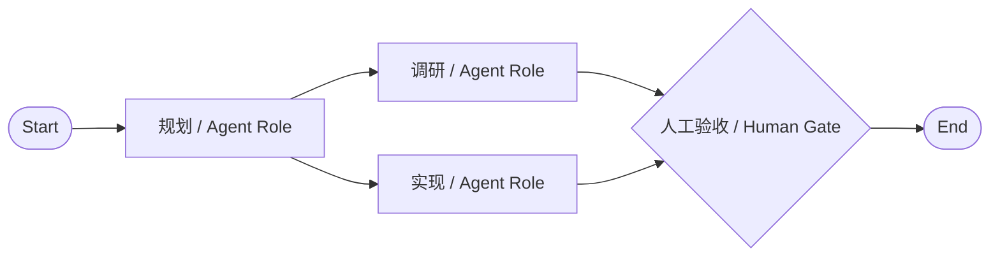

# Stella v2 简化版最终技术方案

> 状态：最终方案  
> 日期：2026-07-17  
> 目标版本：Stella Pi Workbench v2  
> 核心原则：单机、单用户、Kanban 优先、最小可视化 DAG、复用现有 Electron 与 Pi RPC，不引入为未来假设服务的复杂基础设施。

> 自动化增量说明：`docs/specs/stella-local-agent-automation.md` 已获批准，先行实现本地 AgentTaskQueue、动态 Squad 和 Manual / Schedule / Loopback Webhook Autopilot；它覆盖本文 Out of Scope 中对应的三项，但不提前实现 Project、可配置列或可视化 DAG。

> Pi 兼容性增量：ADR 0003 已接受。现有 Pi 工作台是完整、独立的一等产品界面；Task Room、Coordinator、Kanban 和 DAG 只能作为并列的增量能力，不能替换、裁剪或强制接管 Pi 的页面、会话和交互语义。

## Problem Statement

当前 Stella 已经具备 Pi 桌面 GUI、三套皮肤、任务看板、内置 Agent/团队/Workflow、顺序执行和人工关卡，但看板仍然以代码目录为隐含项目身份：任务直接保存项目路径和信任状态，项目不是可独立创建和管理的对象。

这导致以下问题：

1. 用户不能在 Stella 内创建空白、调研、内容、个人规划等非代码项目。
2. 看板列由 Agent 运行状态固定决定，不能表达不同项目自己的业务阶段。
3. 任务必须在创建时选择 Workflow，普通待办和 Agent 执行被过早绑定。
4. Team 目前只是目录信息，Workflow 实际仍直接引用 Agent，没有真正通过团队角色完成分发。
5. 内置 Agent、Team 和 Workflow 是源码常量，用户不能复制并形成自己的固定流程。
6. 异步停止、结算和进程回调需要统一的状态转换入口，避免终态被迟到回调覆盖。

用户希望项目尽可能简单，因此本方案不追求通用项目管理平台、低代码自动化平台或多 Agent 自治系统，只完成一个可靠、可理解、可安装的本地 Kanban Agent 工作台。

## Solution

Stella v2 原样保留当前独立 Pi 工作台，并保留 Electron、React、typed preload、Pi RPC、JSON 原子写入和完整 Board Snapshot 推送模式；任务控制台只做四项结构调整：

1. 增加一等 `Project`，项目拥有自己的可编辑 Kanban 列和本地工作区配置。
2. `Task.columnId` 表示业务阶段，`WorkflowRun.status` 表示 Agent 运行状态，两者彻底分开。
3. 内置和用户定义的 Agent、Team、Workflow 使用同一个 Catalog；用户可以复制内置项后编辑。
4. Workflow 升级为可视化的最小 DAG，只支持 Start、Agent Role、Human Gate 和 End 四种节点；允许分叉与汇合，但执行器始终按稳定拓扑顺序串行调度，所有运行状态通过一个纯状态转换器更新。

最终产品仍然只有一个桌面应用、一个任务状态文件、一套内置 Pi Runtime 实现和一个确定性 DAG 编排器。交互式 Pi 使用长期会话 Runtime 实例；Workflow、AgentTask、Worker 和 Coordinator 使用隔离的 Runtime 实例，不能共享或污染交互会话。

## Product Principles

1. **项目不是目录。** 项目先存在，代码目录只是该项目可选的工作区。
2. **Kanban 只有一种数据模型。** 软件、调研和内容项目的差异只来自初始列和推荐 Workflow。
3. **模板只负责复制初始配置。** 创建后可以修改列，不存在封闭的项目类型枚举。
4. **任务可以不运行 Agent。** Workflow 是可选字段，只有用户点击分发时才创建 Run。
5. **团队分发必须确定。** Team Role 映射到具体 Agent，不使用 LLM 动态选择队员。
6. **运行记录不可改写历史。** Run 创建时快照 Workflow、Team 和 Agent；后续编辑不影响历史。
7. **错误必须显式。** 无效状态转换、缺失目录、失效角色和迁移失败均直接报错，不静默修复。
8. **跨电脑依赖最少。** Pi Runtime 随安装包内置；项目目录由每台电脑上的用户自行选择。
9. **图形不等于并发。** DAG 可以表达分叉和汇合，但一次只运行一个 Agent，避免多个 Agent 同时修改同一工作区。
10. **Pi 工作台完整独立。** 用户不创建 Task 也能使用当前所有 Pi 页面和能力；普通 Pi 消息不会自动进入 Kanban 或 AgentTaskQueue。
11. **交互与编排隔离。** 后台 Workflow、AgentTask 和 Coordinator 使用独立会话，只有显式用户动作才能在 Pi Chat 与正式 Task 之间建立联系。

## User Stories

1. As a Stella user, I want to create a blank project, so that I can use the Kanban without opening a code repository.
2. As a Stella user, I want to create a project from a software, bug-fix, research, content, or personal template, so that I can start with sensible columns.
3. As a Stella user, I want to rename, reorder, add, and remove project columns, so that the board matches my actual process.
4. As a Stella user, I want a non-code project to receive an app-managed workspace, so that an Agent can still produce files when needed.
5. As a developer, I want to bind a project to an external working directory, so that Pi can operate on my real repository.
6. As a recipient of the installer, I want to choose my own local project directory, so that the sender's absolute path is never required.
7. As a recipient of the installer, I want Stella to use its bundled Pi Runtime, so that my global `pi` installation path and `PATH` configuration do not matter.
8. As a Stella user, I want to create a task without selecting a Workflow, so that ordinary Kanban tasks remain lightweight.
9. As a Stella user, I want to assign or change a Workflow before dispatch, so that Agent automation remains optional.
10. As a Stella user, I want the card to stay in its business column while its Agent Run is queued, running, waiting, failed, or completed, so that execution state does not corrupt project state.
11. As a Stella user, I want a clear Run badge on each card, so that I can see execution state without adding runtime-specific columns.
12. As a Stella user, I want to inspect Run nodes, artifacts, errors, and activity from the task detail, so that execution remains explainable.
13. As a Stella user, I want a Human Gate to survive until I approve or reject it, so that critical changes remain under my control.
14. As a Stella user, I want abort to be final, so that a delayed Pi callback cannot restart or complete an aborted Run.
15. As a Stella user, I want built-in Agents, Teams, and Workflows to remain available after upgrades, so that the product works out of the box.
16. As a Stella user, I want to copy a built-in catalog item and edit the copy, so that I can customize behavior without mutating product defaults.
17. As a Stella user, I want to create an Agent Team by mapping named roles to Agents, so that Workflow nodes can distribute work predictably.
18. As a Stella user, I want to build a Workflow on a visual DAG canvas, so that I can connect Start, Agent Role, Human Gate, and End nodes directly.
19. As a Stella user, I want a Workflow to support fan-out and fan-in, so that several responsibilities can form separate branches and then join before completion.
20. As a Stella user, I want DAG execution to remain deterministic and serial, so that two Agents never write to the same workspace concurrently.
21. As a Stella user, I want to see live node status on the DAG, so that I can understand which branch is pending, running, waiting, completed, or failed.
22. As a Stella user, I want each historical Run to retain the exact graph and definitions it used, so that later catalog edits do not rewrite history.
23. As an existing Stella user, I want my current board data migrated automatically and transparently, so that upgrading does not discard tasks or runs.
24. As an existing Stella user, I want migration failures to preserve the original file and show the exact error, so that data problems are debuggable.
25. As a Stella user, I want Stella, 晨曦, and 定阳 skins to continue working across project, board, catalog, DAG, and Run screens, so that the visual system remains complete.
26. As a Pi user, I want to use every existing Pi workspace page and capability without creating a Task, so that Stella remains a complete standalone Pi GUI.
27. As a Pi user, I want ordinary chat messages, session changes, commands, extensions, branches, compaction and terminal actions to keep their native Pi semantics, so that task orchestration never silently intercepts them.
28. As a Stella user, I want interactive Pi sessions and background task sessions to remain isolated, so that Worker or Coordinator activity cannot alter my current conversation.
29. As a Stella user, I want conversion between a Pi conversation and a formal Task to require an explicit visible action, so that exploratory chat does not pollute the Kanban.

## Simplified Architecture

```text
Renderer
  -> Pi Workspace           Complete interactive Pi pages
  -> Task Control           Kanban / Task Room / Catalog / DAG
  -> typed preload API
Main Process
  -> WorkspaceService       Project / Column / Task / User Catalog CRUD
  -> WorkflowOrchestrator   Dispatch / DAG scheduling / Run / Node / Gate / Abort
  -> WorkflowGraph          Validation / stable topological ordering
  -> BoardStore             One validated JSON state file, serialized atomic writes
  -> InteractivePiRuntime   Long-lived direct Pi session
  -> PiRuntimeFactory       Isolated Workflow / AgentTask / Coordinator sessions
```

There is no HTTP backend, database server, worker service, plugin host, CRDT layer, remote scheduler, or second Agent framework.

## Minimal Domain Model

The following schema is conceptual and records the decisions that implementations must preserve.

```text
WorkspaceState {
  schemaVersion: 2
  projects: Project[]
  tasks: Task[]
  userCatalog: UserCatalog
  runs: WorkflowRun[]
  activities: Activity[]
}

Project {
  id
  name
  description
  columns: Column[]
  workspace: ManagedWorkspace | ExternalWorkspace
  defaultWorkflowId?
  createdAt
  updatedAt
}

Column {
  id
  name
  color
  position
  terminal
}

ManagedWorkspace {
  mode: "managed"
  path
}

ExternalWorkspace {
  mode: "external"
  path
  trusted
}

Task {
  id
  projectId
  columnId
  title
  description
  acceptanceCriteria
  priority
  workflowId?
  activeRunId?
  createdAt
  updatedAt
}

UserCatalog {
  agents: AgentDefinition[]
  teams: TeamDefinition[]
  workflows: WorkflowDefinition[]
}

TeamDefinition {
  id
  version
  name
  roles: TeamRole[]
  archived
}

TeamRole {
  id
  label
  agentId
}

WorkflowDefinition {
  id
  version
  name
  teamId
  graph: WorkflowGraph
  archived
}

WorkflowGraph {
  nodes: WorkflowNode[]
  edges: WorkflowEdge[]
}

WorkflowNode = StartNode | AgentRoleNode | HumanGateNode | EndNode

StartNode {
  kind: "start"
  id
  name
  position: { x, y }
}

AgentRoleNode {
  kind: "agent-role"
  id
  name
  roleId
  objective
  position: { x, y }
}

HumanGateNode {
  kind: "human-gate"
  id
  name
  instructions
  position: { x, y }
}

EndNode {
  kind: "end"
  id
  name
  position: { x, y }
}

WorkflowEdge {
  id
  sourceNodeId
  targetNodeId
}

WorkflowRun {
  id
  taskId
  status
  currentNodeId?
  workflowSnapshot
  teamSnapshot
  agentSnapshots
  executionOrder: nodeId[]
  nodes: NodeRun[]
  createdAt
  updatedAt
  completedAt?
}

NodeRun {
  nodeId
  status
  agentSnapshotId?
  output?
  artifacts: Artifact[]
  error?
  startedAt?
  completedAt?
}
```

### Deliberate Simplifications

- A Project has exactly one Kanban board.
- A Project has exactly one workspace, either app-managed or an external directory.
- A Task has the existing fixed fields; v2 does not add a general custom-field engine.
- A Workflow is a directed acyclic graph with exactly four node kinds: Start, Agent Role, Human Gate, and End.
- Edges are unconditional. The graph may fan out and fan in, but the runtime never executes two nodes concurrently.
- A stable topological order is derived at Run creation, using node-array order as the tie-breaker, and is stored in the Run snapshot.
- A Team is a deterministic role-to-Agent map, not an autonomous manager.
- Workflow edits increment `version`; there is no draft/publish subsystem.
- A Run stores full snapshots, so no separate WorkflowVersion storage entity is required.
- Built-in Catalog items stay in application code; only user items are persisted.
- Renderer updates continue to receive a complete validated Board Bootstrap snapshot.

## Project Templates

Templates are immutable presets shipped with the application. Creating a project copies the selected columns and default Workflow into the new Project; the Project does not retain behavioral dependence on the template.

Initial templates:

1. **Blank**: 待办、进行中、完成。
2. **Software delivery**: 待规划、开发中、待验收、完成。
3. **Bug fix**: 待复现、修复中、回归验证、完成。
4. **Research**: 待调研、调研中、整理结论、完成。
5. **Content production**: 选题、创作中、审核、已发布。
6. **Personal planning**: 收集、计划、本周、完成。

Users can edit the copied columns. Saving a Project back as a reusable custom template is out of scope.

## Workspace and Portability

### Bundled Pi Runtime

The existing packaging decision remains unchanged:

- `@earendil-works/pi-coding-agent` and its production dependencies ship inside Stella.
- Electron's Node executable launches the bundled RPC entry.
- Stella does not search for or depend on a globally installed `pi` command.
- The recipient still uses their own Pi model/provider credentials and configuration.

### Pi Workspace Compatibility Contract

- Pi Workspace remains directly reachable as a peer of Task Control and works when no Task exists.
- The compatibility surface includes project selection and trust; sessions; models and thinking levels; text/image prompts; Slash Commands, Prompts, Skills and Extensions; Extension UI; steer/follow-up delivery; abort and retry; compaction and context statistics; tool activity; session tree, fork, clone, rename and export; and the local command terminal.
- New task UI may add explicit actions such as “固化为任务” or “在 Pi 中打开结果”, but it must not reinterpret ordinary Pi commands or automatically create task records.
- Task Control errors are reported in their own surface. Whenever the bundled interactive Pi Runtime can start, a board-specific data or orchestration error must not silently remove the Pi Workspace route.
- Interactive Pi and task execution use the same bundled runtime implementation but different Runtime instances, session identities and event streams.

### Project Workspace

- A new non-code Project receives a directory under Stella's user-data directory.
- A code Project can be rebound to an external directory selected by the local user.
- External path and trust are stored only in that local installation's state file.
- Task and Run records refer to `projectId`, never to copied absolute paths.
- Dispatch always resolves the Project's current workspace and trust immediately before starting Pi.
- Changing trust affects future dispatches; historical task values never authorize execution.

This is sufficient for Windows/macOS portability without introducing device IDs, cloud synchronization, portable resource URIs, or a multi-resource model.

## Business State and Run State

`Task.columnId` is the only Kanban business state. Starting, waiting, failing, aborting, or completing a Run does not move the Task.

The card shows a separate latest-Run badge:

```text
queued | running | waiting | succeeded | failed | cancelled | interrupted
```

The user moves the card manually. Automatic column transitions are out of scope because they would require project-specific mapping rules and re-couple execution to business state.

## Run State Machine

All Run mutations pass through one pure transition function. Services and Runtime callbacks may request transitions but cannot write Run status directly.

Allowed high-level sequence:

```text
queued -> running
running -> waiting -> running
running -> succeeded
running -> failed
queued/running/waiting -> cancelled
queued/running -> interrupted
```

Rules:

1. `succeeded`, `failed`, `cancelled`, and `interrupted` are terminal.
2. A terminal Run cannot transition to any other state.
3. Every transition identifies `runId`, `currentNodeId`, and the expected current status.
4. Repository updates re-read the latest Run inside the serialized update transaction; no stale Run object may be committed.
5. Runtime callbacks must match the active in-memory Runtime token and current Node.
6. A callback received after abort or shutdown produces an explicit stale-event diagnostic and does not mutate persisted state.
7. Retry is not implemented in v2; the user starts a new Run, preserving the old failed Run.
8. On application startup, persisted `queued` or `running` Runs become `interrupted`; they are never reported as successful.
9. A persisted `waiting` Run remains waiting only when its current snapshotted node is a Human Gate, so an approval can survive application restart. Any other waiting-state shape is an explicit validation error.

The implementation may use a small TypeScript reducer. XState is not required for v2.

## Catalog Behavior

### Built-in Items

- Shipped in source code and always available.
- Read-only in the UI.
- Can be copied to a user item.
- Keep stable IDs and explicit integer versions.

### User Items

- Persisted in `userCatalog` in the same JSON file.
- Can be created, edited, copied, and archived.
- Cannot shadow a built-in ID.
- Editing increments the integer `version`.
- Archived items cannot be selected for new tasks but remain readable in historical Run snapshots.

### Team Execution

- Each Workflow selects exactly one Team.
- Each Agent Role node targets one `roleId` from that Team.
- At dispatch, the role resolves to exactly one Agent.
- Missing Team, Role, or Agent is a validation error and prevents dispatch.
- Run creation snapshots the resolved Workflow, Team, and Agents.
- There is no Leader routing, selector Agent, round-robin policy, delegation loop, or Agent-to-Agent group chat.

## DAG Validation and Execution

The visual canvas is backed by a small domain validator and scheduler; React Flow is a rendering and editing library, not the source of execution truth.

Example supported graph:



The graph visibly branches after planning and joins at the Human Gate. If Research appears before Build in the graph's node array, the persisted serial execution order is `Start -> Planning -> Research -> Build -> Human Gate -> End`; the gate cannot become ready until both branches succeed.

### Save and Dispatch Validation

A Workflow can be saved and dispatched only when all of these rules pass:

1. Node and edge IDs are unique, and every edge endpoint exists.
2. There is exactly one Start node and exactly one End node.
3. Start has no incoming edge; End has no outgoing edge.
4. Self-edges and duplicate source/target edges are rejected.
5. The graph is acyclic.
6. Every node is reachable from Start, and every node has a path to End.
7. Every Agent Role node references a role on the Workflow's selected Team.
8. Every selected Team role resolves to an existing, non-archived Agent when a new Run is created.

Validation returns structured errors containing the affected node or edge ID. The editor highlights the matching element and shows the same error in a visible list. Invalid graphs are not silently rewritten or partially saved.

### Deterministic Serial Scheduler

When a Run is created, the main process validates the graph and computes a stable topological order. If two nodes are simultaneously eligible, their order in `WorkflowGraph.nodes` is the tie-breaker. That exact `executionOrder` is persisted in the Run so later canvas edits cannot change history.

Execution follows these rules:

1. Start is marked succeeded without launching Pi.
2. A pending node becomes ready only after all of its predecessor nodes have succeeded.
3. The scheduler chooses the first ready node in the Run's persisted `executionOrder`.
4. At most one Agent Role node may be running. A fan-out therefore creates multiple ready branches but executes them one by one.
5. An Agent Role node launches one Pi RPC process using the Agent resolved from its Team Role snapshot.
6. A Human Gate node changes the Run to `waiting`; approval succeeds that node and resumes scheduling, while rejection fails the node and Run.
7. A branch failure fails the Run immediately. Remaining pending nodes stay visibly pending in the historical snapshot.
8. A fan-in node becomes ready only when every incoming branch has succeeded.
9. End is marked succeeded without launching Pi once all of its predecessors succeed; the Run then becomes `succeeded`.

This provides real DAG structure and visual branch/join semantics without parallel workspace writes, expression evaluation, loop control, or a distributed scheduler.

## Persistence and Migration

### Keep JSON Storage

Stella v2 keeps the current atomic JSON design because it is adequate for a single-user desktop application and avoids native database packaging work.

- Authoritative file remains under Electron `userData`.
- Writes remain serialized through one queue.
- Every write validates the full next state before replacing the file.
- Writes continue to use temporary-file plus atomic rename.
- The application keeps all data in memory for filtering and rendering.
- No arbitrary record cap or silent history deletion is introduced.

### Schema v1 to v2 Migration

Migration executes once during store initialization:

1. Copy the original v1 file to a timestamped backup.
2. Group legacy tasks by canonicalized `projectPath` and create one Project per unique path.
3. Create each migrated Project with the Software delivery columns and an external workspace binding.
4. Convert task path/name/trust fields into `projectId`; trust comes from the Project workspace.
5. Map legacy task statuses to business columns:
   - `planned` and `queued` -> 待规划
   - `running` -> 开发中
   - `review` -> 待验收
   - `blocked`, `failed`, and `interrupted` -> 待规划, while retaining the real Run result and activity
   - `completed` -> 完成
6. Convert every legacy linear Workflow into `Start -> legacy steps in order -> End`; legacy Agent steps become Agent Role nodes and Human Gate steps become Human Gate nodes.
7. Convert legacy Step Run records to Node Run records while preserving status, output, Artifact, Activity, and timestamp history in the Run snapshot.
8. Validate the complete v2 state before replacing the authoritative file.
9. If any step fails, leave the v1 file untouched and surface the exact migration error and backup path.

There is no silent coercion of malformed data.

## Renderer Interactions

### Project Navigation

- Sidebar shows Projects instead of deriving projects from task paths.
- Users can create, rename, archive, and select a Project.
- Project creation asks for name, preset, and workspace mode.
- External workspace selection uses the existing native folder picker and trust dialog.

### Kanban

- Board renders the selected Project's columns.
- Cards are filtered by `projectId` and grouped by `columnId`.
- Dragging a card only changes `columnId`.
- Project settings edit column name, color, order, and terminal marker.
- Deleting a non-empty column requires the user to choose a destination column; cancellation leaves data unchanged.

### Task Editor and Detail

- Task creation selects the Project automatically from the current board.
- Workflow is optional.
- Dispatch is disabled with an explicit reason when no Workflow exists or the external workspace is unavailable.
- Card and detail show Run status separately from the business column.
- Human Gate and Abort controls remain in Task detail.

### Catalog

- Catalog keeps three tabs: Agents, Teams, Workflows.
- Workflows use `@xyflow/react` as a visual DAG canvas.
- A new Workflow starts with one non-deletable Start node and one non-deletable End node.
- The node palette adds Agent Role and Human Gate nodes; no custom or plugin node type is exposed.
- Users can pan, zoom, fit the view, use the minimap, drag nodes, connect handles, reconnect edges, select elements, and delete selected non-terminal nodes or edges.
- Keyboard Delete/Backspace performs the same validated deletion as the toolbar; a dirty editor asks for confirmation before navigation.
- Selecting an Agent Role node opens an inspector for name, Team Role, and objective. Selecting a Human Gate opens name and instructions.
- The inspector exposes move-earlier and move-later actions for same-time-ready execution priority. These reorder the node array without moving the canvas position, making serial branch order explicit and controllable.
- Edges are directed and unconditional. Creating a self-edge or duplicate edge shows an immediate validation error.
- Save performs full graph validation. Errors appear in a summary and highlight the relevant nodes or edges; the previous saved graph remains authoritative.
- Built-in Workflows open read-only on the same canvas and can be copied into the user Catalog for editing.
- The “按拓扑整理” action uses a small application-owned layout function: topological depth determines columns and node-array order determines rows. Users can drag nodes afterward.
- The implementation does not add Dagre or ELK. Node array order remains the deterministic execution tie-breaker and is shown as a small execution-order badge after validation.

### Run DAG View

- Task detail renders the Run's snapshotted graph in read-only mode, never the latest edited Workflow.
- Node borders and badges show `pending`, `running`, `waiting`, `succeeded`, `failed`, `cancelled`, or `interrupted`.
- The active node is centered or focused on request; zoom, pan, fit-view, and minimap remain available.
- The selected node shows its Agent, Team Role, timestamps, output, artifact links, and error details in the existing Run detail panel.
- Human Gate approve/reject actions appear only when the selected snapshotted gate is the current waiting node.
- Fan-out branches and fan-in joins remain visible even though runtime scheduling is serial.

### Skins

Stella, 晨曦, and 定阳 remain presentation-only themes. Domain records never store skin-specific values. Every new dialog and Project screen must render under all three token sets.

## Implementation Decisions

1. Keep Electron main process as the only authority for filesystem, persistence, trust, and child processes.
2. Keep context isolation, disabled Renderer Node integration, and the typed preload boundary.
3. Replace the current board service responsibilities with one Workspace Service for Project, Column, Task, and user Catalog commands.
4. Keep Workflow Orchestrator as a separate application service because it owns process lifetime and asynchronous Run transitions.
5. Keep one Board Repository interface and one JSON Board Store implementation.
6. Add a pure graph validator/topological sorter and a pure Run transition function as the only writers of execution order and Run/Node status.
7. Keep full-state Board Bootstrap responses and Snapshot events; do not add event sourcing or incremental projection infrastructure.
8. Keep built-in Catalog definitions immutable in application code and merge them with persisted user definitions at bootstrap.
9. Resolve Workflow Team Roles to Agents before Run creation and snapshot the complete resolved configuration.
10. Do not require a Workflow during Task creation.
11. Do not let Run events mutate Task columns.
12. Use app-managed workspaces for projects without an external directory.
13. Keep the bundled Pi Runtime and current RPC protocol.
14. Use explicit schema-version migration with backup; do not add compatibility branches throughout business logic.
15. Preserve existing skins and packaging configuration.
16. Add only `@xyflow/react` for graph rendering/editing; graph validation and scheduling remain application-owned TypeScript modules.

## IPC Contract Changes

The typed desktop API adds explicit operations for:

- create, update, archive, and select Project;
- edit Project columns;
- choose or rebind an external workspace;
- create and update a Task using `projectId`, `columnId`, and optional `workflowId`;
- move a Task to a Project column;
- create, update, copy, and archive user Agent, Team, and Workflow definitions;
- save a validated Workflow graph and return structured node/edge validation errors.

Existing operations remain for:

- initialize and subscribe to Board Snapshot;
- dispatch Task;
- resolve Human Gate;
- abort Run;
- reveal path and open external URL;
- Pi conversation commands.

All IPC input is validated in the main process before reaching services.

## Delivery Order

### Phase 0: Run Correctness

1. Add the pure Run transition function.
2. Route settle, abort, fail, complete, approve, reject, shutdown, and restart recovery through it.
3. Re-read current Run state inside every repository update.
4. Add stale Runtime token checks and explicit diagnostics.
5. Add race tests before changing the schema.

### Phase 1: Project and Configurable Columns

1. Introduce schema v2 Project, Column, and Task references.
2. Add v1-to-v2 migration and backup.
3. Add Project navigation, creation, settings, and workspace selection.
4. Render Project-specific columns.
5. Split Task business column from Run badge.

### Phase 2: User Catalog, Team Roles, and Visual DAG

1. Persist user Agent, Team, and Workflow arrays.
2. Merge built-in and user Catalog at bootstrap.
3. Add create, copy, edit, and archive interactions.
4. Add the pure Workflow graph validator, stable topological sorter, and serial ready-node scheduler.
5. Add the React Flow editor and read-only Run overlay.
6. Change Workflow Agent Role nodes to target Team Roles.
7. Snapshot the graph, execution order, resolved Team, and Agents in every Run.

### Phase 3: Verification and Distribution

1. Complete migration, state-machine, service, and Renderer tests.
2. Run packaged Windows end-to-end tests.
3. Build macOS x64 and arm64 artifacts in macOS CI.
4. Verify first launch, project creation, external folder binding, DAG editing, branch/join execution, gate, abort, restart recovery, and all three skins.
5. Update README screenshots and data-location documentation after behavior is verified.

## Testing Decisions

Tests should assert visible domain behavior and persisted outcomes, not private method calls or component implementation details.

### Primary Test Seam

The highest application seam is the typed desktop API backed by a temporary JSON store and a controllable fake Pi Runtime. It verifies commands, persisted state, emitted Board Bootstrap, and errors together.

### Focused Existing Seams

The current test structure remains useful:

- Domain tests validate parsing, invariants, column membership, catalog references, DAG rules, stable topological ordering, and Run transitions.
- Board Store tests validate atomic persistence, migration, backup, restart interruption, and explicit malformed-data failures.
- Workflow Orchestrator tests use a fake Runtime to validate branch/join scheduling, serial Agent execution, Human Gate, artifacts, abort, stale callbacks, and shutdown.
- Renderer tests validate Project creation, column editing, optional Workflow selection, card movement, Catalog editing, DAG interactions, graph validation feedback, Run overlays, and Run badges.
- Packaged end-to-end tests validate the real bundled Pi Runtime and desktop bridge.

### Required DAG Tests

1. Reject missing or duplicate Start and End nodes.
2. Reject cycles, self-edges, duplicate edges, dangling edge endpoints, and disconnected nodes.
3. Reject an Agent Role node whose Team Role or Agent cannot be resolved.
4. Convert a legacy ordered Workflow into a valid linear DAG without changing step order.
5. Execute `Start -> A -> End` exactly once.
6. Execute a fan-out/fan-in graph in stable node-array topological order with no overlapping Pi Runtime process.
7. Keep a join pending until every predecessor succeeds.
8. Fail the Run on one branch failure and do not start remaining pending nodes.
9. Pause and resume correctly when a Human Gate is located on one branch.
10. Preserve the Run's graph and execution order after the source Workflow is edited.
11. Highlight the exact invalid node or edge in the editor and keep the prior saved graph unchanged.
12. Render snapshotted node states correctly in Stella, 晨曦, and 定阳 skins.

### Required Race Tests

1. Abort while Runtime is starting.
2. Abort while Agent settlement is reading artifact/session data.
3. Abort and Runtime exit arriving in either order.
4. Human Gate approval and abort arriving in either order.
5. Duplicate Agent completion event.
6. Late completion from a previous Run after a new Run begins.
7. Application shutdown while a Node is running.

Each case must prove that a terminal Run remains terminal and no new Agent starts after cancellation or interruption.

### Required Migration Tests

1. Empty v1 state.
2. Multiple tasks sharing one canonical path.
3. Tasks from multiple paths.
4. Case and separator variants on Windows paths.
5. Existing completed, failed, interrupted, and waiting Runs.
6. Malformed v1 input preserves the source and reports the exact failure.
7. Running migration twice does not duplicate Projects or history.

## Acceptance Criteria

1. Users can create and switch among multiple Projects without first opening a code repository.
2. Blank, software, bug-fix, research, content, and personal presets create editable Project columns.
3. A Task belongs to one Project and one Project column and may have no Workflow.
4. A card's business column does not change when its Run state changes.
5. Non-code Projects use an app-managed workspace; code Projects can bind a local external directory.
6. The installer uses the bundled Pi Runtime and does not depend on a global Pi path.
7. Dispatch resolves the Project's current local path and trust.
8. Built-in Catalog items are immutable and copyable; user items are editable and archivable.
9. Users can create, connect, move, inspect, reconnect, and delete supported DAG nodes and edges on a visual canvas.
10. A Workflow has exactly one Start and End, is acyclic and connected, and references valid Team Roles.
11. Invalid Workflow graphs remain unsaved and show element-specific errors without replacing the previous valid graph.
12. A fan-out/fan-in Workflow executes in a persisted deterministic topological order with at most one active Agent.
13. A join waits for all predecessors, and one failed branch fails the Run without launching additional nodes.
14. Run history contains the exact graph, execution order, resolved Workflow, Team, and Agent snapshots.
15. Task detail visualizes historical node status and exposes Human Gate approval/rejection on the current waiting node.
16. Abort, failure, completion, and interruption are terminal and protected from stale callbacks.
17. Existing v1 board data and ordered Workflows migrate with a backup and no loss of history.
18. Migration and validation errors are explicit and do not silently reset the board.
19. Stella, 晨曦, and 定阳 render every new screen and DAG state correctly.
20. Windows packaged tests pass; macOS artifacts are built and smoke-tested on their native runners.

## Out of Scope

The following are deliberately excluded from Stella v2 to keep the product simple:

- SQLite, PostgreSQL, or any database server;
- cloud synchronization, accounts, teams of human users, RBAC, and real-time collaboration;
- CRDT or event sourcing;
- multiple resources or multiple directories per Project;
- list, table, calendar, Gantt, and multiple saved views;
- general custom fields and formula fields;
- user-created reusable Project templates;
- Workflow draft/publish/version tables;
- conditional edges, expression languages, switch nodes, loops, true parallel execution, retries, timers, cron, and webhooks;
- custom/plugin Workflow node kinds and automatic graph layout engines;
- dynamic Squad Leader routing, selector Agents, delegation, swarm, or group chat;
- OpenHands, CrewAI, AutoGen, LangGraph, n8n, Dify, or Temporal as runtime dependencies;
- remote Agent servers, Docker sandbox management, plugin marketplace, connector marketplace, and credential vault;
- automatic mapping from Run states to Project columns;
- cross-device board-data import/synchronization.

## Further Notes

- The solution intentionally uses ideas from Plane, Vikunja, Activepieces, XState, LangGraph, CrewAI, and OpenHands without reproducing their platform scope.
- The current repository has no LICENSE file. This specification assumes clean-room implementation using the existing Stella codebase and compatible dependencies only.
- The large architecture research remains useful as a boundary reference, but this document is authoritative for Stella v2 implementation scope.
- Any future request for custom views, custom fields, conditional routing, parallel DAG execution, dynamic Agent routing, or cloud sync must be proposed as a separate version and must not expand this implementation implicitly.
